# _Sistemas operativo_

### **Alumno: Gutierrez Ortiz Angel Yahir**

### **Profesor: Jesus Eduardo Alacaraz Chavez**

### **Número de control: 22121318**

---

## **Administración de Memoria**

### **3.1 Política y filosofía**

**1. ¿Cuál es la diferencia entre fragmentación interna y externa? Explica
cómo cada una afecta el rendimiento de la memoria.**

La **fragmentación interna** ocurre cuando el espacio de memoria asignado a un programa es mayor al espacio requerido por ese programa y a este desperdicio de memoria es lo que se conoce como fragmentación interna.

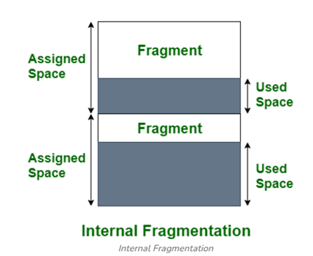

Esta fragmentación afecta el rendimiento de la memoria especialmente si los bloques de paginación son grades ya que el desperdicio de memoria aumenta entre mas tamaño tengan los bloques ya que no importará que tan pequeño sea el programa que se cargue en memoria porque siempre ocupara ese espacio por lo que no es eficiente.

La **fragmentación externa** ocurre cuando hay bloques de memoria libres y estos a su vez son demasiados pequeños para ser utilizados para cargar segmentos más grades.

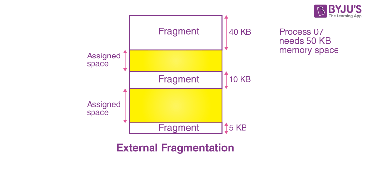

Sun desventaja que al haber muchos bloques de memoria libres el sistema operativo tarda mas en busca un bloque de memoria adecuado para el segmento que quiere cargar. Otro problema es que para poder unir los bloques de memoria libres y así poder usarlos en segmentos de mayor tamaño hay que realizar métodos de compactación que lo cual es tardado y también consume recursos del sistema.

La principal diferencia entre estas dos fragmentaciones es que la fragmentación interna ocurre cuando se hace paginación de la memoria y se crean bloques o particiones de memoria fija. Mientras que la fragmentación externa ocurre cuando se utiliza segmentación en la cual el programa de divide en varios segmentos de tamaños diferentes y cuando alguno de estos segmentos se libera es cuando ocurre esta fragmentación.

Ademas, no puede ocurrir fragmentación externa en la paginación porque los bloques de memoria son dinámicos y por lo mismo no puede ocurrir fragmentación interna en la segmentación.

**2. Investiga y explica las políticas de reemplazo de páginas en sistemas operativos. ¿Cuál consideras más eficiente y por qué?**

-     **NRU (Not Recently Used)**

  El algoritmo LRU selecciona para eliminación una página de la clase con el número más bajo, ya que estas representan las menos utilizadas. Este enfoque asegura que las páginas que se usan con frecuencia permanezcan en memoria, evitando recargas innecesarias y ahorrando tiempo.

  Para implementar este algoritmo, el sistema operativo utiliza dos bits de control en la tabla de páginas que le permiten determinar cuáles páginas han sido usadas recientemente. Estos bits son:

  **R (Referenced)**: Indica si la página ha sido referenciada anteriormente.

  **M (Modified)**: Indica si la página ha sido modificada.

  Cuando ocurre un fallo de página, que es cuando se intenta acceder a una pagina que no esta en la memoria principal, el sistema revisa las páginas que ya están cargadas en memoria y las clasifica en cuatro categorías según los valores de los bits R y M:

  Clase 0: La página no ha sido referenciada ni modificada.

  Clase 1: La página no ha sido referenciada, pero sí modificada.

  Clase 2: La página ha sido referenciada, pero no modificada.

  Clase 3: La página ha sido referenciada y modificada.

  Cuando se necesita reemplazar una página, el algoritmo da prioridad a las de clase 0, ya que son las menos importantes en términos de uso y cambios realizados por lo que son las que reemplaza primero.

- **Primera en entrar, primera en salir (FIFO)**

  En este algoritmo se elimina la página que más tiempo lleva en memoria y elimina al al último la que menos tiempo lleve. Para esto el sistema operativo usa una cola en la en las que las nuevas paginas se van hasta el final para que se tenga un orden.

  El problema de este algoritmo es que no toma en cuenta si la pagina que va a borrar es importante porque sea usada constantemente.

- **Segunda oportunidad**

  Este algoritmo funciona casi igual que el algoritmo de FIFO con la diferencia de que este tiene un bit R como en el algoritmo de NRU, y que usa para verificar si la pagina fue referenciada o usada recientemente. En el caso de que el bit R sea 0 la pagina se borra inmediatamente, pero en el caso de que el bit sea 1 la página pasa hasta al final de la cola y su bit R se reinicia a 0.
  Un ejemplo de este algoritmo es la siguiente imagen:

  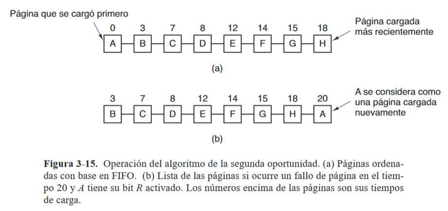

  Lo que busca este este algoritmo es eliminar el problema de FIFO al tomar en cuenta si las paginas han sido utilizadas o referenciadas en un intervalo de reloj. En el caso de que todas las paginas tengan el bit R igual a 1, es decir que han sido referenciadas en el ultimo intervalo, el algoritmo se convierte en un FIFO normal en el que no toma en cuenta el bit R.

- **Algoritmo de Reloj**

  Este algoritmo es similar al de la segunda oportunidad, pero en vez de una cola se hace con una lista circular en forma de reloj en la que la manecilla del reloj apunta a la pagina mas antigua a eliminar. En este algoritmo también se toma en cuenta el bit R siguiendo la misma lógica de la segunda oportunidad, si es 0 se elimina y si es 1 se cambia el bit a 0 y la manecilla se mueve a la siguiente página con más tiempo en memoria.

  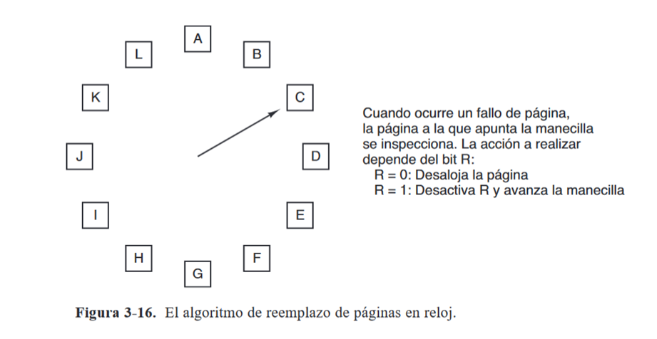

- **Menos usadas recientemente (LRU)**

  En el RLU toma en cuenta que las páginas que más se han utilizado recientemente es mas probable que se utilicen en un futuro y las que menos se han utilizado lo mas probable es que sigan si utilizarse a futuro. Entonces lo que este algoritmo hace es eliminar la página que ha pasado más tiempo sin ser utilizada.

  Para hacer esto el algoritmo utiliza una lista enlazada de todas las paginas cargadas en memoria con la página de uso más reciente en la parte de adelante y la de uso menos reciente en la parte final. El mayor problema de este algoritmo es que es costoso y complejo porque se tiene que actualizar la lista enlazada cada que se referencia alguna pagina ya que se debe buscar la página, eliminarla y mover todas las demás paginas por lo que lleva mucho tiempo de procesamiento.

  **¿Cuál consideras más eficiente y por qué?**

  Si bien considero que ninguno de los algoritmos es perfecto porque cada uno tiene sus propios problemas si me inclino mas por el algoritmo de **LRU** creo que tiene un buen enfoque de eliminacion de pagina basado en la pagina menos usada frecuentemente ya que de esta forma se evita eliminar paginas importantes para el proceso lo que es mas eficiente ya que de esta forma no se generan tantos fallos de pagina en los que se tenga que reemplazar por lo que ahorra muchos recursos al SO.

---

### **3.2 Memoria Real**

#### **1. Escribe un programa en C o Python que simule la administración de memoria mediante particiones fijas.**

```c
   #include <stdio.h>

   // estructura de un proceso con id y tamaño
   typedef struct _nodo
   {
       int id;
       int tamaño;

   } nodo;

   void asignarProceso(int numProceso, int tamProceso, int length, nodo particiones[])
   {
       int bandera = 0; // Bandera para comprobar si hay alguna particion con el espacio suficiente para asignar un proceso.
       printf("\nIngresa el id del proceso: ");
       scanf("%d", &numProceso);

       printf("\nIngresa el tamaño del proceso: ");
       scanf("%d", &tamProceso);

       for (int i = 0; i < length; i++)
       {
           if (tamProceso <= particiones[i].tamaño && particiones[i].id == -1 && bandera == 0)
           {
               particiones[i].id = numProceso;
               printf("Se asigno el proceso %d a la particion %d \n\n", particiones[i].id, i + 1);
               bandera = 1;
           }
       }

       if (!bandera)
       {
           printf("\nNo hay espacio en memoria suficiente para asignar\n\n");
       }
   }

   void eliminarProceso(int length, nodo particiones[])
   {
       int memoriaLibre = 1;
       for (int i = 0; i < length; i++)
       {
           if (particiones[i].id != -1)
           {
               memoriaLibre = 0;
               break;
           }
       }
       if (memoriaLibre)
       {
           printf("No hay procesos cargados en memoria.\n");
       }

       int numProceso;
       int bandera; // bandera para verificar si hay un proceso en memoria con ese id
       printf("\nIngresa el id del proceso:");
       bandera = 0;
       scanf("%d", &numProceso);
       for (int i = 0; i < length; i++)
       {
           if (particiones[i].id == numProceso)
           {
               int aux = particiones[i].id;
               particiones[i].id = -1;
               printf("Se libero el proceso con id %d de la partición %d", aux, i + 1);
               bandera = 1;
               break;
           }
       }

       if (!bandera)
       {
           printf("No hay proceso con el id ingresado. Intente de nuevo \n\n");
       }
   }

   void mostrarMemoria(int length, nodo particiones[])
   {
       for (int i = 0; i < length; i++)
       {
           if (particiones[i].id != -1)
           {
               printf("\nLa partición %d esta ocupada por el proceso %d\n\n", i + 1, particiones[i].id);
           }
           else
           {
               printf("La particion %d esta desocupada\n\n", i + 1);
           }
       }
   }

   int main()
   {
       int eleccion = 0, maxMemoria = 0, numParticiones = 0, numProceso = 0, tamProceso = 0, tamTotal = 0, tamParticion = 0;

       printf("Ingresa el tamaño de la memoria: (KB): ");
       scanf("%d", &maxMemoria);

       printf("Ingrese la cantidad de particiones:");
       scanf("%d", &numParticiones);

       nodo particiones[numParticiones];                          // arreglo de particiones fijas que simula la memoria
       int length = sizeof(particiones) / sizeof(particiones[0]); // length del arreglo

       int bandera = 0;
       do
       {
           tamTotal = 0;
           printf("\nIngresa el tamaño que tendran las particiones (KB): ");
           scanf("%d", &tamParticion);

           for (int i = 0; i < numParticiones; i++) // guarda en cada una de las particiones el mismo tamaño de particiones
           {
               particiones[i].id = -1;
               particiones[i].tamaño = tamParticion;
               tamTotal += particiones[i].tamaño;
           }

           if (tamTotal > maxMemoria)
           {
               printf("\nEl tamaño fijo de todas las particiones(%d KB) es mayor al tamaño maximo de memoria(%d KB). Por favor ingresa un tamaño fijo para las particiones menor.\n\n", tamTotal, maxMemoria);
           }
           else
           {
               bandera = 1;
           }
       } while (bandera == 0);

       printf("La memoria fisica tendrá un tamaño de %d KB divido en %d particiones de %d KB\n", maxMemoria, numParticiones, tamParticion);
       while (eleccion != 4)
       {
           printf("       ||MENU||      ");
           printf("\n1.- Asignar proceso");
           printf("\n2.- Liberar proceso");
           printf("\n3.- Mostrar estado de la memoria\n\n");
           printf("\n4.- Salir\n\n");
           printf("Opción:");
           scanf("%d", &eleccion);

           switch (eleccion)
           {
           case 1:
               asignarProceso(numProceso, tamProceso, length, particiones);
               break;
           case 2:
               eliminarProceso(length, particiones);
               break;
           case 3:
               mostrarMemoria(length, particiones);
               break;
           case 4:
               break;
           default:
               break;
           }
       }

       return 0;
   }
```

#### **2. Diseña un algoritmo para calcular qué procesos pueden ser asignados a un sistema con memoria real limitada utilizando el algoritmo de "primera cabida"**

    1. INICIO
    2. Leer el tamaño total de la memoria física.
    3. Leer el tamaño de los bloques de cada partición.
    4. Leer el tamaño total del proceso a asignar a memoria.
    5. Buscar entre todos las particiones el tamaño de bloque que sea  suficientemente grande para asignar el proceso que se quiere cargar.
    6. Si se encuentra una partición, verificar si está ocupada o libre.
    7. Si esta libre, cargar el proceso en memoria y marcar el bloque como ocupado
        Si está ocupada, seguir buscando.
    8. Si no hay ningún bloque con el espacio disponible, no cargar el proceso.
    9. FIN

### **3.3 Organización de memoria virtual**

#### **1. Investiga y explica el concepto de "paginación" y "segmentación". ¿Cuáles son las ventajas y desventajas de cada técnica?**

#### **Paginación.**

La paginación es una técnica que se utiliza para asignar memoria en la que la memoria física se divide en bloques del mismo tamaño llamados marcos de página mientras que los procesos a asignar también se dividen en bloques del mismo tamaño llamados página. Esta técnica ayuda a reducir la fragmentación interna y externa ya que no se necesita que las páginas del proceso a cargar se asignen de manera continua dentro de la memoria.

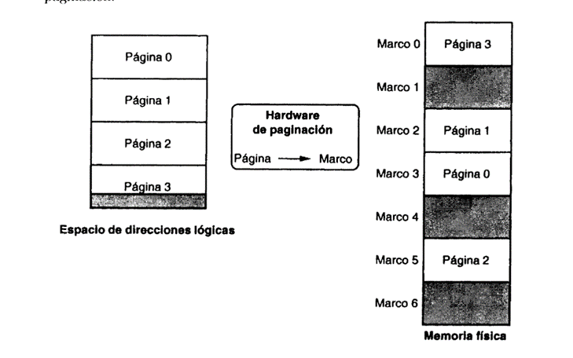

Por ejemplo, en la imagen de arriba el proceso a ser cargado en memoria es dividido en 4 páginas que después son asignadas a cada marco de pagina de la memoria sin necesidad que cada pagina este de forma continua.

Para que el sistema operativo pueda saber que paginas están asignadas en memoria para cada proceso activo necesita de una tabla de páginas. Esta tabla de paginas es diferente para cada proceso activo e indica que paginas están activas y en que marco de pagina dentro de la memoria.

**Ventajas**

Una de sus ventajas es que no se necesita tener todas las páginas del proceso activo cargadas en memoria para que este se este ejecutando, sino que se pueden cargar solo las paginas que están siendo usadas en ese momento y cuando se requiera código de una pagina que no esta cargada reemplazar la nueva pagina por una que no se este usando dentro de la memoria activa.

Otra ventaja de esta técnica es que se elimina la fragmentación externa esto porque cada marco de pagina se puede asignar a un proceso diferente y no se necesita que las paginas estén cargadas de forma continua.

**Desventajas**

Una desventaja es que la fragmentación interna sigue existiendo, aunque sea mínima. Esta fragmentación normalmente se da en el ultimo marco de pagina asignado a un proceso solo si la memoria que ocupa el proceso no es un múltiplo entero del tamaño de la página. Por ejemplo, si el tamaño de la pagina es de 4KB y la memoria que necesita es 3.5 KB el resto quedara sin utilizarse.

Los fallos de pagina tambien podrian representar una desventaja porque dependiendo la tecnica que se utilice para llevar el reemplazo de la pagina pueden ser muy complejos y pueden consumir mucho tiempo y recursos del sistema a esta realizado operaciones de E/S cada que se reemplaza una página por lo que esto generaría que el sistema operativo baje su rendimiento.

#### **Segmentación.**

La segmentación es una técnica que se utiliza para gestionar la memoria, esta lo que hace es dividir un proceso en segmentos lógicos. En este caso, la principal diferencia entre la paginación es que los segmentos son de diferentes tamaños y no de un mismo tamaño fijo.

**Ventajas**
La principal ventaja de la segmentación es que ya no se trabaja con un solo espacio de direcciones para proceso, sino que cada segmento del proceso tiene su propio espacio de direcciones independiente uno del otro lo que le permite cambiar aumentar o disminuir su espacio de direcciones si se necesita.

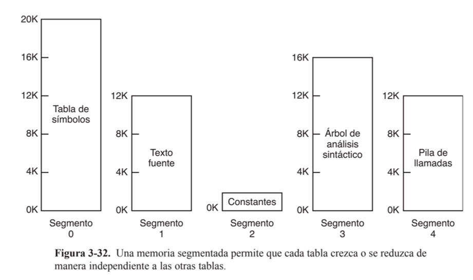

Por ejemplo, en esta imagen se muestra los segmentos de un compilador los cuales tienen un tamaño variable independiente de cada uno. Esto ayuda bastante ya que si un programa fuera muy complejo y tuviera muchas estructuras de control podría necesitar un espacio de direcciones más grande del que se le asigno y podría toparse con el espacio de direcciones de otro proceso lo que podría ocasionar problemas. Esto no pasa con la segmentación precisamente porque cada segmento tiene su propio espacio de direcciones por lo que sería muy difícil que un proceso accede a las direcciones de otro al poder variar su longitud.

Otra ventaja gran ventaja es que el proceso al ser segmentado puede tener varios niveles de protección dependiendo del segmento, se puede especificar si cierto segmento solo es de lectura, de escritura, de ejecución, etc. Lo que ayuda mucho a la seguridad del proceso.

**Desventajas**

La principal desventaja de la segmentación es que puede generar fragmentación externa en la que se generan huecos de memoria libre entre cada segmento cuando este se libera de la memoria y si en estos huecos de memoria no puede ser asignado un nuevo proceso, ya que el proceso necesita más espacio, la única forma de utilizar estos huecos seria uniéndolos o compactándolos, pero este proceso es muy tardado y consume muchos recursos del sistema operativo.

#### **2. Escribe un programa que simule una tabla de páginas para procesos con acceso aleatorio a memoria virtual.**

```c
    #include <stdio.h>
    #include <stdlib.h>

    #define MAX_PROCESOS 20

    int numProcesos;

    typedef struct Marco
    {
        int numMarco;
        int libre;
        int procesoID;
        int paginaID;
        int tiempoUso;
    } Marco;

    typedef struct Pagina
    {
        int numMarco;
        int referencia;
        int modificado;
        int presente;
        int pagina;
    } Pagina;

    typedef struct Proceso
    {
        int id;
        int tamaño;
        int paginas;
        Pagina *tablaPaginas;
    } Proceso;

    void crearProceso(Proceso procesos[], int tamMarco)
    {
        if (numProcesos >= MAX_PROCESOS)
        {
            printf("Error: no se pueden crear más procesos.\n");
            return;
        }

        Proceso *nuevo = &procesos[numProcesos];
        numProcesos++;
        printf("Ingresa el ID del proceso: ");
        scanf("%d", &nuevo->id);
        printf("Ingresa el tamaño del proceso: ");
        scanf("%d", &nuevo->tamaño);

        nuevo->paginas = (nuevo->tamaño + tamMarco - 1) / tamMarco;
        nuevo->tablaPaginas = (Pagina*)calloc(nuevo->paginas, sizeof(Pagina));

        for (int i = 0; i < nuevo->paginas; i++)
        {
            nuevo->tablaPaginas[i].numMarco = -1;
            nuevo->tablaPaginas[i].presente = 0;
            nuevo->tablaPaginas[i].referencia = 0;
            nuevo->tablaPaginas[i].modificado = 0;
            nuevo->tablaPaginas[i].pagina = i;
        }

        printf("Proceso creado con ID %d y %d páginas.\n", nuevo->id, nuevo->paginas);
    }


    void asignarPagina(Proceso procesos[], Marco memoria[], int numMarcos)
    {
        int id, pagina;
        printf("Ingresa el ID del proceso: ");
        scanf("%d", &id);
        printf("Ingresa la página a acceder(de 0 a n): ");
        scanf("%d", &pagina);

        for (int i = 0; i < numProcesos; i++)
        {
            if (procesos[i].id == id)
            {
                if (pagina >= procesos[i].paginas)
                {
                    printf("Error: la página %d no existe.\n", pagina);
                    return;
                }

                if (procesos[i].tablaPaginas[pagina].presente)
                {
                    printf("La página %d ya está en memoria (marco %d).\n",
                        pagina, procesos[i].tablaPaginas[pagina].numMarco);
                    return;
                }

                for (int j = 0; j < numMarcos; j++)
                {
                    if (memoria[j].libre)
                    {
                        memoria[j].libre = 0;
                        memoria[j].procesoID = id;
                        memoria[j].paginaID = pagina;

                        procesos[i].tablaPaginas[pagina].numMarco = j;
                        procesos[i].tablaPaginas[pagina].presente = 1;

                        printf("Página %d del proceso %d cargada en el marco %d.\n", pagina, id, j);
                        return;
                    }
                }

                printf("Fallo de página: no hay marcos disponibles. Se usuará el algoritmo de LRU para reemplazar la pagina\n");


                return;
            }
        }

        printf("Error: proceso no encontrado.\n");
    }

    void eliminarPagina(Proceso procesos[], Marco memoria[], int numMarcos)
    {

        int id, pagina;
        printf("Ingresa el ID del proceso: ");
        scanf("%d", &id);
        printf("Ingresa la página a eliminar(de 0 a n): ");
        scanf("%d", &pagina);

        for (int i = 0; i < numProcesos; i++)
        {
            if (procesos[i].id == id)
            {
                if (pagina >= procesos[i].paginas)
                {
                    printf("Error: la página %d no existe.\n", pagina);
                    return;
                }

                if (procesos[i].tablaPaginas[pagina].presente)
                {
                    memoria[procesos[i].tablaPaginas[pagina].numMarco].libre = 1;
                    procesos[i].tablaPaginas[pagina].numMarco = -1;
                    procesos[i].tablaPaginas[i].presente = 0;
                    procesos[i].tablaPaginas[i].referencia = 0;
                    procesos[i].tablaPaginas[i].modificado = 0;
                    printf("Se elimino la pagina exitosamente.");
                    return;
                }
                else
                {
                    printf("\nError la pagina %d no esta cargada en memoria. Debes cargarla primero para poder eliminarla",pagina);
                    return;
                }
            }
        }

        printf("Error: proceso no encontrado.\n");
    }

    void mostrarMemoria(Marco memoria[], int numMarcos)
    {
        printf("\nEstado de la memoria física:\n");
        for (int i = 0; i < numMarcos; i++)
        {
            if (memoria[i].libre)
            {
                printf("Marco %d: Libre\n", i);
            }
            else
            {
                printf("Marco %d: Proceso %d, Página %d\n", i, memoria[i].procesoID, memoria[i].paginaID);
            }
        }
    }

    int main()
    {
        Proceso procesos[MAX_PROCESOS];
        int contador = 0;

        int tamMemoria, tamMarco;
        printf("Ingresa el tamaño de la memoria (KB): ");
        scanf("%d", &tamMemoria);
        printf("Ingresa el tamaño del marco de página (KB): ");
        scanf("%d", &tamMarco);

        int numMarcos = tamMemoria / tamMarco;
        Marco memoria[numMarcos];

        for (int i = 0; i < numMarcos; i++)
        {
            memoria[i].numMarco = i;
            memoria[i].libre = 1;
        }

        int eleccion;
        do
        {
            printf("\n1. Crear proceso\n2. Asignar pagina a memoria\n3. Eliminar pagina de memoria\n4. Mostrar estado de memoria\n5.-Salir\nOpción: ");
            scanf("%d", &eleccion);

            switch (eleccion)
            {
            case 1:
                crearProceso(procesos, tamMarco);
                break;
            case 2:
                asignarPagina(procesos, memoria, numMarcos);
                break;
            case 3:
                eliminarPagina(procesos, memoria, numMarcos);
                break;
            case 4:
                mostrarMemoria(memoria, numMarcos);
                break;
            case 5:
                printf("Saliendo...\n");
                break;
            default:
                printf("No existe esa opcion.\n");
            }
        } while (eleccion != 5);

        return 0;
    }
```

### **3.4 Administración de memoria virtual**

#### **1. Escribe un código que implemente el algoritmo de reemplazo de página "Least Recently Used" (LRU).**

```c
#include <stdio.h>
#include <stdlib.h>

#define MAX_PROCESOS 20

int numProcesos;

typedef struct Marco
{
   int numMarco;
   int libre;
   int procesoID;
   int paginaID;
   int tiempoUso;
} Marco;

typedef struct Pagina
{
   int numMarco;
   int referencia;
   int modificado;
   int presente;
   int pagina;
} Pagina;

typedef struct Proceso
{
   int id;
   int tamano;
   int paginas;
   Pagina *tablaPaginas;
} Proceso;

void crearProceso(Proceso procesos[], int tamMarco)
{
   if (numProcesos >= MAX_PROCESOS)
   {
       printf("Error: no se pueden crear más procesos.\n");
       return;
   }

   Proceso *nuevo = &procesos[numProcesos];
   numProcesos++;
   printf("Ingresa el ID del proceso: ");
   scanf("%d", &nuevo->id);
   printf("Ingresa el tamaño del proceso: ");
   scanf("%d", &nuevo->tamano);

   nuevo->paginas = (nuevo->tamano + tamMarco - 1) / tamMarco;
   nuevo->tablaPaginas = (Pagina*)calloc(nuevo->paginas, sizeof(Pagina));

   for (int i = 0; i < nuevo->paginas; i++)
   {
       nuevo->tablaPaginas[i].numMarco = -1;
       nuevo->tablaPaginas[i].presente = 0;
       nuevo->tablaPaginas[i].referencia = 0;
       nuevo->tablaPaginas[i].modificado = 0;
       nuevo->tablaPaginas[i].pagina = i;
   }

   printf("Proceso creado con ID %d y %d páginas.\n", nuevo->id, nuevo->paginas);
}

void asignarPagina(Proceso procesos[], Marco memoria[], int numMarcos)
{
   int id, pagina;
   printf("Ingresa el ID del proceso: ");
   scanf("%d", &id);
   printf("Ingresa la página a acceder (de 0 a n): ");
   scanf("%d", &pagina);

   for (int i = 0; i < numProcesos; i++)
   {
       if (procesos[i].id == id)
       {
           if (pagina >= procesos[i].paginas)
           {
               printf("Error: la página %d no existe.\n", pagina);
               return;
           }

           if (procesos[i].tablaPaginas[pagina].presente)
           {
               printf("La página %d ya está en memoria (marco %d).\n",
                      pagina, procesos[i].tablaPaginas[pagina].numMarco);

               for (int j = 0; j < numMarcos; j++)
               {
                   if (!memoria[j].libre)
                   {
                       memoria[j].tiempoUso++;
                   }
               }

               memoria[procesos[i].tablaPaginas[pagina].numMarco].tiempoUso = 0;
               return;
           }

           for (int j = 0; j < numMarcos; j++)
           {
               if (memoria[j].libre)
               {
                   memoria[j].libre = 0;
                   memoria[j].procesoID = id;
                   memoria[j].paginaID = pagina;
                   memoria[j].tiempoUso = 0;

                   procesos[i].tablaPaginas[pagina].numMarco = j;
                   procesos[i].tablaPaginas[pagina].presente = 1;

                   for (int k = 0; k < numMarcos; k++)
                   {
                       if (!memoria[k].libre)
                       {
                           memoria[k].tiempoUso++;
                       }
                   }

                   printf("Página %d del proceso %d cargada en el marco %d.\n", pagina, id, j);
                   return;
               }
           }

           printf("Fallo de página: no hay marcos disponibles. Se usará el algoritmo de LRU para reemplazar la página\n");

           int minUso = memoria[0].tiempoUso;
           int minIndex = 0;

           for (int j = 1; j < numMarcos; j++)
           {
               if (memoria[j].tiempoUso < minUso)
               {
                   minUso = memoria[j].tiempoUso;
                   minIndex = j;
               }
           }

           printf("Reemplazando la página %d del proceso %d en el marco %d.\n", memoria[minIndex].paginaID, memoria[minIndex].procesoID, minIndex);
           memoria[minIndex].procesoID = id;
           memoria[minIndex].paginaID = pagina;
           memoria[minIndex].tiempoUso = 0;

           procesos[i].tablaPaginas[pagina].numMarco = minIndex;
           procesos[i].tablaPaginas[pagina].presente = 1;
           return;
       }
   }

   printf("Error: proceso no encontrado.\n");
}

void eliminarPagina(Proceso procesos[], Marco memoria[], int numMarcos)
{
   int id, pagina;
   printf("Ingresa el ID del proceso: ");
   scanf("%d", &id);
   printf("Ingresa la página a eliminar (de 0 a n): ");
   scanf("%d", &pagina);

   for (int i = 0; i < numProcesos; i++)
   {
       if (procesos[i].id == id)
       {
           if (pagina >= procesos[i].paginas)
           {
               printf("Error: la página %d no existe.\n", pagina);
               return;
           }

           if (procesos[i].tablaPaginas[pagina].presente)
           {
               memoria[procesos[i].tablaPaginas[pagina].numMarco].libre = 1;
               procesos[i].tablaPaginas[pagina].numMarco = -1;
               procesos[i].tablaPaginas[i].presente = 0;
               procesos[i].tablaPaginas[i].referencia = 0;
               procesos[i].tablaPaginas[i].modificado = 0;
               printf("Se elimino la pagina exitosamente.");
               return;
           }
           else
           {
               printf("\nError la pagina %d no esta cargada en memoria. Debes cargarla primero para poder eliminarla",pagina);
               return;
           }
       }
   }

   printf("Error: proceso no encontrado.\n");
}

void mostrarMemoria(Marco memoria[], int numMarcos)
{
   printf("\nEstado de la memoria física:\n");
   for (int i = 0; i < numMarcos; i++)
   {
       if (memoria[i].libre)
       {
           printf("Marco %d: Libre\n", i);
       }
       else
       {
           printf("Marco %d: Proceso %d, Página %d, Tiempo de uso: %d\n", i, memoria[i].procesoID, memoria[i].paginaID, memoria[i].tiempoUso);
       }
   }
}

int main()
{
   Proceso procesos[MAX_PROCESOS];
   int contador = 0;
   printf("NOTA: El numero de marcos se calculará de forma automatica(tamaño de la memoria / tamaño de marco).\n");
   printf("NOTA: Cada que se asigna una pagina, el tiempo de uso de las otras paginas ya cargadas en la RAM tambien aumenta.\n");
   int tamMemoria, tamMarco;
   printf("\nIngresa el tamaño de la memoria (KB): ");
   scanf("%d", &tamMemoria);
   printf("Ingresa el tamaño del marco de página (KB): ");
   scanf("%d", &tamMarco);

   int numMarcos = tamMemoria / tamMarco;
   Marco memoria[numMarcos];

   for (int i = 0; i < numMarcos; i++)
   {
       memoria[i].numMarco = i;
       memoria[i].libre = 1;
   }

   int eleccion;
   do
   {
       printf("\n1. Crear proceso\n2. Asignar pagina a memoria\n3. Eliminar pagina de memoria\n4. Mostrar estado de memoria\n5.-Salir\nOpción: ");
       scanf("%d", &eleccion);

       switch (eleccion)
       {
       case 1:
           crearProceso(procesos, tamMarco);
           break;
       case 2:
           asignarPagina(procesos, memoria, numMarcos);
           break;
       case 3:
           eliminarPagina(procesos, memoria, numMarcos);
           break;
       case 4:
           mostrarMemoria(memoria, numMarcos);
           break;
       case 5:
           printf("Saliendo...\n");
           break;
       default:
           printf("No existe esa opcion.\n");
       }
   } while (eleccion != 5);

   return 0;
}

```

#### **Diseña un diagrama que represente el proceso de traducción de direcciones virtuales a físicas en un sistema con memoria virtual.**

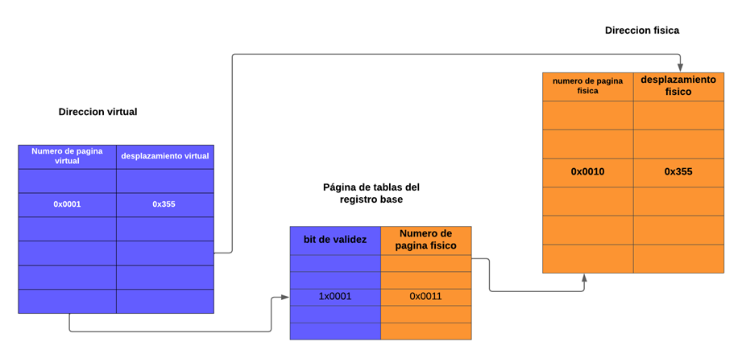

### **Integración**

#### **1. Analiza un sistema operativo moderno (por ejemplo, Linux o Windows) e identifica cómo administra la memoria virtual.**

En Linux, la administración de la memoria virtual se basa principalmente en la paginación por demanda, lo que significa que un proceso no necesita cargar todas sus páginas en memoria para ejecutarse. Las páginas se cargan conforme son necesarias, optimizando el uso de recursos.

Para el reemplazo de páginas, Linux utiliza el algoritmo PFRA (Page Frame Reclaiming Algorithm). Este algoritmo clasifica las páginas en cuatro tipos: no reclamables, intercambiables, sincronizarles y descartables. El objetivo de este enfoque es mantener marcos de página libres para que cualquier proceso pueda utilizarlos cuando lo necesite.

En cuanto al direccionamiento, Linux utiliza direcciones virtuales y físicas. Las direcciones virtuales son usadas por los procesos de usuario, mientras que las físicas son utilizadas por el núcleo. La traducción entre ambos tipos de direcciones se realiza mediante un esquema de tablas de paginación de tres niveles, compuesto por el directorio de páginas, el directorio intermedio de páginas y la tabla de páginas.
En este sistema, una dirección virtual se divide en cuatro partes: los tres primeros componentes son índices para las tres tablas, y el último es un desplazamiento que apunta al marco en la memoria física.

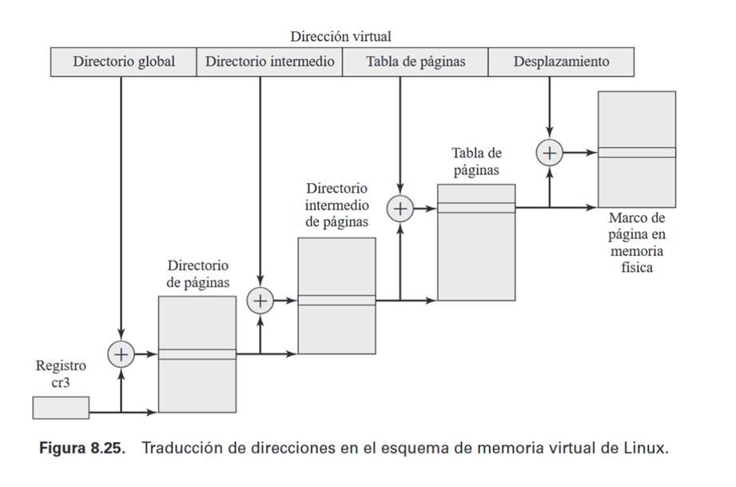

En esta imagen, la dirección virtual la divide en 4 partes, donde las 3 partes son los índices de cada tabla y cada tabla lo que hace es apuntar a la página de la siguiente tabla hasta llegar al marco de página en la memoria física. Esta forma de direccionamiento lo que le permite a Linux es que las tablas de páginas sean independientes de la arquitectura del equipo.

Además, el manejo de memoria incluye un sistema eficiente para liberar y reasignar marcos mediante el algoritmo del compañero, que combina o divide bloques de marcos contiguos según las necesidades. También existe un demonio de paginación que trabaja en segundo plano, liberando marcos de memoria cuando el sistema alcanza ciertos umbrales críticos, utilizando el algoritmo del reloj para determinar qué páginas liberar.

También, el manejo de memoria incluye un sistema eficiente para liberar y reasignar marcos mediante el algoritmo del compañero, que combina o divide bloques de marcos contiguos según las necesidades.
Otra implementación de Linux es que existe un demonio de paginación que trabaja en segundo plano, liberando marcos de memoria cuando el sistema alcanza ciertos umbrales críticos, utilizando el algoritmo del reloj para determinar qué páginas liberar.

#### **2. Realiza una simulación en cualquier lenguaje de programación que emule el swapping de procesos en memoria virtual.**

```c
#include <stdio.h>
#include <stdlib.h>
#include <time.h>

#define tamanoMemoria 50
#define procesosMaximos 500
#define numeroMarcos 5

int contador = 0;

typedef struct Proceso
{
   int id;
   int tamMemoria;
} Proceso;

typedef struct Marco
{
   int numMarco;
   int libre;
   int procesoID;
} Marco;

Marco memoriaPrincipal[numeroMarcos];
Marco memoriaSecundaria[numeroMarcos];
Proceso procesos[procesosMaximos];

void inicializar()
{
   for (int i = 0; i < numeroMarcos; i++)
   {
       memoriaPrincipal[i].numMarco = i;
       memoriaPrincipal[i].libre = 1;
       memoriaSecundaria[i].numMarco = i;
       memoriaSecundaria[i].libre = 1;
   }
}

void intercambioFIFO()
{
   int procesoASwapear = memoriaPrincipal[0].procesoID;

   if (procesoASwapear == 0)
   {
       printf("\nNo hay procesos para intercambiar.\n");
       return;
   }

   for (int i = 0; i < numeroMarcos; i++)
   {
       if (memoriaSecundaria[i].libre)
       {
           memoriaSecundaria[i].procesoID = procesoASwapear;
           memoriaSecundaria[i].libre = 0;
           printf("\nProceso %d intercambiado a memoria secundaria (Marco %d).\n", procesoASwapear, memoriaSecundaria[i].numMarco);
           break;
       }
   }

   for (int i = 0; i < numeroMarcos - 1; i++)
   {
       memoriaPrincipal[i] = memoriaPrincipal[i + 1];
       memoriaPrincipal[i].numMarco = i;
   }

   memoriaPrincipal[numeroMarcos - 1].libre = 1;
   memoriaPrincipal[numeroMarcos - 1].procesoID = 0;
   memoriaPrincipal[numeroMarcos - 1].numMarco = numeroMarcos - 1;

   printf("\nMemoria principal ajustada tras el intercambio.\n");
}

void asignarProceso()
{
   if (contador >= procesosMaximos)
   {
       printf("\nError: No se pueden asignar más procesos a la memoria. Iniciando intercambio (Swapping) de procesos por FIFO...\n");
   }
   else
   {
       for (int i = 0; i < numeroMarcos; i++)
       {
           if (memoriaPrincipal[i].libre == 1)
           {
               memoriaPrincipal[i].procesoID = procesos[contador].id;
               memoriaPrincipal[i].libre = 0;
               printf("\nSe cargó el proceso %d en el marco %d.\n", memoriaPrincipal[i].procesoID, memoriaPrincipal[i].numMarco);
               return;
           }
       }
       printf("\nMemoria RAM llena. Iniciando proceso de swapping...\n");
       intercambioFIFO();
       asignarProceso();
   }
}

void creaProceso()
{
   if (contador >= procesosMaximos)
   {
       printf("\nNo se pueden crear más procesos. Límite alcanzado.\n");
       return;
   }

   Proceso nuevo;
   nuevo.id = contador + 1;
   nuevo.tamMemoria = rand() % 101 + 10;

   procesos[contador] = nuevo;
   printf("\nProceso creado: ID %d, Tamaño %d.\n", nuevo.id, nuevo.tamMemoria);
   asignarProceso();
   contador++;
}

void mostrarMemoria(int control)
{
   if (control == 1)
   {
       printf("\nMemoria Principal:\n");
       for (int i = 0; i < numeroMarcos; i++)
       {
           if (memoriaPrincipal[i].libre)
           {
               printf("Marco %d: Libre\n", memoriaPrincipal[i].numMarco);
           }
           else
           {
               printf("Marco %d: Proceso %d\n", memoriaPrincipal[i].numMarco, memoriaPrincipal[i].procesoID);
           }
       }
   }
   else
   {
       printf("\nMemoria Secundaria:\n");
       for (int i = 0; i < numeroMarcos; i++)
       {
           if (memoriaSecundaria[i].libre)
           {
               printf("Marco %d: Libre\n", memoriaSecundaria[i].numMarco);
           }
           else
           {
               printf("Marco %d: Proceso %d\n", memoriaSecundaria[i].numMarco, memoriaSecundaria[i].procesoID);
           }
       }
   }
}

int main()
{
   srand(time(NULL));
   inicializar();

   int eleccion;

   do
   {
       printf("\n\n    || MENU ||\n");
       printf("1.- Generar proceso\n");
       printf("2.- Mostrar estado de memoria principal\n");
       printf("3.- Mostrar estado de memoria secundaria\n");
       printf("4.- Salir\n");
       printf("Elección: ");
       scanf("%d", &eleccion);

       switch (eleccion)
       {
       case 1:
           creaProceso();
           break;
       case 2:
           mostrarMemoria(1);
           break;
       case 3:
           mostrarMemoria(0);
           break;
       case 4:
           printf("Saliendo...\n");
           break;
       default:
           printf("No existe esa opción.\n");
       }

   } while (eleccion != 4);

   return 0;
}

```

## **Administración de Entrada/Salida**

### **4.1 Dispositivos y manejadores de dispositivos**

#### **1. Explica la diferencia entre dispositivos de bloque y dispositivos de carácter. Da un ejemplo de cada uno.**

**Dispositivos de bloque**

Un dispositivo de bloque almacena información en bloques de tamaño fijo, donde cada bloque tiene su propia dirección. La principal característica de este tipo de dispositivo de entrada/salida (E/S) es que permite leer y escribir información de manera independiente a la posición de los bloques, lo que lo hace muy flexible para el acceso directo a los datos.
El sistema operativo utiliza dispositivos de bloque principalmente para almacenar información.

Ejemplos:

- Discos duros (HDD)
- Unidades de estado sólido (SSD)
- Memorias USB

**Dispositivos de caracter**

Un dispositivo de carácter procesa datos como flujos de caracteres, enviándolos o recibiéndolos uno por uno. A diferencia de los dispositivos de bloque, no tienen una estructura organizada en bloques ni un sistema de direccionamiento. Por esta razón, no es posible buscar un carácter específico como se podría buscar un bloque en un dispositivo de bloque.

Estos dispositivos suelen emplearse en periféricos que no necesitan acceso directo a datos específicos, como:

- Teclados
- Ratones
- Impresoras

#### **2. Diseña un programa que implemente un manejador de dispositivos sencillo para un dispositivo virtual de entrada.**

```c
#include <stdio.h>
#include <string.h>
#include <stdbool.h>

char buffer[100];

typedef struct Dispositivo{
    int id;
    char nombreDispositivo[50];
    int interrupcion;
    char memoria[100]; //simula la meoria de la usb donde guarda la info


}Dispositivo;

typedef struct Controladora
{
    int ocupado;
    int operacion; // el driver le manda el tipo de operacion a la controladora
    char datos[100]; // la controladora guarda los datos del dispositivo real
    Dispositivo Dispositivo;
}Controladora;


typedef struct Driver{

    Controladora controladora;
    int operacion; //0.- lectura 2.- escritura, etc.
}Driver;

Driver driverUSB;
Controladora controladoraUSB;
Dispositivo USB;

void inicializacion(){

    strcpy(USB.nombreDispositivo, "USB de ANGEL");
    strcpy(USB.memoria, "SOY LA INFORMACION DE LECTURA");
    USB.id = 1;
    USB.interrupcion = 0;

    driverUSB.controladora = controladoraUSB;
    driverUSB.operacion = -1; // No esta recibiendo ninguna operacion por parte del proceso

    controladoraUSB.ocupado = 0; // esta libre
    controladoraUSB.operacion = -1; // no tiene niguna operacion
    controladoraUSB.Dispositivo = USB;
}


void lectura(){
    if(driverUSB.controladora.ocupado != 0){
        printf("El dispositivo ya se encuentra en ocupado(en uso por un proceso)\n");
        sleep(5);
    }

    driverUSB.operacion = 0;
    driverUSB.controladora.operacion = 0;
    driverUSB.controladora.ocupado = 1;

    for(int i = 0; i < 5; i++){

        printf("Leyendo datos de la usb.....\n");
        strcpy(buffer,USB.memoria); //se guarda la info en el buffer del proceso para que sea usada.

        sleep(1);
    }

    driverUSB.controladora.ocupado = 0;

}

void escritura(){
     if(driverUSB.controladora.ocupado != 0){
        printf("El dispositivo ya se encuentra en ocupado(en uso por un proceso)\n");
        printf("Esperando a que se desocupe...\n");
        sleep(5);
    }

    driverUSB.operacion = 1; // la operacion es de escritura.
    driverUSB.controladora.operacion = 1; // el driver le dice pasa la operacion de escritura a la controladora para que lo ejecute sobre el dispositivo.
    driverUSB.controladora.ocupado = 1;

    for(int i = 0; i < 5; i++){

        printf("Escribiendo datos hacia la usb.....\n");

        strcpy(buffer, "SOY LA INFORMACION DE ESCRITURA."); //El proceso guarda los datos que quiere guardar en el dispositivo fisico a traves del buffer
        strcpy(driverUSB.controladora.datos, buffer); // La informacion pasa del buffer al registro de datos de la controladora.
        strcpy(USB.memoria, driverUSB.controladora.datos); //Una vez que la info esta en la controladora la pasa a la memoria USB.
        sleep(2);
    }

    driverUSB.controladora.ocupado = 0;

}

void mostrarINFOUSB(){

    printf("El proceso termino de usar la USB. \nLa informacion final que tiene es: %s\n", USB.memoria);
    sleep(2);
    printf("Terminando simulacion....\n");
    sleep(5);

    printf("Simulacion  terminada.");

}


int main() {

    inicializacion();

    printf("Iniciando simulacion.....\n");
    sleep(1);
    printf("Proceso solicita lectura de la informacion del dispositivo %s\n", USB.nombreDispositivo);
    sleep(1);
}printf("Driver recibe solicitud de lectura.\n");
    sleep(1);

    lectura();

    printf("La informacion que tiene el buffer en este momento es: %s\n", buffer);
    sleep(2);

    printf("Proceso solicita escribir informacion en el dispositivo %s\n", USB.nombreDispositivo);
    sleep(1);
    printf("Driver recibe solicitud de escritura.\n");
    sleep(1);

    escritura();

    mostrarINFOUSB();
}
```

### **4.2 Mecanismos y funciones de los manejadores de dispositivos**

#### **1. Investiga qué es la interrupción por E/S y cómo la administra el sis tema operativo. Escribe un ejemplo en pseudocódigo para simular este proceso..**

Una interrupción por E/S es una señal causada por un dispositivo de E/S para indicarle al procesador que debe interrumpir lo que esta ejecutando actualmente para pasar a ejecutar código especifico que maneja esta interrupción.

Mas especificamente, el prceso que sigue el sistema operativo para manejar las interrupciones es algo asi:

- El procesador primero termina de ejecutar la instrucción actual.
- Luego, ejecuta la Rutina de Servicio de Interrupciones o ISR (Interrupt Service Routine), que contiene las instrucciones necesarias para manejar la interrupción.
- Para lograr esto:
  - El procesador guarda la dirección de la siguiente instrucción en su flujo de ejecución.
  - Carga la dirección de la ISR y ejecuta sus instrucciones.
  - Al finalizar, restaura la dirección guardada anteriormente para reanudar el flujo normal de ejecución.

Otra forma de explicarlo puede ser a travez de un diagrama de flujo con en la imagen de abajo que tambien muestra como seria este proceso:

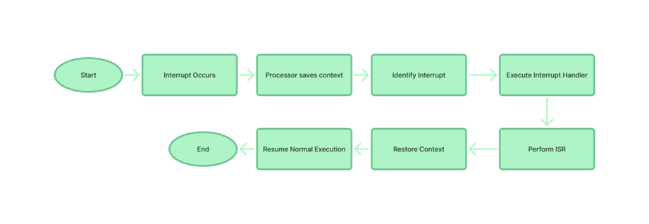

Normalmente este tipo de interrupciones pasan cuando el dispositivo de E/S termina una operación y emite la señal de interrupción para que el procesador sepa que el dispositivo de E/S termino. Esto es bueno para el procesador porque no tiene que estar esperando o escuchando activamente a que el E/S termine y así pueda seguir ejecutando instrucciones.

**PSEUDOCODIGO**
```
Iniciar sistema:
    Crear dispositivo USB con nombre "USB de ANGEL", ID 1, y memoria "SOY LA INFORMACION DE LECTURA".
    Asignar a driverUSB.controladora la controladoraUSB.
    Establecer driverUSB.operacion como -1.
    Establecer controladoraUSB.ocupado como 1.
    Establecer controladoraUSB.operacion como -1.
    Asignar dispositivo USB a la controladora.

    Inicializar tabla de estados con el dispositivo USB y estado 0.

Solicitud de lectura:
    Si driverUSB.controladora.ocupado no es 0:
        Mostrar "El dispositivo está ocupado. Esperando..."
        Esperar hasta que controladoraUSB.ocupado sea 0.

    Marcar que se va a hacer una operación de lectura:
        driverUSB.operacion = 0
        driverUSB.controladora.operacion = 0
        tablaEstados.operacion = 0
        controladoraUSB.ocupado = 1
        tablaEstados.estado = 1

    Simular lectura tres veces.
    Copiar datos leídos a un buffer.

    Generar interrupción:
        Si tablaEstados.estado es 1:
            Mostrar "Manejando interrupción para el dispositivo".
            Dependiendo de la operación:
                Si la operación es lectura:
                    Simular atención de la interrupción de lectura.
                Si la operación es escritura:
                    Simular atención de la interrupción de escritura.
            Cambiar estado a 0.
            Mostrar "El dispositivo terminó de ejecutar las IRS".

    Marcar el dispositivo como libre.

Solicitud de escritura:
    Si controladoraUSB.ocupado no es 0:
        Mostrar "El dispositivo está ocupado. Esperando..."
        Esperar hasta que controladoraUSB.ocupado sea 0.

    Marcar que se va a hacer una operación de escritura:
        driverUSB.operacion = 1
        driverUSB.controladora.operacion = 1
        tablaEstados.operacion = 1
        controladoraUSB.ocupado = 1

    Simular escritura cinco veces.
    Copiar nuevos datos a la memoria del USB.

    Marcar el dispositivo como libre.

Mostrar la información final del dispositivo:
    Mostrar "El proceso terminó de usar el dispositivo".
    Mostrar los datos finales que contiene el USB.
    Terminar simulación.
```

#### **2. Escribe un programa que utilice el manejo de interrupciones en un sistema básico de simulación.**

```c
#include <stdio.h>
#include <string.h>
#include <unistd.h>

char buffer[100];

typedef struct Dispositivo
{
    int id;
    char nombreDispositivo[50];
    int interrupcion;
    char memoria[100];
} Dispositivo;

typedef struct Controladora
{
    int ocupado;
    }    int operacion;
    char datos[100];
    Dispositivo Dispositivo;
} Controladora;

typedef struct TablaEstados
{
    Dispositivo dispositivo;
    int estado;
    int operacion;
} TablaEstados;

typedef struct Driver
{
    Controladora controladora;
    int operacion;
} Driver;

Driver driverUSB;
Controladora controladoraUSB;
Dispositivo USB;
TablaEstados tablaEstados;

void inicializacion()
{
    strcpy(USB.nombreDispositivo, "USB de ANGEL");
    strcpy(USB.memoria, "SOY LA INFORMACION DE LECTURA");
    USB.id = 1;
    USB.interrupcion = 0;

    driverUSB.controladora = controladoraUSB;
    driverUSB.operacion = -1;

    driverUSB.controladora.ocupado = 1;
    driverUSB.controladora.operacion = -1;
    driverUSB.controladora.Dispositivo = USB;

    tablaEstados.dispositivo = USB;
    tablaEstados.estado = 0;
    tablaEstados.operacion = -1;
}

void interrupcion()
{
    printf("\nInterrupción generada, La operación del dispositivo %s ha finalizado.\n", USB.nombreDispositivo);

    if (tablaEstados.estado == 1)
    {
        printf("Manejando interrupción para el dispositivo %s...\n", tablaEstados.dispositivo.nombreDispositivo);
        sleep(1);
        if (tablaEstados.operacion == 0)
        {
            for (int i = 0; i < 3; i++)
            {
                printf("Atendiendo interrupcion de lectura...\n");
                sleep(1);
            }
        }
        else if (tablaEstados.operacion == 1)
        {
            for (int i = 0; i < 3; i++)
            {
                printf("Atendiendo interrupcion de escritura...\n");
                sleep(1);
            }
        }

        tablaEstados.estado = 0;
        printf("EL dispositivo %s termino de ejecutar las IRS.\n", tablaEstados.dispositivo.nombreDispositivo);
    }
}

void lectura()
{
    if (driverUSB.controladora.ocupado != 0)
    {
        printf("El dispositivo ya se encuentra en ocupado(en uso por un proceso). Espera a que se desocupe\n");
        for(int i = 0; i <3; i++){
            printf("\nEsperando...");
            sleep(1);
        }
        driverUSB.controladora.ocupado = 0;

        printf("\nEl dispositivo esta libre para recibir ordenes. Iniciando Dispositivo: %s", USB.nombreDispositivo);
    }

    driverUSB.operacion = 0;
    driverUSB.controladora.operacion = 0;
    tablaEstados.operacion = 0;
    driverUSB.controladora.ocupado = 1;

    tablaEstados.estado = 1;

    for (int i = 0; i < 3; i++)
    {
        printf("Leyendo datos de la usb.....\n");
        sleep(1);
    }

    strcpy(buffer, USB.memoria);
    printf("Datos leidos y almacenados en el buffer: %s\n", buffer);

    interrupcion();

    driverUSB.controladora.ocupado = 0;
}

void escritura()
{
    if (driverUSB.controladora.ocupado != 0)
    {
        printf("El dispositivo ya se encuentra en ocupado(en uso por un proceso)\n");
        printf("Esperando a que se desocupe...\n");
        sleep(1);
    }

    driverUSB.operacion = 1;
    driverUSB.controladora.operacion = 1;
    tablaEstados.operacion = 1;
    driverUSB.controladora.ocupado = 1;

    for (int i = 0; i < 5; i++)
    {
        printf("Escribiendo datos hacia la usb.....\n");

        strcpy(buffer, "SOY INFORMACION DE ESCITURA ");
        strcpy(driverUSB.controladora.datos, buffer);
        strcpy(USB.memoria, driverUSB.controladora.datos);
        sleep(1);
    }

    driverUSB.controladora.ocupado = 0;
}

void mostrarINFOUSB()
{
    printf("El proceso terminó de usar la USB. \nLa información final que tiene es: %s\n", USB.memoria);
    sleep(2);
    printf("Terminando simulación....\n");
    sleep(5);

    printf("Simulación terminada.");
}

int main()
{
    inicializacion();

    printf("Iniciando simulación.....\n");
    sleep(1);
    printf("\nProceso solicita lectura de la información del dispositivo %s\n", USB.nombreDispositivo);
    sleep(1);
    printf("\nDriver recibe solicitud de lectura.\n");
    sleep(1);

    lectura();

    printf("\nLa información que tiene el buffer en este momento es: %s\n", buffer);
    sleep(2);

    printf("\nProceso solicita escribir información en el dispositivo %s\n", USB.nombreDispositivo);
    sleep(1);
    printf("\nDriver recibe solicitud de escritura.\n");
    sleep(1);

    escritura();

    mostrarINFOUSB();
}
```

### **4.3 Estructuras de datos para manejo de dispositivos**

#### **1. Investiga y explica qué es una cola de E/S. Diseña una simulación de una cola con prioridad.**

Basicamente una cola con prioridad es una una estructura de datos como las colas normales son utilizadas por el SO para gestionar las solicitudes de entrada y salida que hacen los procesos. Por ejemplo cuando un proceso necesita guardar o leer informacion de un disco duro o si necesita leer un caracter del teclado.

La forma en la que el sistema operativo gestiona estas solicitudes es con el algoritmo de FIFO y es por eso que se les llama cola de E/S. Porque siguen el esquema de que el primero en llegar es el primero en salir.

En este caso, si se recibe una solicitud de e/s agrega la a la cola como primer elemento y si una nueva llega la agrega despues de el primer elemento para que cuando se tengan que atender comienze a partir de la que llego primero.

#### **2. Escribe un programa que simule las operaciones de un manejador de dispositivos utilizando una tabla de estructuras**

```c
//Esta es una variacion del codigo del 4.2 con estructuras y manejo de varios dispositivos

#include <stdio.h>
#include <string.h>
#include <unistd.h>

#define cantidadDispositivos 3

char buffer[100];

typedef struct Dispositivo {
    int id;
    char nombreDispositivo[50];
    int interrupcion;
    char memoria[100];
} Dispositivo;

typedef struct Controladora {
    int ocupado;
    int operacion;
    char datos[100];
    Dispositivo dispositivo;
} Controladora;

typedef struct TablaEstados {
    Dispositivo dispositivo;
    int estado;
    int operacion;
} TablaEstados;

typedef struct Driver {
    Controladora controladora;
    int operacion;
} Driver;

Dispositivo dispositivos[cantidadDispositivos];
Driver driverUSB[cantidadDispositivos];
Controladora controladoras[cantidadDispositivos];
TablaEstados tablaEstados[cantidadDispositivos];

void inicializacion() {
    for (int i = 0; i < cantidadDispositivos; i++) {
        dispositivos[i].id = i + 1;
        sprintf(dispositivos[i].nombreDispositivo, "DISCO DURO:  %d", i + 1);
        strcpy(dispositivos[i].memoria, "SOY LA INFORMACION DE LECTURA");
        dispositivos[i].interrupcion = 0;

        driverUSB[i].controladora = controladoras[i];
        driverUSB[i].operacion = -1;
        driverUSB[i].controladora.ocupado = 0;
        driverUSB[i].controladora.operacion = -1;
        driverUSB[i].controladora.dispositivo = dispositivos[i];

        tablaEstados[i].dispositivo = dispositivos[i];
        tablaEstados[i].estado = 0;
        tablaEstados[i].operacion = -1;
    }
}

void interrupcion(int i) {
    printf("\nInterrupción generada, La operación del dispositivo %s ha finalizado.\n", dispositivos[i].nombreDispositivo);

    if (tablaEstados[i].estado == 1) {
        printf("Manejando interrupción para el dispositivo %s...\n", tablaEstados[i].dispositivo.nombreDispositivo);
        sleep(1);
        if (tablaEstados[i].operacion == 0) {
            for (int j = 0; j < 3; j++) {
                printf("Atendiendo interrupción de lectura...\n");
                sleep(1);
            }
        }
        else if (tablaEstados[i].operacion == 1) {
            for (int j = 0; j < 3; j++) {
                printf("Atendiendo interrupción de escritura...\n");
                sleep(1);
            }
        }

        tablaEstados[i].estado = 0;
        printf("EL dispositivo %s terminó de ejecutar las IRS.\n", tablaEstados[i].dispositivo.nombreDispositivo);
    }
}

void lectura(int i) {
    if (driverUSB[i].controladora.ocupado != 0) {
        printf("El dispositivo %s ya se encuentra ocupado. Espera a que se desocupe...\n", dispositivos[i].nombreDispositivo);
        for(int j = 0; j < 3; j++){
            printf("\nEsperando...");
            sleep(1);
        }
        driverUSB[i].controladora.ocupado = 0;
        printf("\nEl dispositivo %s está libre para recibir órdenes. Iniciando Dispositivo...\n", dispositivos[i].nombreDispositivo);
    }

    driverUSB[i].operacion = 0;
    driverUSB[i].controladora.operacion = 0;
    tablaEstados[i].operacion = 0;
    driverUSB[i].controladora.ocupado = 1;

    tablaEstados[i].estado = 1;

    for (int j = 0; j < 3; j++) {
        printf("Leyendo datos de la %s.....\n", dispositivos[i].nombreDispositivo);
        sleep(1);
    }

    strcpy(buffer, dispositivos[i].memoria);
    printf("Datos leídos y almacenados en el buffer: %s\n", buffer);

    interrupcion(i);

    driverUSB[i].controladora.ocupado = 0;
}

void escritura(int i) {
    if (driverUSB[i].controladora.ocupado != 0) {
        printf("El dispositivo %s ya se encuentra ocupado.\n", dispositivos[i].nombreDispositivo);
        printf("Esperando a que se desocupe...\n");
        sleep(1);
    }

    driverUSB[i].operacion = 1;
    driverUSB[i].controladora.operacion = 1;
    tablaEstados[i].operacion = 1;
    driverUSB[i].controladora.ocupado = 1;

    for (int j = 0; j < 5; j++) {
        printf("Escribiendo datos hacia la %s.....\n", dispositivos[i].nombreDispositivo);

        strcpy(buffer, "SOY INFORMACION DE ESCRITURA ");
        strcpy(driverUSB[i].controladora.datos, buffer);
        strcpy(dispositivos[i].memoria, driverUSB[i].controladora.datos);
        sleep(1);
    }

    driverUSB[i].controladora.ocupado = 0;
}

void mostrarINFOUSB(int i) {
    printf("El proceso terminó de usar el dispositivo %s. \nLa información final que tiene es: %s\n", dispositivos[i].nombreDispositivo, dispositivos[i].memoria);
    sleep(1);
}

int main() {
    inicializacion();

    printf("Iniciando simulación.....\n");
    sleep(1);

    for (int i = 0; i < cantidadDispositivos; i++) {
        printf("\nProceso solicita lectura de la información del dispositivo %s\n", dispositivos[i].nombreDispositivo);
        sleep(1);
        printf("\nDriver recibe solicitud de lectura.\n");
        sleep(1);

        lectura(i);

        printf("\nLa información que tiene el buffer en este momento es: %s\n", buffer);
        sleep(1);

        printf("\nProceso solicita escribir información en el dispositivo %s\n", dispositivos[i].nombreDispositivo);
        sleep(1);
        printf("\nDriver recibe solicitud de escritura.\n");
        sleep(1);

        escritura(i);

        mostrarINFOUSB(i);
    }

    printf("Terminando simulación....\n");
    sleep(1);

    printf("Simulación terminada.\n");

    return 0;
}

```

### **4.4 Operaciones de Entrada/Salida**

#### **1. Diseña un flujo que describa el proceso de lectura de un archivo desde un disco magnético. Acompáñalo con un programa básico que simule el proceso.**

.png>)

Cuando un proceso necesita leer un archivo desde un disco magnético, el sistema operativo tiene que hacer varias cosas. Primero, recibe la solicitud para leer el archivo y comienza a buscarlo en el disco. Una vez que lo encuentra, tiene que mover la cabeza de lectura del disco a la pista donde está el archivo. Después, los datos del archivo se leen en bloques, que son las pequeñas unidades en las que se guarda todo en el disco. Estos bloques se ponen en una especie de memoria temporal llamada búfer y después se pasan al proceso que pidió los datos. Al final, el sistema operativo actualiza lo que tenga que actualizar y libera los recursos que usó durante todo este proceso. Todo esto se hace para que los datos puedan ser leídos correctamente y estén listos para el proceso que los necesita.

#### **2. Implementa un programa en Python, C o java que realice operaciones de entrada/salida asíncronas usando archivos.**

### **Integración**

#### **1. Escribe un programa que implemente el algoritmo de planificación de discos "Elevator (SCAN)".**

#### **2. Diseña un sistema que maneje múltiples dispositivos simulados (disco duro, impresora, teclado) y muestra cómo se realiza la comunicación entre ellos.**

### **Avanzados**

#### **1. Explica cómo los sistemas operativos modernos optimizan las operaciones de entrada/salida con el uso de memoria caché.**

Basicamente una memoria cache es un medio de almacenamiento como el de la ram para guardar datos pero esta memoria es mucho mas rapida que la ram y por lo tanto es mas costoso por lo que estas memorias son de almacenamiento pequeño.


La forma en la que los sistmeas operativos usan esta memoria es mas que nada como una especie axiliar en la que guardan datos que el SO utiliza con mucha frequencia. Esto lo hacen para que se pueda reducir el tiempo en el que acceden a los datos y de esta forma mejorar los tiempos de respuestas y la eficiencia del SO en general.

En cuanto a los dispositivos de E/S SO puede guarda tambien las instrucciones mas comunes de los dispositivos, las instrucciones de los drivers, para guardar las paginas de memoria que mas se usan, etc.
Por ejemplo, si un programa necesita leer datos secuenciales de un archivo grande, el driver de E/S puede predecir que se solicitarán más bloques de datos a medida que el archivo se lee, por lo que carga los bloques en la caché para reducir los tiempos de acceso lo que optimiza bastante las operaciones de lectura y escritura en los SO.

## **Actividades: Dispositivos de entrada y salida en Linux**

### **Actividad 1: Listar dispositivos conectados**

**Ejecute los siguientes comandos y anote sus observaciones:**

- `lsblk`: Enumera los dispositivos de bloque.


Este comando lo que me mostró fueron los dispositivos de bloque de mi equipo. Por ejemplo me mostro el disco principal de mi maquina con el nombre de sda y tambien muestra el tamaño que en este caso es de 25GB porque es el de la maquina virtual.
- `lsusb`: Lista los dispositivos conectados a los puertos USB.
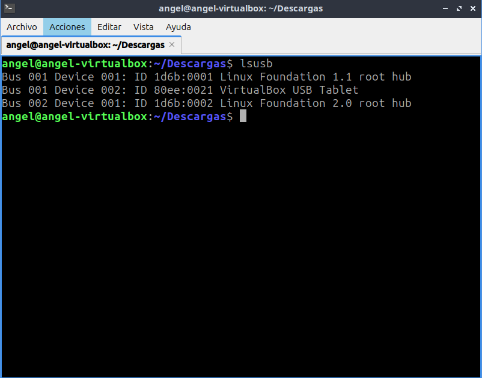

Aqui se supone que este comando muestra los dispositivos USB en mi computadora pero como estoy en una VM lo que me muestra son los controladores de USB de la VM por asi decirlo. Ya que intente conectar una usb la cual si me la reconocia la maquina principal windows pero en la VM de linux no me la reconoce y tampoco el comando de lsusb me lo muestra

- `lspci`: Muestra los dispositivos conectados al bus PCI.

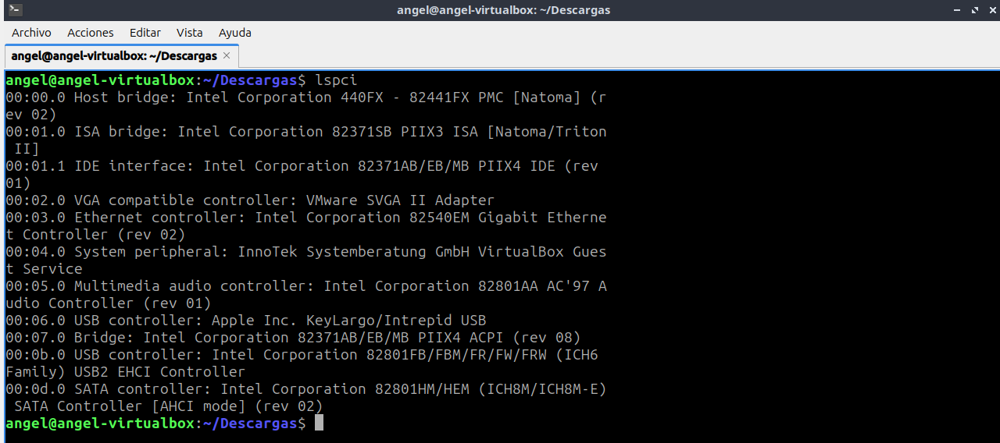

Este comando es curioso ya que como es una VM los dispositivos de PCI tambien son virtuales. Al parecer los primeros numeros muestran el numero del bus
de esos dispositivos luego muestra el tipo de dispositivo y luego el fabricante pero como son virtuales me muestra muchos dispositivos de INTEL aunque yo en mi maquina verdadera tengo Ryzen 

- `dmesg | grep usb`: Muestra los mensajes del kernel relacionados con dispositivos USB.

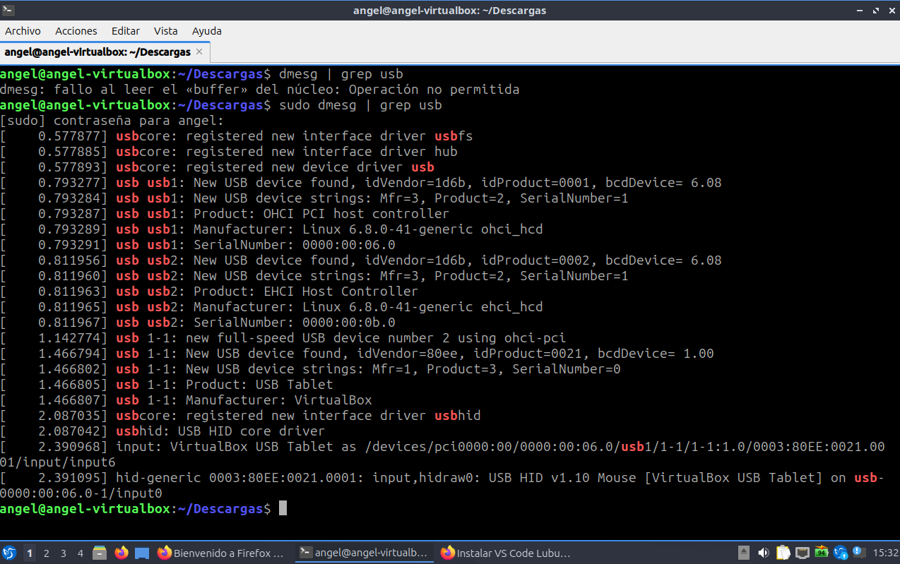

En este comando al principio no me dejaba ejecutarlo como todos los demas 
porque este necesita darle permisos de superusuario por lo que lo ejecute
con la palabra de sudo antes del comando y ya pude hacer que me mostrará la info.

**Conteste:**

- **¿Qué tipos de dispositivos se muestran en la salida de `lsblk`?**
    
    **RESPUESTA:** En mi caso me mostro lo que son los dispositivos de bloque de mi computadora los cuales son los de almacenamiento como los discos duros. Al principio, no entendia el porque me salian muchos dispositivos con el nombre de loop pero despues de buscar en internet a que se referian los loops encontre que no eran como tal dispositivos fisicos sino que son como archivos que el sistema usa
por lo que realmente el unico dispositivo de bloque real que si me muestra es el de sda que es el disco duro de mi maquina virtual el cual tiene un tamaño de 25GB 
  
- **¿Cuál es la diferencia entre `lsusb` y `lspci`?**

    **RESPUESTA:** La diferencia es que lsusb te muestra todo lo que está conectado a los puertos USB, como memorias, teclados, etc. Pero en mi caso, como estoy en una máquina virtual, solo me enseña los controladores USB que la VM emula. En cambio, lspci lista los dispositivos del bus PCI, que suelen ser cosas más internas del hardware como la tarjeta de red o de video. Igual, en mi VM todo esto es virtual, así que me aparecen cosas de Intel, aunque en mi compu real uso Ryzen.

- **¿Qué información adicional proporciona `dmesg | grep usb`?**

    **RESPUESTA:**  Este comando te da más detalles sobre lo que pasa con los dispositivos USB en el sistema, como si conectaste o desconectaste algo.Sirve mucho para ver si un dispositivo lo reconoce o no el sustema. Por ejemplo, intenté meter una USB, pero la VM no la registró, y al usar este comando confirmé que el kernel no detectó ningún evento relacionado con la USB. Así que claramente no pasó nada en la VM.

### **Actividad 2: Verificar dispositivos de almacenamiento**

1. Use el comando `fdisk -l` para listar todos los discos y particiones.
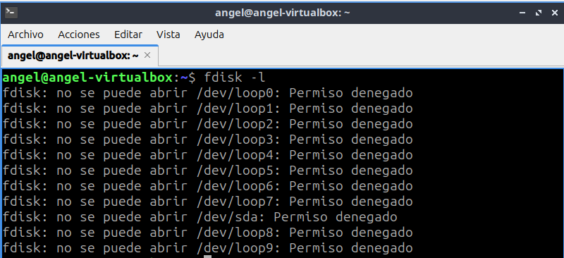

2. Utilice `blkid` para ver los identificadores UUID y los tipos de sistema de archivos.
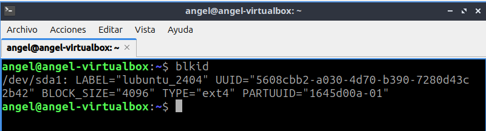

3. Use `df -h` para listar los dispositivos montados y su espacio disponible.
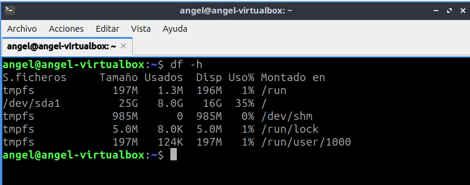

**Conteste:**

- **¿Qué dispositivos de almacenamiento están conectados a su sistema?**

    **RESPUESTA:** En mi sistema el único dispositivo de almacenamiento físico que aparece es el disco principal /dev/sda. Este es el disco virtual de mi máquina virtual y tiene un tamaño total de 25GB. También aparecen varios dispositivos tipo loop, pero estos no son discos reales, sino archivos que el sistema monta como si fueran dispositivos de bloque.

- **¿Qué particiones están montadas actualmente?**

    **RESPUESTA:** Según el comando df -h la partición montada es /dev/sda1 que está montada en la raíz (/) del sistema. También hay particiones temporales (tmpfs) que se usan para cosas como la memoria compartida (/dev/shm) y el sistema de archivos temporal en /run y /run/user/1000.

- **¿Qué tipo de sistemas de archivos se usan en las particiones?**

    **RESPUESTA:** En la partición principal /dev/sda1 el sistema de archivos es ext4, como se puede ver en el comando blkid. Las particiones temporales (tmpfs) usan un sistema de archivos en memoria que no es persistente y está diseñado para datos temporales.

### **Actividad 3: Explorar dispositivos de entradas**
1. Ejecute `cat /proc/bus/input/devices` para listar los dispositivos de entrada.
2. Use `evtest` para monitorear eventos de dispositivos de entrada (requiere permisos de superusuario).
3. Investigue los siguientes dispositivos:
* Teclado
* Mouse
* Controladores USB adicionales
4. Conteste:
* ¿Qué eventos genera cada dispositivo al interactuar con ellos?
* ¿Cómo se identifican los dispositivos en `/proc/bus/input/devices`?

### **Actividad 4: Examinar dispositivos de salida**


1. Use `xrandr` para listar las pantallas conectadas y sus resoluciones.
2. Ejecute `aplay -l` para listar las tarjetas de sonido disponibles.
3. Use `lsof /dev/snd/*` para ver qué procesos están utilizando la tarjeta de sonido.
4. Conteste:
* ¿Qué salidas de video están disponibles en su sistema?
* ¿Qué dispositivos de sonido se detectaron?
* ¿Qué procesos están usando la tarjeta de sonido?

### **Actividad 5: Crear un script de resumen**

1. Cree un archivo llamado `dispositivos.sh` y agregue el siguiente contenido: ```bash #!/bin/bash echo "Dispositivos de bloque:" lsblk echo "Dispositivos USB:" lsusb echo "Dispositivos PCI:" lspci echo "Dispositivos de entrada:" cat /proc/bus/input/devices echo "Salidas de video:" xrandr echo "Tarjetas de sonido:" aplay -l ```
2. Ejecute el script usando `bash dispositivos.sh`.
3. Modifique el script para guardar la salida en un archivo llamado `resumendispositivos.txt`.
4. Conteste:
* ¿Qué ventajas tiene usar un script para recopilar esta información?
* ¿Qué cambios realizaría para personalizar el script?


### **Actividad 6: Reflexión y discusión**

1. Reflexione sobre lo aprendido y discuta en equipo:

* ¿Qué comando encontró más útil y por qué?
* ¿Qué tan importante es conocer los dispositivos conectados al sistema?
* ¿Cómo podrían estos conocimientos aplicarse en la administración de sistemas?


## **Comandos de Entrada y Salida, Discos y Archivos**

### **Ejercicio 1: Montar y Desmontar Discos**

### **Ejercicio 2: Redirección de Entrada y Salida**

### **Ejercicio 3: Copiar y Mover Archivos**

### **Ejercicio 4: Comprimir y Descomprimir Archivos**

### **Ejercicio 5: Permisos y Propiedades de Archivos**

### **Ejercicio 6: Exploración de Dispositivos**

### **Ejercicio 7: Crear y Formatear Particiones**
