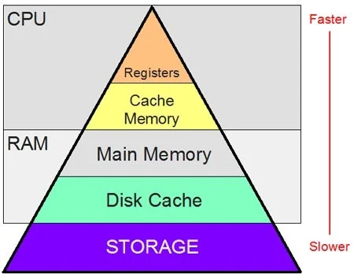
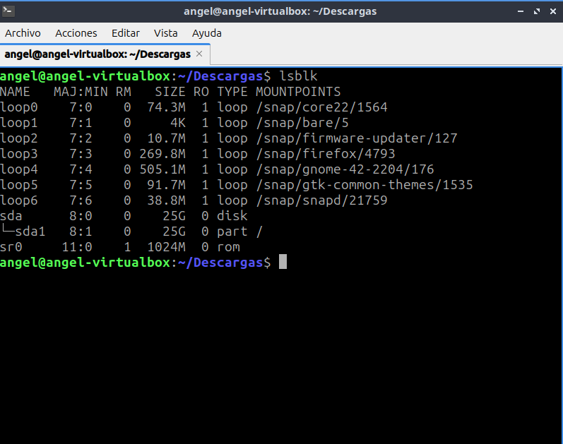

# _Sistemas operativo_

### **Alumno: Gutierrez Ortiz Angel Yahir**

### **Profesor: Jesus Eduardo Alacaraz Chavez**

### **Número de control: 22121318**

---

## **Administración de Memoria**

### **3.1 Política y filosofía**

**1. ¿Cuál es la diferencia entre fragmentación interna y externa? Explica
cómo cada una afecta el rendimiento de la memoria.**

La **fragmentación interna** ocurre cuando el espacio de memoria asignado a un programa es mayor al espacio requerido por ese programa y a este desperdicio de memoria es lo que se conoce como fragmentación interna.


Esta fragmentación afecta el rendimiento de la memoria especialmente si los bloques de paginación son grades ya que el desperdicio de memoria aumenta entre mas tamaño tengan los bloques ya que no importará que tan pequeño sea el programa que se cargue en memoria porque siempre ocupara ese espacio por lo que no es eficiente.

La **fragmentación externa** ocurre cuando hay bloques de memoria libres y estos a su vez son demasiados pequeños para ser utilizados para cargar segmentos más grades.


Sun desventaja que al haber muchos bloques de memoria libres el sistema operativo tarda mas en busca un bloque de memoria adecuado para el segmento que quiere cargar. Otro problema es que para poder unir los bloques de memoria libres y así poder usarlos en segmentos de mayor tamaño hay que realizar métodos de compactación que lo cual es tardado y también consume recursos del sistema.

La principal diferencia entre estas dos fragmentaciones es que la fragmentación interna ocurre cuando se hace paginación de la memoria y se crean bloques o particiones de memoria fija. Mientras que la fragmentación externa ocurre cuando se utiliza segmentación en la cual el programa de divide en varios segmentos de tamaños diferentes y cuando alguno de estos segmentos se libera es cuando ocurre esta fragmentación.

Ademas, no puede ocurrir fragmentación externa en la paginación porque los bloques de memoria son dinámicos y por lo mismo no puede ocurrir fragmentación interna en la segmentación.

**2. Investiga y explica las políticas de reemplazo de páginas en sistemas operativos. ¿Cuál consideras más eficiente y por qué?**

-     **NRU (Not Recently Used)**

  El algoritmo LRU selecciona para eliminación una página de la clase con el número más bajo, ya que estas representan las menos utilizadas. Este enfoque asegura que las páginas que se usan con frecuencia permanezcan en memoria, evitando recargas innecesarias y ahorrando tiempo.

  Para implementar este algoritmo, el sistema operativo utiliza dos bits de control en la tabla de páginas que le permiten determinar cuáles páginas han sido usadas recientemente. Estos bits son:

  **R (Referenced)**: Indica si la página ha sido referenciada anteriormente.

  **M (Modified)**: Indica si la página ha sido modificada.

  Cuando ocurre un fallo de página, que es cuando se intenta acceder a una pagina que no esta en la memoria principal, el sistema revisa las páginas que ya están cargadas en memoria y las clasifica en cuatro categorías según los valores de los bits R y M:

  Clase 0: La página no ha sido referenciada ni modificada.

  Clase 1: La página no ha sido referenciada, pero sí modificada.

  Clase 2: La página ha sido referenciada, pero no modificada.

  Clase 3: La página ha sido referenciada y modificada.

  Cuando se necesita reemplazar una página, el algoritmo da prioridad a las de clase 0, ya que son las menos importantes en términos de uso y cambios realizados por lo que son las que reemplaza primero.

- **Primera en entrar, primera en salir (FIFO)**

  En este algoritmo se elimina la página que más tiempo lleva en memoria y elimina al al último la que menos tiempo lleve. Para esto el sistema operativo usa una cola en la en las que las nuevas paginas se van hasta el final para que se tenga un orden.

  El problema de este algoritmo es que no toma en cuenta si la pagina que va a borrar es importante porque sea usada constantemente.

- **Segunda oportunidad**

  Este algoritmo funciona casi igual que el algoritmo de FIFO con la diferencia de que este tiene un bit R como en el algoritmo de NRU, y que usa para verificar si la pagina fue referenciada o usada recientemente. En el caso de que el bit R sea 0 la pagina se borra inmediatamente, pero en el caso de que el bit sea 1 la página pasa hasta al final de la cola y su bit R se reinicia a 0.
  Un ejemplo de este algoritmo es la siguiente imagen:

  

  Lo que busca este este algoritmo es eliminar el problema de FIFO al tomar en cuenta si las paginas han sido utilizadas o referenciadas en un intervalo de reloj. En el caso de que todas las paginas tengan el bit R igual a 1, es decir que han sido referenciadas en el ultimo intervalo, el algoritmo se convierte en un FIFO normal en el que no toma en cuenta el bit R.

- **Algoritmo de Reloj**

  Este algoritmo es similar al de la segunda oportunidad, pero en vez de una cola se hace con una lista circular en forma de reloj en la que la manecilla del reloj apunta a la pagina mas antigua a eliminar. En este algoritmo también se toma en cuenta el bit R siguiendo la misma lógica de la segunda oportunidad, si es 0 se elimina y si es 1 se cambia el bit a 0 y la manecilla se mueve a la siguiente página con más tiempo en memoria.

  

- **Menos usadas recientemente (LRU)**

  En el RLU toma en cuenta que las páginas que más se han utilizado recientemente es mas probable que se utilicen en un futuro y las que menos se han utilizado lo mas probable es que sigan si utilizarse a futuro. Entonces lo que este algoritmo hace es eliminar la página que ha pasado más tiempo sin ser utilizada.

  Para hacer esto el algoritmo utiliza una lista enlazada de todas las paginas cargadas en memoria con la página de uso más reciente en la parte de adelante y la de uso menos reciente en la parte final. El mayor problema de este algoritmo es que es costoso y complejo porque se tiene que actualizar la lista enlazada cada que se referencia alguna pagina ya que se debe buscar la página, eliminarla y mover todas las demás paginas por lo que lleva mucho tiempo de procesamiento.

  **¿Cuál consideras más eficiente y por qué?**

  Si bien considero que ninguno de los algoritmos es perfecto porque cada uno tiene sus propios problemas si me inclino mas por el algoritmo de **LRU** creo que tiene un buen enfoque de eliminacion de pagina basado en la pagina menos usada frecuentemente ya que de esta forma se evita eliminar paginas importantes para el proceso lo que es mas eficiente ya que de esta forma no se generan tantos fallos de pagina en los que se tenga que reemplazar por lo que ahorra muchos recursos al SO.

---

### **3.2 Memoria Real**

#### **1. Escribe un programa en C o Python que simule la administración de memoria mediante particiones fijas.**

```c
   #include <stdio.h>

   // estructura de un proceso con id y tamaño
   typedef struct _nodo
   {
       int id;
       int tamaño;

   } nodo;

   void asignarProceso(int numProceso, int tamProceso, int length, nodo particiones[])
   {
       int bandera = 0; // Bandera para comprobar si hay alguna particion con el espacio suficiente para asignar un proceso.
       printf("\nIngresa el id del proceso: ");
       scanf("%d", &numProceso);

       printf("\nIngresa el tamaño del proceso: ");
       scanf("%d", &tamProceso);

       for (int i = 0; i < length; i++)
       {
           if (tamProceso <= particiones[i].tamaño && particiones[i].id == -1 && bandera == 0)
           {
               particiones[i].id = numProceso;
               printf("Se asigno el proceso %d a la particion %d \n\n", particiones[i].id, i + 1);
               bandera = 1;
           }
       }

       if (!bandera)
       {
           printf("\nNo hay espacio en memoria suficiente para asignar\n\n");
       }
   }

   void eliminarProceso(int length, nodo particiones[])
   {
       int memoriaLibre = 1;
       for (int i = 0; i < length; i++)
       {
           if (particiones[i].id != -1)
           {
               memoriaLibre = 0;
               break;
           }
       }
       if (memoriaLibre)
       {
           printf("No hay procesos cargados en memoria.\n");
       }

       int numProceso;
       int bandera; // bandera para verificar si hay un proceso en memoria con ese id
       printf("\nIngresa el id del proceso:");
       bandera = 0;
       scanf("%d", &numProceso);
       for (int i = 0; i < length; i++)
       {
           if (particiones[i].id == numProceso)
           {
               int aux = particiones[i].id;
               particiones[i].id = -1;
               printf("Se libero el proceso con id %d de la partición %d", aux, i + 1);
               bandera = 1;
               break;
           }
       }

       if (!bandera)
       {
           printf("No hay proceso con el id ingresado. Intente de nuevo \n\n");
       }
   }

   void mostrarMemoria(int length, nodo particiones[])
   {
       for (int i = 0; i < length; i++)
       {
           if (particiones[i].id != -1)
           {
               printf("\nLa partición %d esta ocupada por el proceso %d\n\n", i + 1, particiones[i].id);
           }
           else
           {
               printf("La particion %d esta desocupada\n\n", i + 1);
           }
       }
   }

   int main()
   {
       int eleccion = 0, maxMemoria = 0, numParticiones = 0, numProceso = 0, tamProceso = 0, tamTotal = 0, tamParticion = 0;

       printf("Ingresa el tamaño de la memoria: (KB): ");
       scanf("%d", &maxMemoria);

       printf("Ingrese la cantidad de particiones:");
       scanf("%d", &numParticiones);

       nodo particiones[numParticiones];                          // arreglo de particiones fijas que simula la memoria
       int length = sizeof(particiones) / sizeof(particiones[0]); // length del arreglo

       int bandera = 0;
       do
       {
           tamTotal = 0;
           printf("\nIngresa el tamaño que tendran las particiones (KB): ");
           scanf("%d", &tamParticion);

           for (int i = 0; i < numParticiones; i++) // guarda en cada una de las particiones el mismo tamaño de particiones
           {
               particiones[i].id = -1;
               particiones[i].tamaño = tamParticion;
               tamTotal += particiones[i].tamaño;
           }

           if (tamTotal > maxMemoria)
           {
               printf("\nEl tamaño fijo de todas las particiones(%d KB) es mayor al tamaño maximo de memoria(%d KB). Por favor ingresa un tamaño fijo para las particiones menor.\n\n", tamTotal, maxMemoria);
           }
           else
           {
               bandera = 1;
           }
       } while (bandera == 0);

       printf("La memoria fisica tendrá un tamaño de %d KB divido en %d particiones de %d KB\n", maxMemoria, numParticiones, tamParticion);
       while (eleccion != 4)
       {
           printf("       ||MENU||      ");
           printf("\n1.- Asignar proceso");
           printf("\n2.- Liberar proceso");
           printf("\n3.- Mostrar estado de la memoria\n\n");
           printf("\n4.- Salir\n\n");
           printf("Opción:");
           scanf("%d", &eleccion);

           switch (eleccion)
           {
           case 1:
               asignarProceso(numProceso, tamProceso, length, particiones);
               break;
           case 2:
               eliminarProceso(length, particiones);
               break;
           case 3:
               mostrarMemoria(length, particiones);
               break;
           case 4:
               break;
           default:
               break;
           }
       }

       return 0;
   }
```

#### **2. Diseña un algoritmo para calcular qué procesos pueden ser asignados a un sistema con memoria real limitada utilizando el algoritmo de "primera cabida"**

    1. INICIO
    2. Leer el tamaño total de la memoria física.
    3. Leer el tamaño de los bloques de cada partición.
    4. Leer el tamaño total del proceso a asignar a memoria.
    5. Buscar entre todos las particiones el tamaño de bloque que sea  suficientemente grande para asignar el proceso que se quiere cargar.
    6. Si se encuentra una partición, verificar si está ocupada o libre.
    7. Si esta libre, cargar el proceso en memoria y marcar el bloque como ocupado
        Si está ocupada, seguir buscando.
    8. Si no hay ningún bloque con el espacio disponible, no cargar el proceso.
    9. FIN

### **3.3 Organización de memoria virtual**

#### **1. Investiga y explica el concepto de "paginación" y "segmentación". ¿Cuáles son las ventajas y desventajas de cada técnica?**

#### **Paginación.**

La paginación es una técnica que se utiliza para asignar memoria en la que la memoria física se divide en bloques del mismo tamaño llamados marcos de página mientras que los procesos a asignar también se dividen en bloques del mismo tamaño llamados página. Esta técnica ayuda a reducir la fragmentación interna y externa ya que no se necesita que las páginas del proceso a cargar se asignen de manera continua dentro de la memoria.


Por ejemplo, en la imagen de arriba el proceso a ser cargado en memoria es dividido en 4 páginas que después son asignadas a cada marco de pagina de la memoria sin necesidad que cada pagina este de forma continua.

Para que el sistema operativo pueda saber que paginas están asignadas en memoria para cada proceso activo necesita de una tabla de páginas. Esta tabla de paginas es diferente para cada proceso activo e indica que paginas están activas y en que marco de pagina dentro de la memoria.

**Ventajas**

Una de sus ventajas es que no se necesita tener todas las páginas del proceso activo cargadas en memoria para que este se este ejecutando, sino que se pueden cargar solo las paginas que están siendo usadas en ese momento y cuando se requiera código de una pagina que no esta cargada reemplazar la nueva pagina por una que no se este usando dentro de la memoria activa.

Otra ventaja de esta técnica es que se elimina la fragmentación externa esto porque cada marco de pagina se puede asignar a un proceso diferente y no se necesita que las paginas estén cargadas de forma continua.

**Desventajas**

Una desventaja es que la fragmentación interna sigue existiendo, aunque sea mínima. Esta fragmentación normalmente se da en el ultimo marco de pagina asignado a un proceso solo si la memoria que ocupa el proceso no es un múltiplo entero del tamaño de la página. Por ejemplo, si el tamaño de la pagina es de 4KB y la memoria que necesita es 3.5 KB el resto quedara sin utilizarse.

Los fallos de pagina tambien podrian representar una desventaja porque dependiendo la tecnica que se utilice para llevar el reemplazo de la pagina pueden ser muy complejos y pueden consumir mucho tiempo y recursos del sistema a esta realizado operaciones de E/S cada que se reemplaza una página por lo que esto generaría que el sistema operativo baje su rendimiento.

#### **Segmentación.**

La segmentación es una técnica que se utiliza para gestionar la memoria, esta lo que hace es dividir un proceso en segmentos lógicos. En este caso, la principal diferencia entre la paginación es que los segmentos son de diferentes tamaños y no de un mismo tamaño fijo.

**Ventajas**
La principal ventaja de la segmentación es que ya no se trabaja con un solo espacio de direcciones para proceso, sino que cada segmento del proceso tiene su propio espacio de direcciones independiente uno del otro lo que le permite cambiar aumentar o disminuir su espacio de direcciones si se necesita.


Por ejemplo, en esta imagen se muestra los segmentos de un compilador los cuales tienen un tamaño variable independiente de cada uno. Esto ayuda bastante ya que si un programa fuera muy complejo y tuviera muchas estructuras de control podría necesitar un espacio de direcciones más grande del que se le asigno y podría toparse con el espacio de direcciones de otro proceso lo que podría ocasionar problemas. Esto no pasa con la segmentación precisamente porque cada segmento tiene su propio espacio de direcciones por lo que sería muy difícil que un proceso accede a las direcciones de otro al poder variar su longitud.

Otra ventaja gran ventaja es que el proceso al ser segmentado puede tener varios niveles de protección dependiendo del segmento, se puede especificar si cierto segmento solo es de lectura, de escritura, de ejecución, etc. Lo que ayuda mucho a la seguridad del proceso.

**Desventajas**

La principal desventaja de la segmentación es que puede generar fragmentación externa en la que se generan huecos de memoria libre entre cada segmento cuando este se libera de la memoria y si en estos huecos de memoria no puede ser asignado un nuevo proceso, ya que el proceso necesita más espacio, la única forma de utilizar estos huecos seria uniéndolos o compactándolos, pero este proceso es muy tardado y consume muchos recursos del sistema operativo.

#### **2. Escribe un programa que simule una tabla de páginas para procesos con acceso aleatorio a memoria virtual.**

```c
    #include <stdio.h>
    #include <stdlib.h>

    #define MAX_PROCESOS 20

    int numProcesos;

    typedef struct Marco
    {
        int numMarco;
        int libre;
        int procesoID;
        int paginaID;
        int tiempoUso;
    } Marco;

    typedef struct Pagina
    {
        int numMarco;
        int referencia;
        int modificado;
        int presente;
        int pagina;
    } Pagina;

    typedef struct Proceso
    {
        int id;
        int tamaño;
        int paginas;
        Pagina *tablaPaginas;
    } Proceso;

    void crearProceso(Proceso procesos[], int tamMarco)
    {
        if (numProcesos >= MAX_PROCESOS)
        {
            printf("Error: no se pueden crear más procesos.\n");
            return;
        }

        Proceso *nuevo = &procesos[numProcesos];
        numProcesos++;
        printf("Ingresa el ID del proceso: ");
        scanf("%d", &nuevo->id);
        printf("Ingresa el tamaño del proceso: ");
        scanf("%d", &nuevo->tamaño);

        nuevo->paginas = (nuevo->tamaño + tamMarco - 1) / tamMarco;
        nuevo->tablaPaginas = (Pagina*)calloc(nuevo->paginas, sizeof(Pagina));

        for (int i = 0; i < nuevo->paginas; i++)
        {
            nuevo->tablaPaginas[i].numMarco = -1;
            nuevo->tablaPaginas[i].presente = 0;
            nuevo->tablaPaginas[i].referencia = 0;
            nuevo->tablaPaginas[i].modificado = 0;
            nuevo->tablaPaginas[i].pagina = i;
        }

        printf("Proceso creado con ID %d y %d páginas.\n", nuevo->id, nuevo->paginas);
    }


    void asignarPagina(Proceso procesos[], Marco memoria[], int numMarcos)
    {
        int id, pagina;
        printf("Ingresa el ID del proceso: ");
        scanf("%d", &id);
        printf("Ingresa la página a acceder(de 0 a n): ");
        scanf("%d", &pagina);

        for (int i = 0; i < numProcesos; i++)
        {
            if (procesos[i].id == id)
            {
                if (pagina >= procesos[i].paginas)
                {
                    printf("Error: la página %d no existe.\n", pagina);
                    return;
                }

                if (procesos[i].tablaPaginas[pagina].presente)
                {
                    printf("La página %d ya está en memoria (marco %d).\n",
                        pagina, procesos[i].tablaPaginas[pagina].numMarco);
                    return;
                }

                for (int j = 0; j < numMarcos; j++)
                {
                    if (memoria[j].libre)
                    {
                        memoria[j].libre = 0;
                        memoria[j].procesoID = id;
                        memoria[j].paginaID = pagina;

                        procesos[i].tablaPaginas[pagina].numMarco = j;
                        procesos[i].tablaPaginas[pagina].presente = 1;

                        printf("Página %d del proceso %d cargada en el marco %d.\n", pagina, id, j);
                        return;
                    }
                }

                printf("Fallo de página: no hay marcos disponibles. Se usuará el algoritmo de LRU para reemplazar la pagina\n");


                return;
            }
        }

        printf("Error: proceso no encontrado.\n");
    }

    void eliminarPagina(Proceso procesos[], Marco memoria[], int numMarcos)
    {

        int id, pagina;
        printf("Ingresa el ID del proceso: ");
        scanf("%d", &id);
        printf("Ingresa la página a eliminar(de 0 a n): ");
        scanf("%d", &pagina);

        for (int i = 0; i < numProcesos; i++)
        {
            if (procesos[i].id == id)
            {
                if (pagina >= procesos[i].paginas)
                {
                    printf("Error: la página %d no existe.\n", pagina);
                    return;
                }

                if (procesos[i].tablaPaginas[pagina].presente)
                {
                    memoria[procesos[i].tablaPaginas[pagina].numMarco].libre = 1;
                    procesos[i].tablaPaginas[pagina].numMarco = -1;
                    procesos[i].tablaPaginas[i].presente = 0;
                    procesos[i].tablaPaginas[i].referencia = 0;
                    procesos[i].tablaPaginas[i].modificado = 0;
                    printf("Se elimino la pagina exitosamente.");
                    return;
                }
                else
                {
                    printf("\nError la pagina %d no esta cargada en memoria. Debes cargarla primero para poder eliminarla",pagina);
                    return;
                }
            }
        }

        printf("Error: proceso no encontrado.\n");
    }

    void mostrarMemoria(Marco memoria[], int numMarcos)
    {
        printf("\nEstado de la memoria física:\n");
        for (int i = 0; i < numMarcos; i++)
        {
            if (memoria[i].libre)
            {
                printf("Marco %d: Libre\n", i);
            }
            else
            {
                printf("Marco %d: Proceso %d, Página %d\n", i, memoria[i].procesoID, memoria[i].paginaID);
            }
        }
    }

    int main()
    {
        Proceso procesos[MAX_PROCESOS];
        int contador = 0;

        int tamMemoria, tamMarco;
        printf("Ingresa el tamaño de la memoria (KB): ");
        scanf("%d", &tamMemoria);
        printf("Ingresa el tamaño del marco de página (KB): ");
        scanf("%d", &tamMarco);

        int numMarcos = tamMemoria / tamMarco;
        Marco memoria[numMarcos];

        for (int i = 0; i < numMarcos; i++)
        {
            memoria[i].numMarco = i;
            memoria[i].libre = 1;
        }

        int eleccion;
        do
        {
            printf("\n1. Crear proceso\n2. Asignar pagina a memoria\n3. Eliminar pagina de memoria\n4. Mostrar estado de memoria\n5.-Salir\nOpción: ");
            scanf("%d", &eleccion);

            switch (eleccion)
            {
            case 1:
                crearProceso(procesos, tamMarco);
                break;
            case 2:
                asignarPagina(procesos, memoria, numMarcos);
                break;
            case 3:
                eliminarPagina(procesos, memoria, numMarcos);
                break;
            case 4:
                mostrarMemoria(memoria, numMarcos);
                break;
            case 5:
                printf("Saliendo...\n");
                break;
            default:
                printf("No existe esa opcion.\n");
            }
        } while (eleccion != 5);

        return 0;
    }
```

### **3.4 Administración de memoria virtual**

#### **1. Escribe un código que implemente el algoritmo de reemplazo de página "Least Recently Used" (LRU).**

```c
#include <stdio.h>
#include <stdlib.h>

#define MAX_PROCESOS 20

int numProcesos;

typedef struct Marco
{
   int numMarco;
   int libre;
   int procesoID;
   int paginaID;
   int tiempoUso;
} Marco;

typedef struct Pagina
{
   int numMarco;
   int referencia;
   int modificado;
   int presente;
   int pagina;
} Pagina;

typedef struct Proceso
{
   int id;
   int tamano;
   int paginas;
   Pagina *tablaPaginas;
} Proceso;

void crearProceso(Proceso procesos[], int tamMarco)
{
   if (numProcesos >= MAX_PROCESOS)
   {
       printf("Error: no se pueden crear más procesos.\n");
       return;
   }

   Proceso *nuevo = &procesos[numProcesos];
   numProcesos++;
   printf("Ingresa el ID del proceso: ");
   scanf("%d", &nuevo->id);
   printf("Ingresa el tamaño del proceso: ");
   scanf("%d", &nuevo->tamano);

   nuevo->paginas = (nuevo->tamano + tamMarco - 1) / tamMarco;
   nuevo->tablaPaginas = (Pagina*)calloc(nuevo->paginas, sizeof(Pagina));

   for (int i = 0; i < nuevo->paginas; i++)
   {
       nuevo->tablaPaginas[i].numMarco = -1;
       nuevo->tablaPaginas[i].presente = 0;
       nuevo->tablaPaginas[i].referencia = 0;
       nuevo->tablaPaginas[i].modificado = 0;
       nuevo->tablaPaginas[i].pagina = i;
   }

   printf("Proceso creado con ID %d y %d páginas.\n", nuevo->id, nuevo->paginas);
}

void asignarPagina(Proceso procesos[], Marco memoria[], int numMarcos)
{
   int id, pagina;
   printf("Ingresa el ID del proceso: ");
   scanf("%d", &id);
   printf("Ingresa la página a acceder (de 0 a n): ");
   scanf("%d", &pagina);

   for (int i = 0; i < numProcesos; i++)
   {
       if (procesos[i].id == id)
       {
           if (pagina >= procesos[i].paginas)
           {
               printf("Error: la página %d no existe.\n", pagina);
               return;
           }

           if (procesos[i].tablaPaginas[pagina].presente)
           {
               printf("La página %d ya está en memoria (marco %d).\n",
                      pagina, procesos[i].tablaPaginas[pagina].numMarco);

               for (int j = 0; j < numMarcos; j++)
               {
                   if (!memoria[j].libre)
                   {
                       memoria[j].tiempoUso++;
                   }
               }

               memoria[procesos[i].tablaPaginas[pagina].numMarco].tiempoUso = 0;
               return;
           }

           for (int j = 0; j < numMarcos; j++)
           {
               if (memoria[j].libre)
               {
                   memoria[j].libre = 0;
                   memoria[j].procesoID = id;
                   memoria[j].paginaID = pagina;
                   memoria[j].tiempoUso = 0;

                   procesos[i].tablaPaginas[pagina].numMarco = j;
                   procesos[i].tablaPaginas[pagina].presente = 1;

                   for (int k = 0; k < numMarcos; k++)
                   {
                       if (!memoria[k].libre)
                       {
                           memoria[k].tiempoUso++;
                       }
                   }

                   printf("Página %d del proceso %d cargada en el marco %d.\n", pagina, id, j);
                   return;
               }
           }

           printf("Fallo de página: no hay marcos disponibles. Se usará el algoritmo de LRU para reemplazar la página\n");

           int minUso = memoria[0].tiempoUso;
           int minIndex = 0;

           for (int j = 1; j < numMarcos; j++)
           {
               if (memoria[j].tiempoUso < minUso)
               {
                   minUso = memoria[j].tiempoUso;
                   minIndex = j;
               }
           }

           printf("Reemplazando la página %d del proceso %d en el marco %d.\n", memoria[minIndex].paginaID, memoria[minIndex].procesoID, minIndex);
           memoria[minIndex].procesoID = id;
           memoria[minIndex].paginaID = pagina;
           memoria[minIndex].tiempoUso = 0;

           procesos[i].tablaPaginas[pagina].numMarco = minIndex;
           procesos[i].tablaPaginas[pagina].presente = 1;
           return;
       }
   }

   printf("Error: proceso no encontrado.\n");
}

void eliminarPagina(Proceso procesos[], Marco memoria[], int numMarcos)
{
   int id, pagina;
   printf("Ingresa el ID del proceso: ");
   scanf("%d", &id);
   printf("Ingresa la página a eliminar (de 0 a n): ");
   scanf("%d", &pagina);

   for (int i = 0; i < numProcesos; i++)
   {
       if (procesos[i].id == id)
       {
           if (pagina >= procesos[i].paginas)
           {
               printf("Error: la página %d no existe.\n", pagina);
               return;
           }

           if (procesos[i].tablaPaginas[pagina].presente)
           {
               memoria[procesos[i].tablaPaginas[pagina].numMarco].libre = 1;
               procesos[i].tablaPaginas[pagina].numMarco = -1;
               procesos[i].tablaPaginas[i].presente = 0;
               procesos[i].tablaPaginas[i].referencia = 0;
               procesos[i].tablaPaginas[i].modificado = 0;
               printf("Se elimino la pagina exitosamente.");
               return;
           }
           else
           {
               printf("\nError la pagina %d no esta cargada en memoria. Debes cargarla primero para poder eliminarla",pagina);
               return;
           }
       }
   }

   printf("Error: proceso no encontrado.\n");
}

void mostrarMemoria(Marco memoria[], int numMarcos)
{
   printf("\nEstado de la memoria física:\n");
   for (int i = 0; i < numMarcos; i++)
   {
       if (memoria[i].libre)
       {
           printf("Marco %d: Libre\n", i);
       }
       else
       {
           printf("Marco %d: Proceso %d, Página %d, Tiempo de uso: %d\n", i, memoria[i].procesoID, memoria[i].paginaID, memoria[i].tiempoUso);
       }
   }
}

int main()
{
   Proceso procesos[MAX_PROCESOS];
   int contador = 0;
   printf("NOTA: El numero de marcos se calculará de forma automatica(tamaño de la memoria / tamaño de marco).\n");
   printf("NOTA: Cada que se asigna una pagina, el tiempo de uso de las otras paginas ya cargadas en la RAM tambien aumenta.\n");
   int tamMemoria, tamMarco;
   printf("\nIngresa el tamaño de la memoria (KB): ");
   scanf("%d", &tamMemoria);
   printf("Ingresa el tamaño del marco de página (KB): ");
   scanf("%d", &tamMarco);

   int numMarcos = tamMemoria / tamMarco;
   Marco memoria[numMarcos];

   for (int i = 0; i < numMarcos; i++)
   {
       memoria[i].numMarco = i;
       memoria[i].libre = 1;
   }

   int eleccion;
   do
   {
       printf("\n1. Crear proceso\n2. Asignar pagina a memoria\n3. Eliminar pagina de memoria\n4. Mostrar estado de memoria\n5.-Salir\nOpción: ");
       scanf("%d", &eleccion);

       switch (eleccion)
       {
       case 1:
           crearProceso(procesos, tamMarco);
           break;
       case 2:
           asignarPagina(procesos, memoria, numMarcos);
           break;
       case 3:
           eliminarPagina(procesos, memoria, numMarcos);
           break;
       case 4:
           mostrarMemoria(memoria, numMarcos);
           break;
       case 5:
           printf("Saliendo...\n");
           break;
       default:
           printf("No existe esa opcion.\n");
       }
   } while (eleccion != 5);

   return 0;
}

```

#### **Diseña un diagrama que represente el proceso de traducción de direcciones virtuales a físicas en un sistema con memoria virtual.**


### **Integración**

#### **1. Analiza un sistema operativo moderno (por ejemplo, Linux o Windows) e identifica cómo administra la memoria virtual.**

En Linux, la administración de la memoria virtual se basa principalmente en la paginación por demanda, lo que significa que un proceso no necesita cargar todas sus páginas en memoria para ejecutarse. Las páginas se cargan conforme son necesarias, optimizando el uso de recursos.

Para el reemplazo de páginas, Linux utiliza el algoritmo PFRA (Page Frame Reclaiming Algorithm). Este algoritmo clasifica las páginas en cuatro tipos: no reclamables, intercambiables, sincronizarles y descartables. El objetivo de este enfoque es mantener marcos de página libres para que cualquier proceso pueda utilizarlos cuando lo necesite.

En cuanto al direccionamiento, Linux utiliza direcciones virtuales y físicas. Las direcciones virtuales son usadas por los procesos de usuario, mientras que las físicas son utilizadas por el núcleo. La traducción entre ambos tipos de direcciones se realiza mediante un esquema de tablas de paginación de tres niveles, compuesto por el directorio de páginas, el directorio intermedio de páginas y la tabla de páginas.
En este sistema, una dirección virtual se divide en cuatro partes: los tres primeros componentes son índices para las tres tablas, y el último es un desplazamiento que apunta al marco en la memoria física.


En esta imagen, la dirección virtual la divide en 4 partes, donde las 3 partes son los índices de cada tabla y cada tabla lo que hace es apuntar a la página de la siguiente tabla hasta llegar al marco de página en la memoria física. Esta forma de direccionamiento lo que le permite a Linux es que las tablas de páginas sean independientes de la arquitectura del equipo.

Además, el manejo de memoria incluye un sistema eficiente para liberar y reasignar marcos mediante el algoritmo del compañero, que combina o divide bloques de marcos contiguos según las necesidades. También existe un demonio de paginación que trabaja en segundo plano, liberando marcos de memoria cuando el sistema alcanza ciertos umbrales críticos, utilizando el algoritmo del reloj para determinar qué páginas liberar.

También, el manejo de memoria incluye un sistema eficiente para liberar y reasignar marcos mediante el algoritmo del compañero, que combina o divide bloques de marcos contiguos según las necesidades.
Otra implementación de Linux es que existe un demonio de paginación que trabaja en segundo plano, liberando marcos de memoria cuando el sistema alcanza ciertos umbrales críticos, utilizando el algoritmo del reloj para determinar qué páginas liberar.

#### **2. Realiza una simulación en cualquier lenguaje de programación que emule el swapping de procesos en memoria virtual.**

```c
#include <stdio.h>
#include <stdlib.h>
#include <time.h>

#define tamanoMemoria 50
#define procesosMaximos 500
#define numeroMarcos 5

int contador = 0;

typedef struct Proceso
{
   int id;
   int tamMemoria;
} Proceso;

typedef struct Marco
{
   int numMarco;
   int libre;
   int procesoID;
} Marco;

Marco memoriaPrincipal[numeroMarcos];
Marco memoriaSecundaria[numeroMarcos];
Proceso procesos[procesosMaximos];

void inicializar()
{
   for (int i = 0; i < numeroMarcos; i++)
   {
       memoriaPrincipal[i].numMarco = i;
       memoriaPrincipal[i].libre = 1;
       memoriaSecundaria[i].numMarco = i;
       memoriaSecundaria[i].libre = 1;
   }
}

void intercambioFIFO()
{
   int procesoASwapear = memoriaPrincipal[0].procesoID;

   if (procesoASwapear == 0)
   {
       printf("\nNo hay procesos para intercambiar.\n");
       return;
   }

   for (int i = 0; i < numeroMarcos; i++)
   {
       if (memoriaSecundaria[i].libre)
       {
           memoriaSecundaria[i].procesoID = procesoASwapear;
           memoriaSecundaria[i].libre = 0;
           printf("\nProceso %d intercambiado a memoria secundaria (Marco %d).\n", procesoASwapear, memoriaSecundaria[i].numMarco);
           break;
       }
   }

   for (int i = 0; i < numeroMarcos - 1; i++)
   {
       memoriaPrincipal[i] = memoriaPrincipal[i + 1];
       memoriaPrincipal[i].numMarco = i;
   }

   memoriaPrincipal[numeroMarcos - 1].libre = 1;
   memoriaPrincipal[numeroMarcos - 1].procesoID = 0;
   memoriaPrincipal[numeroMarcos - 1].numMarco = numeroMarcos - 1;

   printf("\nMemoria principal ajustada tras el intercambio.\n");
}

void asignarProceso()
{
   if (contador >= procesosMaximos)
   {
       printf("\nError: No se pueden asignar más procesos a la memoria. Iniciando intercambio (Swapping) de procesos por FIFO...\n");
   }
   else
   {
       for (int i = 0; i < numeroMarcos; i++)
       {
           if (memoriaPrincipal[i].libre == 1)
           {
               memoriaPrincipal[i].procesoID = procesos[contador].id;
               memoriaPrincipal[i].libre = 0;
               printf("\nSe cargó el proceso %d en el marco %d.\n", memoriaPrincipal[i].procesoID, memoriaPrincipal[i].numMarco);
               return;
           }
       }
       printf("\nMemoria RAM llena. Iniciando proceso de swapping...\n");
       intercambioFIFO();
       asignarProceso();
   }
}

void creaProceso()
{
   if (contador >= procesosMaximos)
   {
       printf("\nNo se pueden crear más procesos. Límite alcanzado.\n");
       return;
   }

   Proceso nuevo;
   nuevo.id = contador + 1;
   nuevo.tamMemoria = rand() % 101 + 10;

   procesos[contador] = nuevo;
   printf("\nProceso creado: ID %d, Tamaño %d.\n", nuevo.id, nuevo.tamMemoria);
   asignarProceso();
   contador++;
}

void mostrarMemoria(int control)
{
   if (control == 1)
   {
       printf("\nMemoria Principal:\n");
       for (int i = 0; i < numeroMarcos; i++)
       {
           if (memoriaPrincipal[i].libre)
           {
               printf("Marco %d: Libre\n", memoriaPrincipal[i].numMarco);
           }
           else
           {
               printf("Marco %d: Proceso %d\n", memoriaPrincipal[i].numMarco, memoriaPrincipal[i].procesoID);
           }
       }
   }
   else
   {
       printf("\nMemoria Secundaria:\n");
       for (int i = 0; i < numeroMarcos; i++)
       {
           if (memoriaSecundaria[i].libre)
           {
               printf("Marco %d: Libre\n", memoriaSecundaria[i].numMarco);
           }
           else
           {
               printf("Marco %d: Proceso %d\n", memoriaSecundaria[i].numMarco, memoriaSecundaria[i].procesoID);
           }
       }
   }
}

int main()
{
   srand(time(NULL));
   inicializar();

   int eleccion;

   do
   {
       printf("\n\n    || MENU ||\n");
       printf("1.- Generar proceso\n");
       printf("2.- Mostrar estado de memoria principal\n");
       printf("3.- Mostrar estado de memoria secundaria\n");
       printf("4.- Salir\n");
       printf("Elección: ");
       scanf("%d", &eleccion);

       switch (eleccion)
       {
       case 1:
           creaProceso();
           break;
       case 2:
           mostrarMemoria(1);
           break;
       case 3:
           mostrarMemoria(0);
           break;
       case 4:
           printf("Saliendo...\n");
           break;
       default:
           printf("No existe esa opción.\n");
       }

   } while (eleccion != 4);

   return 0;
}

```

## **Administración de Entrada/Salida**

### **4.1 Dispositivos y manejadores de dispositivos**

#### **1. Explica la diferencia entre dispositivos de bloque y dispositivos de carácter. Da un ejemplo de cada uno.**

**Dispositivos de bloque**

Un dispositivo de bloque almacena información en bloques de tamaño fijo, donde cada bloque tiene su propia dirección. La principal característica de este tipo de dispositivo de entrada/salida (E/S) es que permite leer y escribir información de manera independiente a la posición de los bloques, lo que lo hace muy flexible para el acceso directo a los datos.
El sistema operativo utiliza dispositivos de bloque principalmente para almacenar información.

Ejemplos:

- Discos duros (HDD)
- Unidades de estado sólido (SSD)
- Memorias USB

**Dispositivos de caracter**

Un dispositivo de carácter procesa datos como flujos de caracteres, enviándolos o recibiéndolos uno por uno. A diferencia de los dispositivos de bloque, no tienen una estructura organizada en bloques ni un sistema de direccionamiento. Por esta razón, no es posible buscar un carácter específico como se podría buscar un bloque en un dispositivo de bloque.

Estos dispositivos suelen emplearse en periféricos que no necesitan acceso directo a datos específicos, como:

- Teclados
- Ratones
- Impresoras

#### **2. Diseña un programa que implemente un manejador de dispositivos sencillo para un dispositivo virtual de entrada.**

```c
#include <stdio.h>
#include <string.h>
#include <stdbool.h>

char buffer[100];

typedef struct Dispositivo{
    int id;
    char nombreDispositivo[50];
    int interrupcion;
    char memoria[100]; //simula la meoria de la usb donde guarda la info


}Dispositivo;

typedef struct Controladora
{
    int ocupado;
    int operacion; // el driver le manda el tipo de operacion a la controladora
    char datos[100]; // la controladora guarda los datos del dispositivo real
    Dispositivo Dispositivo;
}Controladora;


typedef struct Driver{

    Controladora controladora;
    int operacion; //0.- lectura 2.- escritura, etc.
}Driver;

Driver driverUSB;
Controladora controladoraUSB;
Dispositivo USB;

void inicializacion(){

    strcpy(USB.nombreDispositivo, "USB de ANGEL");
    strcpy(USB.memoria, "SOY LA INFORMACION DE LECTURA");
    USB.id = 1;
    USB.interrupcion = 0;

    driverUSB.controladora = controladoraUSB;
    driverUSB.operacion = -1; // No esta recibiendo ninguna operacion por parte del proceso

    controladoraUSB.ocupado = 0; // esta libre
    controladoraUSB.operacion = -1; // no tiene niguna operacion
    controladoraUSB.Dispositivo = USB;
}


void lectura(){
    if(driverUSB.controladora.ocupado != 0){
        printf("El dispositivo ya se encuentra en ocupado(en uso por un proceso)\n");
        sleep(5);
    }

    driverUSB.operacion = 0;
    driverUSB.controladora.operacion = 0;
    driverUSB.controladora.ocupado = 1;

    for(int i = 0; i < 5; i++){

        printf("Leyendo datos de la usb.....\n");
        strcpy(buffer,USB.memoria); //se guarda la info en el buffer del proceso para que sea usada.

        sleep(1);
    }

    driverUSB.controladora.ocupado = 0;

}

void escritura(){
     if(driverUSB.controladora.ocupado != 0){
        printf("El dispositivo ya se encuentra en ocupado(en uso por un proceso)\n");
        printf("Esperando a que se desocupe...\n");
        sleep(5);
    }

    driverUSB.operacion = 1; // la operacion es de escritura.
    driverUSB.controladora.operacion = 1; // el driver le dice pasa la operacion de escritura a la controladora para que lo ejecute sobre el dispositivo.
    driverUSB.controladora.ocupado = 1;

    for(int i = 0; i < 5; i++){

        printf("Escribiendo datos hacia la usb.....\n");

        strcpy(buffer, "SOY LA INFORMACION DE ESCRITURA."); //El proceso guarda los datos que quiere guardar en el dispositivo fisico a traves del buffer
        strcpy(driverUSB.controladora.datos, buffer); // La informacion pasa del buffer al registro de datos de la controladora.
        strcpy(USB.memoria, driverUSB.controladora.datos); //Una vez que la info esta en la controladora la pasa a la memoria USB.
        sleep(2);
    }

    driverUSB.controladora.ocupado = 0;

}

void mostrarINFOUSB(){

    printf("El proceso termino de usar la USB. \nLa informacion final que tiene es: %s\n", USB.memoria);
    sleep(2);
    printf("Terminando simulacion....\n");
    sleep(5);

    printf("Simulacion  terminada.");

}


int main() {

    inicializacion();

    printf("Iniciando simulacion.....\n");
    sleep(1);
    printf("Proceso solicita lectura de la informacion del dispositivo %s\n", USB.nombreDispositivo);
    sleep(1);
}printf("Driver recibe solicitud de lectura.\n");
    sleep(1);

    lectura();

    printf("La informacion que tiene el buffer en este momento es: %s\n", buffer);
    sleep(2);

    printf("Proceso solicita escribir informacion en el dispositivo %s\n", USB.nombreDispositivo);
    sleep(1);
    printf("Driver recibe solicitud de escritura.\n");
    sleep(1);

    escritura();

    mostrarINFOUSB();
}
```

### **4.2 Mecanismos y funciones de los manejadores de dispositivos**

#### **1. Investiga qué es la interrupción por E/S y cómo la administra el sis tema operativo. Escribe un ejemplo en pseudocódigo para simular este proceso..**

Una interrupción por E/S es una señal causada por un dispositivo de E/S para indicarle al procesador que debe interrumpir lo que esta ejecutando actualmente para pasar a ejecutar código especifico que maneja esta interrupción.

Mas especificamente, el prceso que sigue el sistema operativo para manejar las interrupciones es algo asi:

- El procesador primero termina de ejecutar la instrucción actual.
- Luego, ejecuta la Rutina de Servicio de Interrupciones o ISR (Interrupt Service Routine), que contiene las instrucciones necesarias para manejar la interrupción.
- Para lograr esto:
  - El procesador guarda la dirección de la siguiente instrucción en su flujo de ejecución.
  - Carga la dirección de la ISR y ejecuta sus instrucciones.
  - Al finalizar, restaura la dirección guardada anteriormente para reanudar el flujo normal de ejecución.

Otra forma de explicarlo puede ser a travez de un diagrama de flujo con en la imagen de abajo que tambien muestra como seria este proceso:


Normalmente este tipo de interrupciones pasan cuando el dispositivo de E/S termina una operación y emite la señal de interrupción para que el procesador sepa que el dispositivo de E/S termino. Esto es bueno para el procesador porque no tiene que estar esperando o escuchando activamente a que el E/S termine y así pueda seguir ejecutando instrucciones.

**PSEUDOCODIGO**

```
Iniciar sistema:
    Crear dispositivo USB con nombre "USB de ANGEL", ID 1, y memoria "SOY LA INFORMACION DE LECTURA".
    Asignar a driverUSB.controladora la controladoraUSB.
    Establecer driverUSB.operacion como -1.
    Establecer controladoraUSB.ocupado como 1.
    Establecer controladoraUSB.operacion como -1.
    Asignar dispositivo USB a la controladora.

    Inicializar tabla de estados con el dispositivo USB y estado 0.

Solicitud de lectura:
    Si driverUSB.controladora.ocupado no es 0:
        Mostrar "El dispositivo está ocupado. Esperando..."
        Esperar hasta que controladoraUSB.ocupado sea 0.

    Marcar que se va a hacer una operación de lectura:
        driverUSB.operacion = 0
        driverUSB.controladora.operacion = 0
        tablaEstados.operacion = 0
        controladoraUSB.ocupado = 1
        tablaEstados.estado = 1

    Simular lectura tres veces.
    Copiar datos leídos a un buffer.

    Generar interrupción:
        Si tablaEstados.estado es 1:
            Mostrar "Manejando interrupción para el dispositivo".
            Dependiendo de la operación:
                Si la operación es lectura:
                    Simular atención de la interrupción de lectura.
                Si la operación es escritura:
                    Simular atención de la interrupción de escritura.
            Cambiar estado a 0.
            Mostrar "El dispositivo terminó de ejecutar las IRS".

    Marcar el dispositivo como libre.

Solicitud de escritura:
    Si controladoraUSB.ocupado no es 0:
        Mostrar "El dispositivo está ocupado. Esperando..."
        Esperar hasta que controladoraUSB.ocupado sea 0.

    Marcar que se va a hacer una operación de escritura:
        driverUSB.operacion = 1
        driverUSB.controladora.operacion = 1
        tablaEstados.operacion = 1
        controladoraUSB.ocupado = 1

    Simular escritura cinco veces.
    Copiar nuevos datos a la memoria del USB.

    Marcar el dispositivo como libre.

Mostrar la información final del dispositivo:
    Mostrar "El proceso terminó de usar el dispositivo".
    Mostrar los datos finales que contiene el USB.
    Terminar simulación.
```

#### **2. Escribe un programa que utilice el manejo de interrupciones en un sistema básico de simulación.**

```c
#include <stdio.h>
#include <string.h>
#include <unistd.h>

char buffer[100];

typedef struct Dispositivo
{
    int id;
    char nombreDispositivo[50];
    int interrupcion;
    char memoria[100];
} Dispositivo;

typedef struct Controladora
{
    int ocupado;
    }    int operacion;
    char datos[100];
    Dispositivo Dispositivo;
} Controladora;

typedef struct TablaEstados
{
    Dispositivo dispositivo;
    int estado;
    int operacion;
} TablaEstados;

typedef struct Driver
{
    Controladora controladora;
    int operacion;
} Driver;

Driver driverUSB;
Controladora controladoraUSB;
Dispositivo USB;
TablaEstados tablaEstados;

void inicializacion()
{
    strcpy(USB.nombreDispositivo, "USB de ANGEL");
    strcpy(USB.memoria, "SOY LA INFORMACION DE LECTURA");
    USB.id = 1;
    USB.interrupcion = 0;

    driverUSB.controladora = controladoraUSB;
    driverUSB.operacion = -1;

    driverUSB.controladora.ocupado = 1;
    driverUSB.controladora.operacion = -1;
    driverUSB.controladora.Dispositivo = USB;

    tablaEstados.dispositivo = USB;
    tablaEstados.estado = 0;
    tablaEstados.operacion = -1;
}

void interrupcion()
{
    printf("\nInterrupción generada, La operación del dispositivo %s ha finalizado.\n", USB.nombreDispositivo);

    if (tablaEstados.estado == 1)
    {
        printf("Manejando interrupción para el dispositivo %s...\n", tablaEstados.dispositivo.nombreDispositivo);
        sleep(1);
        if (tablaEstados.operacion == 0)
        {
            for (int i = 0; i < 3; i++)
            {
                printf("Atendiendo interrupcion de lectura...\n");
                sleep(1);
            }
        }
        else if (tablaEstados.operacion == 1)
        {
            for (int i = 0; i < 3; i++)
            {
                printf("Atendiendo interrupcion de escritura...\n");
                sleep(1);
            }
        }

        tablaEstados.estado = 0;
        printf("EL dispositivo %s termino de ejecutar las IRS.\n", tablaEstados.dispositivo.nombreDispositivo);
    }
}

void lectura()
{
    if (driverUSB.controladora.ocupado != 0)
    {
        printf("El dispositivo ya se encuentra en ocupado(en uso por un proceso). Espera a que se desocupe\n");
        for(int i = 0; i <3; i++){
            printf("\nEsperando...");
            sleep(1);
        }
        driverUSB.controladora.ocupado = 0;

        printf("\nEl dispositivo esta libre para recibir ordenes. Iniciando Dispositivo: %s", USB.nombreDispositivo);
    }

    driverUSB.operacion = 0;
    driverUSB.controladora.operacion = 0;
    tablaEstados.operacion = 0;
    driverUSB.controladora.ocupado = 1;

    tablaEstados.estado = 1;

    for (int i = 0; i < 3; i++)
    {
        printf("Leyendo datos de la usb.....\n");
        sleep(1);
    }

    strcpy(buffer, USB.memoria);
    printf("Datos leidos y almacenados en el buffer: %s\n", buffer);

    interrupcion();

    driverUSB.controladora.ocupado = 0;
}

void escritura()
{
    if (driverUSB.controladora.ocupado != 0)
    {
        printf("El dispositivo ya se encuentra en ocupado(en uso por un proceso)\n");
        printf("Esperando a que se desocupe...\n");
        sleep(1);
    }

    driverUSB.operacion = 1;
    driverUSB.controladora.operacion = 1;
    tablaEstados.operacion = 1;
    driverUSB.controladora.ocupado = 1;

    for (int i = 0; i < 5; i++)
    {
        printf("Escribiendo datos hacia la usb.....\n");

        strcpy(buffer, "SOY INFORMACION DE ESCITURA ");
        strcpy(driverUSB.controladora.datos, buffer);
        strcpy(USB.memoria, driverUSB.controladora.datos);
        sleep(1);
    }

    driverUSB.controladora.ocupado = 0;
}

void mostrarINFOUSB()
{
    printf("El proceso terminó de usar la USB. \nLa información final que tiene es: %s\n", USB.memoria);
    sleep(2);
    printf("Terminando simulación....\n");
    sleep(5);

    printf("Simulación terminada.");
}

int main()
{
    inicializacion();

    printf("Iniciando simulación.....\n");
    sleep(1);
    printf("\nProceso solicita lectura de la información del dispositivo %s\n", USB.nombreDispositivo);
    sleep(1);
    printf("\nDriver recibe solicitud de lectura.\n");
    sleep(1);

    lectura();

    printf("\nLa información que tiene el buffer en este momento es: %s\n", buffer);
    sleep(2);

    printf("\nProceso solicita escribir información en el dispositivo %s\n", USB.nombreDispositivo);
    sleep(1);
    printf("\nDriver recibe solicitud de escritura.\n");
    sleep(1);

    escritura();

    mostrarINFOUSB();
}
```

### **4.3 Estructuras de datos para manejo de dispositivos**

#### **1. Investiga y explica qué es una cola de E/S. Diseña una simulación de una cola con prioridad.**

Basicamente una cola con prioridad es una una estructura de datos como las colas normales son utilizadas por el SO para gestionar las solicitudes de entrada y salida que hacen los procesos. Por ejemplo cuando un proceso necesita guardar o leer informacion de un disco duro o si necesita leer un caracter del teclado.

La forma en la que el sistema operativo gestiona estas solicitudes es con el algoritmo de FIFO y es por eso que se les llama cola de E/S. Porque siguen el esquema de que el primero en llegar es el primero en salir.

En este caso, si se recibe una solicitud de e/s agrega la a la cola como primer elemento y si una nueva llega la agrega despues de el primer elemento para que cuando se tengan que atender comienze a partir de la que llego primero.

#### **2. Escribe un programa que simule las operaciones de un manejador de dispositivos utilizando una tabla de estructuras**

```c
//Esta es una variacion del codigo del 4.2 con estructuras y manejo de varios dispositivos

#include <stdio.h>
#include <string.h>
#include <unistd.h>

#define cantidadDispositivos 3

char buffer[100];

typedef struct Dispositivo {
    int id;
    char nombreDispositivo[50];
    int interrupcion;
    char memoria[100];
} Dispositivo;

typedef struct Controladora {
    int ocupado;
    int operacion;
    char datos[100];
    Dispositivo dispositivo;
} Controladora;

typedef struct TablaEstados {
    Dispositivo dispositivo;
    int estado;
    int operacion;
} TablaEstados;

typedef struct Driver {
    Controladora controladora;
    int operacion;
} Driver;

Dispositivo dispositivos[cantidadDispositivos];
Driver driverUSB[cantidadDispositivos];
Controladora controladoras[cantidadDispositivos];
TablaEstados tablaEstados[cantidadDispositivos];

void inicializacion() {
    for (int i = 0; i < cantidadDispositivos; i++) {
        dispositivos[i].id = i + 1;
        sprintf(dispositivos[i].nombreDispositivo, "DISCO DURO:  %d", i + 1);
        strcpy(dispositivos[i].memoria, "SOY LA INFORMACION DE LECTURA");
        dispositivos[i].interrupcion = 0;

        driverUSB[i].controladora = controladoras[i];
        driverUSB[i].operacion = -1;
        driverUSB[i].controladora.ocupado = 0;
        driverUSB[i].controladora.operacion = -1;
        driverUSB[i].controladora.dispositivo = dispositivos[i];

        tablaEstados[i].dispositivo = dispositivos[i];
        tablaEstados[i].estado = 0;
        tablaEstados[i].operacion = -1;
    }
}

void interrupcion(int i) {
    printf("\nInterrupción generada, La operación del dispositivo %s ha finalizado.\n", dispositivos[i].nombreDispositivo);

    if (tablaEstados[i].estado == 1) {
        printf("Manejando interrupción para el dispositivo %s...\n", tablaEstados[i].dispositivo.nombreDispositivo);
        sleep(1);
        if (tablaEstados[i].operacion == 0) {
            for (int j = 0; j < 3; j++) {
                printf("Atendiendo interrupción de lectura...\n");
                sleep(1);
            }
        }
        else if (tablaEstados[i].operacion == 1) {
            for (int j = 0; j < 3; j++) {
                printf("Atendiendo interrupción de escritura...\n");
                sleep(1);
            }
        }

        tablaEstados[i].estado = 0;
        printf("EL dispositivo %s terminó de ejecutar las IRS.\n", tablaEstados[i].dispositivo.nombreDispositivo);
    }
}

void lectura(int i) {
    if (driverUSB[i].controladora.ocupado != 0) {
        printf("El dispositivo %s ya se encuentra ocupado. Espera a que se desocupe...\n", dispositivos[i].nombreDispositivo);
        for(int j = 0; j < 3; j++){
            printf("\nEsperando...");
            sleep(1);
        }
        driverUSB[i].controladora.ocupado = 0;
        printf("\nEl dispositivo %s está libre para recibir órdenes. Iniciando Dispositivo...\n", dispositivos[i].nombreDispositivo);
    }

    driverUSB[i].operacion = 0;
    driverUSB[i].controladora.operacion = 0;
    tablaEstados[i].operacion = 0;
    driverUSB[i].controladora.ocupado = 1;

    tablaEstados[i].estado = 1;

    for (int j = 0; j < 3; j++) {
        printf("Leyendo datos de la %s.....\n", dispositivos[i].nombreDispositivo);
        sleep(1);
    }

    strcpy(buffer, dispositivos[i].memoria);
    printf("Datos leídos y almacenados en el buffer: %s\n", buffer);

    interrupcion(i);

    driverUSB[i].controladora.ocupado = 0;
}

void escritura(int i) {
    if (driverUSB[i].controladora.ocupado != 0) {
        printf("El dispositivo %s ya se encuentra ocupado.\n", dispositivos[i].nombreDispositivo);
        printf("Esperando a que se desocupe...\n");
        sleep(1);
    }

    driverUSB[i].operacion = 1;
    driverUSB[i].controladora.operacion = 1;
    tablaEstados[i].operacion = 1;
    driverUSB[i].controladora.ocupado = 1;

    for (int j = 0; j < 5; j++) {
        printf("Escribiendo datos hacia la %s.....\n", dispositivos[i].nombreDispositivo);

        strcpy(buffer, "SOY INFORMACION DE ESCRITURA ");
        strcpy(driverUSB[i].controladora.datos, buffer);
        strcpy(dispositivos[i].memoria, driverUSB[i].controladora.datos);
        sleep(1);
    }

    driverUSB[i].controladora.ocupado = 0;
}

void mostrarINFOUSB(int i) {
    printf("El proceso terminó de usar el dispositivo %s. \nLa información final que tiene es: %s\n", dispositivos[i].nombreDispositivo, dispositivos[i].memoria);
    sleep(1);
}

int main() {
    inicializacion();

    printf("Iniciando simulación.....\n");
    sleep(1);

    for (int i = 0; i < cantidadDispositivos; i++) {
        printf("\nProceso solicita lectura de la información del dispositivo %s\n", dispositivos[i].nombreDispositivo);
        sleep(1);
        printf("\nDriver recibe solicitud de lectura.\n");
        sleep(1);

        lectura(i);

        printf("\nLa información que tiene el buffer en este momento es: %s\n", buffer);
        sleep(1);

        printf("\nProceso solicita escribir información en el dispositivo %s\n", dispositivos[i].nombreDispositivo);
        sleep(1);
        printf("\nDriver recibe solicitud de escritura.\n");
        sleep(1);

        escritura(i);

        mostrarINFOUSB(i);
    }

    printf("Terminando simulación....\n");
    sleep(1);

    printf("Simulación terminada.\n");

    return 0;
}

```

### **4.4 Operaciones de Entrada/Salida**

#### **1. Diseña un flujo que describa el proceso de lectura de un archivo desde un disco magnético. Acompáñalo con un programa básico que simule el proceso.**

.png>)

Cuando un proceso necesita leer un archivo desde un disco magnético, el sistema operativo tiene que hacer varias cosas. Primero, recibe la solicitud para leer el archivo y comienza a buscarlo en el disco. Una vez que lo encuentra, tiene que mover la cabeza de lectura del disco a la pista donde está el archivo. Después, los datos del archivo se leen en bloques, que son las pequeñas unidades en las que se guarda todo en el disco. Estos bloques se ponen en una especie de memoria temporal llamada búfer y después se pasan al proceso que pidió los datos. Al final, el sistema operativo actualiza lo que tenga que actualizar y libera los recursos que usó durante todo este proceso. Todo esto se hace para que los datos puedan ser leídos correctamente y estén listos para el proceso que los necesita.

#### **2. Implementa un programa en Python, C o java que realice operaciones de entrada/salida asíncronas usando archivos.**

### **Integración**

#### **1. Escribe un programa que implemente el algoritmo de planificación de discos "Elevator (SCAN)".**

#### **2. Diseña un sistema que maneje múltiples dispositivos simulados (disco duro, impresora, teclado) y muestra cómo se realiza la comunicación entre ellos.**

### **Avanzados**

#### **1. Explica cómo los sistemas operativos modernos optimizan las operaciones de entrada/salida con el uso de memoria caché.**

Basicamente una memoria cache es un medio de almacenamiento como el de la ram para guardar datos pero esta memoria es mucho mas rapida que la ram y por lo tanto es mas costoso por lo que estas memorias son de almacenamiento pequeño.



La forma en la que los sistmeas operativos usan esta memoria es mas que nada como una especie axiliar en la que guardan datos que el SO utiliza con mucha frequencia. Esto lo hacen para que se pueda reducir el tiempo en el que acceden a los datos y de esta forma mejorar los tiempos de respuestas y la eficiencia del SO en general.

En cuanto a los dispositivos de E/S SO puede guarda tambien las instrucciones mas comunes de los dispositivos, las instrucciones de los drivers, para guardar las paginas de memoria que mas se usan, etc.
Por ejemplo, si un programa necesita leer datos secuenciales de un archivo grande, el driver de E/S puede predecir que se solicitarán más bloques de datos a medida que el archivo se lee, por lo que carga los bloques en la caché para reducir los tiempos de acceso lo que optimiza bastante las operaciones de lectura y escritura en los SO.

## **Actividades: Dispositivos de entrada y salida en Linux**

### **Actividad 1: Listar dispositivos conectados**

**Ejecute los siguientes comandos y anote sus observaciones:**

- `lsblk`: Enumera los dispositivos de bloque.

```bash
angel@angel-virtualbox:~$ lsblk
NAME   MAJ:MIN RM   SIZE RO TYPE MOUNTPOINTS
loop0    7:0    0     4K  1 loop /snap/bare/5
loop1    7:1    0  74.3M  1 loop /snap/core22/1564
loop2    7:2    0  73.9M  1 loop /snap/core22/1722
loop3    7:3    0 269.8M  1 loop /snap/firefox/4793
loop4    7:4    0  38.8M  1 loop /snap/snapd/21759
loop5    7:5    0 505.1M  1 loop /snap/gnome-42-2204/176
loop6    7:6    0  10.7M  1 loop /snap/firmware-updater/127
loop7    7:7    0  11.1M  1 loop /snap/firmware-updater/147
loop8    7:8    0  91.7M  1 loop /snap/gtk-common-themes/1535
loop9    7:9    0  44.3M  1 loop /snap/snapd/23258
sda      8:0    0    25G  0 disk
└─sda1   8:1    0    25G  0 part /
sr0     11:0    1  1024M  0 rom
```

Este comando lo que me mostró fueron los dispositivos de bloque de mi equipo. Por ejemplo me mostro el disco principal de mi maquina con el nombre de sda y tambien muestra el tamaño que en este caso es de 25GB porque es el de la maquina virtual.

- `lsusb`: Lista los dispositivos conectados a los puertos USB.

```bash
angel@angel-virtualbox:~$ lsusb
Bus 001 Device 001: ID 1d6b:0002 Linux Foundation 2.0 root hub
Bus 002 Device 001: ID 1d6b:0001 Linux Foundation 1.1 root hub
Bus 002 Device 002: ID 80ee:0021 VirtualBox USB Tablet
```

Aqui se supone que este comando muestra los dispositivos USB en mi computadora pero como estoy en una VM lo que me muestra son los controladores de USB de la VM por asi decirlo. Ya que intente conectar una usb la cual si me la reconocia la maquina principal windows pero en la VM de linux no me la reconoce y tampoco el comando de lsusb me lo muestra

- `lspci`: Muestra los dispositivos conectados al bus PCI.

```bash
angel@angel-virtualbox:~$ lspci
00:00.0 Host bridge: Intel Corporation 440FX - 82441FX PMC [Natoma] (rev 02)
00:01.0 ISA bridge: Intel Corporation 82371SB PIIX3 ISA [Natoma/Triton II]
00:01.1 IDE interface: Intel Corporation 82371AB/EB/MB PIIX4 IDE (rev 01)
00:02.0 VGA compatible controller: VMware SVGA II Adapter
00:03.0 Ethernet controller: Intel Corporation 82540EM Gigabit Ethernet Controller (rev 02)
00:04.0 System peripheral: InnoTek Systemberatung GmbH VirtualBox Guest Service
00:05.0 Multimedia audio controller: Intel Corporation 82801AA AC'97 Audio Controller (rev 01)
00:06.0 USB controller: Apple Inc. KeyLargo/Intrepid USB
00:07.0 Bridge: Intel Corporation 82371AB/EB/MB PIIX4 ACPI (rev 08)
00:0b.0 USB controller: Intel Corporation 82801FB/FBM/FR/FW/FRW (ICH6 Family) USB2 EHCI Controller
00:0d.0 SATA controller: Intel Corporation 82801HM/HEM (ICH8M/ICH8M-E) SATA Controller [AHCI mode] (rev 02)
```

Este comando es curioso ya que como es una VM los dispositivos de PCI tambien son virtuales. Al parecer los primeros numeros muestran el numero del bus
de esos dispositivos luego muestra el tipo de dispositivo y luego el fabricante pero como son virtuales me muestra muchos dispositivos de INTEL aunque yo en mi maquina verdadera tengo Ryzen

- `dmesg | grep usb`: Muestra los mensajes del kernel relacionados con dispositivos USB.

```bash
angel@angel-virtualbox:~$ dmesg | grep usb
dmesg: fallo al leer el «buffer» del núcleo: Operación no permitida
angel@angel-virtualbox:~$ sudo dmesg | grep usb
[    0.758060] usbcore: registered new interface driver usbfs
[    0.758070] usbcore: registered new interface driver hub
[    0.758078] usbcore: registered new device driver usb
[    0.932044] usb usb1: New USB device found, idVendor=1d6b, idProduct=0002, bcdDevice= 6.08
[    0.932050] usb usb1: New USB device strings: Mfr=3, Product=2, SerialNumber=1
[    0.932053] usb usb1: Product: EHCI Host Controller
[    0.932055] usb usb1: Manufacturer: Linux 6.8.0-41-generic ehci_hcd
[    0.932058] usb usb1: SerialNumber: 0000:00:0b.0
[    1.005084] usb usb2: New USB device found, idVendor=1d6b, idProduct=0001, bcdDevice= 6.08
[    1.005103] usb usb2: New USB device strings: Mfr=3, Product=2, SerialNumber=1
[    1.005106] usb usb2: Product: OHCI PCI host controller
[    1.005109] usb usb2: Manufacturer: Linux 6.8.0-41-generic ohci_hcd
[    1.005112] usb usb2: SerialNumber: 0000:00:06.0
[    1.338109] usb 2-1: new full-speed USB device number 2 using ohci-pci
[    1.663815] usb 2-1: New USB device found, idVendor=80ee, idProduct=0021, bcdDevice= 1.00
[    1.663825] usb 2-1: New USB device strings: Mfr=1, Product=3, SerialNumber=0
[    1.663828] usb 2-1: Product: USB Tablet
[    1.663830] usb 2-1: Manufacturer: VirtualBox
[    2.824612] usbcore: registered new interface driver usbhid
[    2.824618] usbhid: USB HID core driver
[    2.854947] input: VirtualBox USB Tablet as /devices/pci0000:00/0000:00:06.0/usb2/2-1/2-1:1.0/0003:80EE:0021.0001/input/input6
[    2.855214] hid-generic 0003:80EE:0021.0001: input,hidraw0: USB HID v1.10 Mouse [VirtualBox USB Tablet] on usb-0000:00:06.0-1/input0
```

En este comando al principio no me dejaba ejecutarlo como todos los demas
porque este necesita darle permisos de superusuario por lo que lo ejecute
con la palabra de sudo antes del comando y ya pude hacer que me mostrará la info.

**Conteste:**

- **¿Qué tipos de dispositivos se muestran en la salida de `lsblk`?**
      **RESPUESTA:** En mi caso me mostro lo que son los dispositivos de bloque de mi computadora los cuales son los de almacenamiento como los discos duros. Al principio, no entendia el porque me salian muchos dispositivos con el nombre de loop pero despues de buscar en internet a que se referian los loops encontre que no eran como tal dispositivos fisicos sino que son como archivos que el sistema usa
  por lo que realmente el unico dispositivo de bloque real que si me muestra es el de sda que es el disco duro de mi maquina virtual el cual tiene un tamaño de 25GB
- **¿Cuál es la diferencia entre `lsusb` y `lspci`?**

  **RESPUESTA:** La diferencia es que lsusb te muestra todo lo que está conectado a los puertos USB, como memorias, teclados, etc. Pero en mi caso, como estoy en una máquina virtual, solo me enseña los controladores USB que la VM emula. En cambio, lspci lista los dispositivos del bus PCI, que suelen ser cosas más internas del hardware como la tarjeta de red o de video. Igual, en mi VM todo esto es virtual, así que me aparecen cosas de Intel, aunque en mi compu real uso Ryzen.

- **¿Qué información adicional proporciona `dmesg | grep usb`?**

  **RESPUESTA:** Este comando te da más detalles sobre lo que pasa con los dispositivos USB en el sistema, como si conectaste o desconectaste algo.Sirve mucho para ver si un dispositivo lo reconoce o no el sustema. Por ejemplo, intenté meter una USB, pero la VM no la registró, y al usar este comando confirmé que el kernel no detectó ningún evento relacionado con la USB. Así que claramente no pasó nada en la VM.

### **Actividad 2: Verificar dispositivos de almacenamiento**

1. Use el comando `fdisk -l` para listar todos los discos y particiones.

```bash
angel@angel-virtualbox:~$ sudo fdisk -l
[sudo] contraseña para angel:
Disco /dev/loop0: 4 KiB, 4096 bytes, 8 sectores
Unidades: sectores de 1 * 512 = 512 bytes
Tamaño de sector (lógico/físico): 512 bytes / 512 bytes
Tamaño de E/S (mínimo/óptimo): 512 bytes / 512 bytes


Disco /dev/loop1: 74.27 MiB, 77881344 bytes, 152112 sectores
Unidades: sectores de 1 * 512 = 512 bytes
Tamaño de sector (lógico/físico): 512 bytes / 512 bytes
Tamaño de E/S (mínimo/óptimo): 512 bytes / 512 bytes


Disco /dev/loop2: 73.87 MiB, 77459456 bytes, 151288 sectores
Unidades: sectores de 1 * 512 = 512 bytes
Tamaño de sector (lógico/físico): 512 bytes / 512 bytes
Tamaño de E/S (mínimo/óptimo): 512 bytes / 512 bytes


Disco /dev/loop3: 269.77 MiB, 282873856 bytes, 552488 sectores
Unidades: sectores de 1 * 512 = 512 bytes
Tamaño de sector (lógico/físico): 512 bytes / 512 bytes
Tamaño de E/S (mínimo/óptimo): 512 bytes / 512 bytes


Disco /dev/loop4: 38.83 MiB, 40714240 bytes, 79520 sectores
Unidades: sectores de 1 * 512 = 512 bytes
Tamaño de sector (lógico/físico): 512 bytes / 512 bytes
Tamaño de E/S (mínimo/óptimo): 512 bytes / 512 bytes


Disco /dev/loop5: 505.09 MiB, 529625088 bytes, 1034424 sectores
Unidades: sectores de 1 * 512 = 512 bytes
Tamaño de sector (lógico/físico): 512 bytes / 512 bytes
Tamaño de E/S (mínimo/óptimo): 512 bytes / 512 bytes


Disco /dev/loop6: 10.72 MiB, 11239424 bytes, 21952 sectores
Unidades: sectores de 1 * 512 = 512 bytes
Tamaño de sector (lógico/físico): 512 bytes / 512 bytes
Tamaño de E/S (mínimo/óptimo): 512 bytes / 512 bytes


Disco /dev/loop7: 11.11 MiB, 11649024 bytes, 22752 sectores
Unidades: sectores de 1 * 512 = 512 bytes
Tamaño de sector (lógico/físico): 512 bytes / 512 bytes
Tamaño de E/S (mínimo/óptimo): 512 bytes / 512 bytes


Disco /dev/sda: 25 GiB, 26843545600 bytes, 52428800 sectores
Disk model: VBOX HARDDISK
Unidades: sectores de 1 * 512 = 512 bytes
Tamaño de sector (lógico/físico): 512 bytes / 512 bytes
Tamaño de E/S (mínimo/óptimo): 512 bytes / 512 bytes
Tipo de etiqueta de disco: dos
Identificador del disco: 0x1645d00a

Dispositivo Inicio Comienzo    Final Sectores Tamaño Id Tipo
/dev/sda1   *          2048 52420094 52418047    25G 83 Linux


Disco /dev/loop8: 91.69 MiB, 96141312 bytes, 187776 sectores
Unidades: sectores de 1 * 512 = 512 bytes
Tamaño de sector (lógico/físico): 512 bytes / 512 bytes
Tamaño de E/S (mínimo/óptimo): 512 bytes / 512 bytes


Disco /dev/loop9: 44.3 MiB, 46448640 bytes, 90720 sectores
Unidades: sectores de 1 * 512 = 512 bytes
Tamaño de sector (lógico/físico): 512 bytes / 512 bytes
Tamaño de E/S (mínimo/óptimo): 512 bytes / 512 bytes
```

2. Utilice `blkid` para ver los identificadores UUID y los tipos de sistema de archivos.

```bash
angel@angel-virtualbox:~$ blkid
/dev/sda1: LABEL="lubuntu_2404" UUID="5608cbb2-a030-4d70-b390-7280d43c2b42" BLOCK_SIZE="4096" TYPE="ext4" PARTUUID="1645d00a-01"
```

3. Use `df -h` para listar los dispositivos montados y su espacio disponible.

```bash
angel@angel-virtualbox:~$ df -h
S.ficheros     Tamaño Usados  Disp Uso% Montado en
tmpfs            197M   1.3M  196M   1% /run
/dev/sda1         25G   8.0G   16G  35% /
tmpfs            985M      0  985M   0% /dev/shm
tmpfs            5.0M   8.0K  5.0M   1% /run/lock
tmpfs            197M   124K  197M   1% /run/user/1000
```

**Conteste:**

- **¿Qué dispositivos de almacenamiento están conectados a su sistema?**

  **RESPUESTA:** En mi sistema el único dispositivo de almacenamiento físico que aparece es el disco principal /dev/sda. Este es el disco virtual de mi máquina virtual y tiene un tamaño total de 25GB. También aparecen varios dispositivos tipo loop, pero estos no son discos reales, sino archivos que el sistema monta como si fueran dispositivos de bloque.

- **¿Qué particiones están montadas actualmente?**

  **RESPUESTA:** Según el comando df -h la partición montada es /dev/sda1 que está montada en la raíz del sistema. También hay particiones temporales que se usan para cosas como la memoria compartida y el sistema de archivos temporal.

- **¿Qué tipo de sistemas de archivos se usan en las particiones?**

  **RESPUESTA:** En la partición principal /dev/sda1 el sistema de archivos es de tipo ext4.

### **Actividad 3: Explorar dispositivos de entradas**

1. Ejecute `cat /proc/bus/input/devices` para listar los dispositivos de entrada.

```bash
angel@angel-virtualbox:~$ cat /proc/bus/input/devices
I: Bus=0019 Vendor=0000 Product=0001 Version=0000
N: Name="Power Button"
P: Phys=LNXPWRBN/button/input0
S: Sysfs=/devices/LNXSYSTM:00/LNXPWRBN:00/input/input0
U: Uniq=
H: Handlers=kbd event0
B: PROP=0
B: EV=3
B: KEY=8000 10000000000000 0

I: Bus=0019 Vendor=0000 Product=0003 Version=0000
N: Name="Sleep Button"
P: Phys=LNXSLPBN/button/input0
S: Sysfs=/devices/LNXSYSTM:00/LNXSLPBN:00/input/input1
U: Uniq=
H: Handlers=kbd event1
B: PROP=0
B: EV=3
B: KEY=4000 0 0

I: Bus=0011 Vendor=0001 Product=0001 Version=ab41
N: Name="AT Translated Set 2 keyboard"
P: Phys=isa0060/serio0/input0
S: Sysfs=/devices/platform/i8042/serio0/input/input2
U: Uniq=
H: Handlers=sysrq kbd event2 leds
B: PROP=0
B: EV=120013
B: KEY=402000000 3803078f800d001 feffffdfffefffff fffffffffffffffe
B: MSC=10
B: LED=7

I: Bus=0019 Vendor=0000 Product=0006 Version=0000
N: Name="Video Bus"
P: Phys=LNXVIDEO/video/input0
S: Sysfs=/devices/LNXSYSTM:00/LNXSYBUS:00/PNP0A03:00/LNXVIDEO:00/input/input4
U: Uniq=
H: Handlers=kbd event3
B: PROP=0
B: EV=3
B: KEY=3e000b00000000 0 0 0

I: Bus=0003 Vendor=80ee Product=0021 Version=0110
N: Name="VirtualBox USB Tablet"
P: Phys=usb-0000:00:06.0-1/input0
S: Sysfs=/devices/pci0000:00/0000:00:06.0/usb2/2-1/2-1:1.0/0003:80EE:0021.0001/input/input6
U: Uniq=
H: Handlers=mouse0 event4 js0
B: PROP=0
B: EV=1f
B: KEY=1f0000 0 0 0 0
B: REL=1940
B: ABS=3
B: MSC=10

I: Bus=0011 Vendor=0002 Product=0006 Version=0000
N: Name="ImExPS/2 Generic Explorer Mouse"
P: Phys=isa0060/serio1/input0
S: Sysfs=/devices/platform/i8042/serio1/input/input5
U: Uniq=
H: Handlers=mouse1 event5
B: PROP=1
B: EV=7
B: KEY=1f0000 0 0 0 0
B: REL=143

I: Bus=0001 Vendor=80ee Product=cafe Version=0000
N: Name="VirtualBox mouse integration"
P: Phys=
S: Sysfs=/devices/pci0000:00/0000:00:04.0/input/input7
U: Uniq=
H: Handlers=mouse2 event6 js1
B: PROP=0
B: EV=b
B: KEY=10000 0 0 0 0
B: ABS=3
```

2. Use `evtest` para monitorear eventos de dispositivos de entrada (requiere permisos de superusuario).

```bash
angel@angel-virtualbox:~$ sudo evtest
[sudo] contraseña para angel:
sudo: evtest: orden no encontrada
angel@angel-virtualbox:~$
```

3. Investigue los siguientes dispositivos:

- Teclado
- Mouse
- Controladores USB adicionales

4. Conteste:

- **¿Qué eventos genera cada dispositivo al interactuar con ellos?**

  **RESPUESTA:** Lo que noté al revisar /proc/bus/input/devices es que cada dispositivo tiene ciertos eventos que maneja. Por ejemplo, el teclado genera eventos relacionados con las teclas que presionas y hasta con las luces que tiene, como las de Bloq Mayús. El mouse también tiene sus eventos, que son para registrar movimientos y clics. Algo curioso es que el mouse aparece más de una vez: uno es el genérico del sistema y el otro es la integración de VirtualBox, que también puede manejar movimientos y posición absoluta. Luego están los botones de encendido y suspensión, que solo generan eventos cuando los activas. Quise usar evtest para ver los eventos en tiempo real, pero por algun motivo no me lo reconocia el comando el sistema.

- **¿Cómo se identifican los dispositivos en `/proc/bus/input/devices`?**

  **RESPUESTA:** Los dispositivos se identifican con varias cosas que te ayudan a entender qué es cada uno. Primero, está el tipo de conexión, como si es interno o USB. También tienen un nombre que describe qué son, como "AT Translated Set 2 keyboard" para el teclado. Luego, vienen con un identificador del fabricante y modelo, y algo llamado "Handlers", que básicamente es lo que maneja los eventos del dispositivo, por ejemplo, kbd para el teclado o mouse para el ratón. Otra cosa interesante es que te dice cómo están conectados físicamente al sistema, aunque en mi caso, como es una máquina virtual, muchas cosas son emuladas.

### **Actividad 4: Examinar dispositivos de salida**

1. Use `xrandr` para listar las pantallas conectadas y sus resoluciones.

```bash
angel@angel-virtualbox:~$ xrandr
Screen 0: minimum 1 x 1, current 1280 x 800, maximum 16384 x 16384
Virtual1 connected primary 1280x800+0+0 (normal left inverted right x axis y axis) 0mm x 0mm
   1280x800      60.00*+  59.81
   1920x1440     60.00
   1856x1392     60.00
   1792x1344     60.00
   1920x1200     59.88
   1920x1080     59.96
   1600x1200     60.00
   1680x1050     59.95
   1400x1050     59.98
   1280x1024     60.02
   1440x900      59.89
   1280x960      60.00
   1360x768      60.02
   1152x864      75.00
   1280x768      59.87
   1280x720      59.86
   1024x768      60.00
   800x600       60.32
   640x480       59.94
Virtual2 disconnected (normal left inverted right x axis y axis)
Virtual3 disconnected (normal left inverted right x axis y axis)
Virtual4 disconnected (normal left inverted right x axis y axis)
Virtual5 disconnected (normal left inverted right x axis y axis)
Virtual6 disconnected (normal left inverted right x axis y axis)
Virtual7 disconnected (normal left inverted right x axis y axis)
Virtual8 disconnected (normal left inverted right x axis y axis)
```

2. Ejecute `aplay -l` para listar las tarjetas de sonido disponibles.

```bash
angel@angel-virtualbox:~$ aplay -l
**** Lista de PLAYBACK dispositivos hardware ****
tarjeta 0: I82801AAICH [Intel 82801AA-ICH], dispositivo 0: Intel ICH [Intel 82801AA-ICH]
  Subdispositivos: 1/1
  Subdispositivo #0: subdevice #0
```

3. Use `lsof /dev/snd/*` para ver qué procesos están utilizando la tarjeta de sonido.

```bash
angel@angel-virtualbox:~$ lsof /dev/snd/*
COMMAND    PID  USER   FD   TYPE DEVICE SIZE/OFF NODE NAME
pipewire  1185 angel   59u   CHR  116,1      0t0  412 /dev/snd/seq
pipewire  1185 angel   60u   CHR  116,1      0t0  412 /dev/snd/seq
wireplumb 1188 angel   36u   CHR  116,5      0t0  665 /dev/snd/controlC0
```

4. Conteste:

- **¿Qué salidas de video están disponibles en su sistema?**

  **RESPUESTA:** Segun lo que me mostro el comando como tal solo tengo una salida de video activa que es la de Virtual1 la cual aparece como conectada y tiene una resolución de 1280x800 que es la resolución actual. Luego muestra tabmien como las resoluciones disponibles para esa salida de video y tambien muestra mas salida con el nombre de virtual2, virtual3 y asi pero que aparecen que estan desconectadas.

- **¿Qué dispositivos de sonido se detectaron?**

  **RESPUESTA:** El comando aplay -l mostró que solo hay una tarjeta de sonido disponible que era la de la tarjeta Intel 82801AA-ICH.

- **¿Qué procesos están usando la tarjeta de sonido?**

  **RESPUESTA:** Cuando ejecute el comando de lsof /dev/snd/\* aparecian dos procesos utilizando la tarjeta de sonido. El primero es pipewire con el PID 1185 y el otro wireplumb con el PID 1188.

### **Actividad 5: Crear un script de resumen**

1. Cree un archivo llamado `dispositivos.sh` y agregue el siguiente contenido: `bash #!/bin/bash echo "Dispositivos de bloque:" lsblk echo "Dispositivos USB:" lsusb echo "Dispositivos PCI:" lspci echo "Dispositivos de entrada:" cat /proc/bus/input/devices echo "Salidas de video:" xrandr echo "Tarjetas de sonido:" aplay -l `
   
2. Ejecute el script usando `bash dispositivos.sh`.
   
3. Modifique el script para guardar la salida en un archivo llamado `resumendispositivos.txt`.
   

**Contenido del archivo txt:**

```bash
Dispositivos de bloque:
NAME   MAJ:MIN RM   SIZE RO TYPE MOUNTPOINTS
loop0    7:0    0     4K  1 loop /snap/bare/5
loop1    7:1    0  74.3M  1 loop /snap/core22/1564
loop2    7:2    0  73.9M  1 loop /snap/core22/1722
loop3    7:3    0 269.8M  1 loop /snap/firefox/4793
loop4    7:4    0  38.8M  1 loop /snap/snapd/21759
loop5    7:5    0 505.1M  1 loop /snap/gnome-42-2204/176
loop6    7:6    0  10.7M  1 loop /snap/firmware-updater/127
loop7    7:7    0  11.1M  1 loop /snap/firmware-updater/147
loop8    7:8    0  91.7M  1 loop /snap/gtk-common-themes/1535
loop9    7:9    0  44.3M  1 loop /snap/snapd/23258
sda      8:0    0    25G  0 disk
└─sda1   8:1    0    25G  0 part /
sr0     11:0    1  1024M  0 rom
Dispositivos USB:
Bus 001 Device 001: ID 1d6b:0002 Linux Foundation 2.0 root hub
Bus 002 Device 001: ID 1d6b:0001 Linux Foundation 1.1 root hub
Bus 002 Device 002: ID 80ee:0021 VirtualBox USB Tablet
Dispositivos PCI:
00:00.0 Host bridge: Intel Corporation 440FX - 82441FX PMC [Natoma] (rev 02)
00:01.0 ISA bridge: Intel Corporation 82371SB PIIX3 ISA [Natoma/Triton II]
00:01.1 IDE interface: Intel Corporation 82371AB/EB/MB PIIX4 IDE (rev 01)
00:02.0 VGA compatible controller: VMware SVGA II Adapter
00:03.0 Ethernet controller: Intel Corporation 82540EM Gigabit Ethernet Controller (rev 02)
00:04.0 System peripheral: InnoTek Systemberatung GmbH VirtualBox Guest Service
00:05.0 Multimedia audio controller: Intel Corporation 82801AA AC'97 Audio Controller (rev 01)
00:06.0 USB controller: Apple Inc. KeyLargo/Intrepid USB
00:07.0 Bridge: Intel Corporation 82371AB/EB/MB PIIX4 ACPI (rev 08)
00:0b.0 USB controller: Intel Corporation 82801FB/FBM/FR/FW/FRW (ICH6 Family) USB2 EHCI Controller
00:0d.0 SATA controller: Intel Corporation 82801HM/HEM (ICH8M/ICH8M-E) SATA Controller [AHCI mode] (rev 02)
Dispositivos de entrada:
I: Bus=0019 Vendor=0000 Product=0001 Version=0000
N: Name="Power Button"
P: Phys=LNXPWRBN/button/input0
S: Sysfs=/devices/LNXSYSTM:00/LNXPWRBN:00/input/input0
U: Uniq=
H: Handlers=kbd event0
B: PROP=0
B: EV=3
B: KEY=8000 10000000000000 0

I: Bus=0019 Vendor=0000 Product=0003 Version=0000
N: Name="Sleep Button"
P: Phys=LNXSLPBN/button/input0
S: Sysfs=/devices/LNXSYSTM:00/LNXSLPBN:00/input/input1
U: Uniq=
H: Handlers=kbd event1
B: PROP=0
B: EV=3
B: KEY=4000 0 0

I: Bus=0011 Vendor=0001 Product=0001 Version=ab41
N: Name="AT Translated Set 2 keyboard"
P: Phys=isa0060/serio0/input0
S: Sysfs=/devices/platform/i8042/serio0/input/input2
U: Uniq=
H: Handlers=sysrq kbd event2 leds
B: PROP=0
B: EV=120013
B: KEY=402000000 3803078f800d001 feffffdfffefffff fffffffffffffffe
B: MSC=10
B: LED=7

I: Bus=0019 Vendor=0000 Product=0006 Version=0000
N: Name="Video Bus"
P: Phys=LNXVIDEO/video/input0
S: Sysfs=/devices/LNXSYSTM:00/LNXSYBUS:00/PNP0A03:00/LNXVIDEO:00/input/input4
U: Uniq=
H: Handlers=kbd event3
B: PROP=0
B: EV=3
B: KEY=3e000b00000000 0 0 0

I: Bus=0003 Vendor=80ee Product=0021 Version=0110
N: Name="VirtualBox USB Tablet"
P: Phys=usb-0000:00:06.0-1/input0
S: Sysfs=/devices/pci0000:00/0000:00:06.0/usb2/2-1/2-1:1.0/0003:80EE:0021.0001/input/input6
U: Uniq=
H: Handlers=mouse0 event4 js0
B: PROP=0
B: EV=1f
B: KEY=1f0000 0 0 0 0
B: REL=1940
B: ABS=3
B: MSC=10

I: Bus=0011 Vendor=0002 Product=0006 Version=0000
N: Name="ImExPS/2 Generic Explorer Mouse"
P: Phys=isa0060/serio1/input0
S: Sysfs=/devices/platform/i8042/serio1/input/input5
U: Uniq=
H: Handlers=mouse1 event5
B: PROP=1
B: EV=7
B: KEY=1f0000 0 0 0 0
B: REL=143

I: Bus=0001 Vendor=80ee Product=cafe Version=0000
N: Name="VirtualBox mouse integration"
P: Phys=
S: Sysfs=/devices/pci0000:00/0000:00:04.0/input/input7
U: Uniq=
H: Handlers=mouse2 event6 js1
B: PROP=0
B: EV=b
B: KEY=10000 0 0 0 0
B: ABS=3

Salidas de video:
Screen 0: minimum 1 x 1, current 1280 x 800, maximum 16384 x 16384
Virtual1 connected primary 1280x800+0+0 (normal left inverted right x axis y axis) 0mm x 0mm
   1280x800      60.00*+  59.81
   1920x1440     60.00
   1856x1392     60.00
   1792x1344     60.00
   1920x1200     59.88
   1920x1080     59.96
   1600x1200     60.00
   1680x1050     59.95
   1400x1050     59.98
   1280x1024     60.02
   1440x900      59.89
   1280x960      60.00
   1360x768      60.02
   1152x864      75.00
   1280x768      59.87
   1280x720      59.86
   1024x768      60.00
   800x600       60.32
   640x480       59.94
Virtual2 disconnected (normal left inverted right x axis y axis)
Virtual3 disconnected (normal left inverted right x axis y axis)
Virtual4 disconnected (normal left inverted right x axis y axis)
Virtual5 disconnected (normal left inverted right x axis y axis)
Virtual6 disconnected (normal left inverted right x axis y axis)
Virtual7 disconnected (normal left inverted right x axis y axis)
Virtual8 disconnected (normal left inverted right x axis y axis)
Tarjetas de sonido:
**** Lista de PLAYBACK dispositivos hardware ****
tarjeta 0: I82801AAICH [Intel 82801AA-ICH], dispositivo 0: Intel ICH [Intel 82801AA-ICH]
  Subdispositivos: 1/1
  Subdispositivo #0: subdevice #0
```

4. Conteste:

- **¿Qué ventajas tiene usar un script para recopilar esta información?**

**RESPUESTA:** Principalmente el tiempo que te ahorras porque con el script puedes ejecutar todos esos comandos solamente ejectuando el archivo dispositivos.sh y ya no tienes que estar ejectuando cada comando individualmente cada vez que se quiere hacer la recopilacion de los datos.

- **¿Qué cambios realizaría para personalizar el script?**

**RESPUESTA:**

### **Actividad 6: Reflexión y discusión**

1. Reflexione sobre lo aprendido y discuta en equipo:

- **¿Qué comando encontró más útil y por qué?**

  **RESPUESTA:** El comando que más me ha servido es lsblk. Es muy útil porque muestra todos los discos y particiones y con solo ejecutarlo puedo ver qué discos están conectados, cuáles están montados y cómo está organizada la estructura del almacenamiento y así no tengo que andar buscando información de cada dispositivo por separado.

- **¿Qué tan importante es conocer los dispositivos conectados al sistema?**

  **RESPUESTA:** Es bastante importante saber qué dispositivos están conectados, porque si algo falla o si quiero agregar nuevo hardware, necesito estar seguro de qué tengo y cómo está configurado. Si no sé qué dispositivos tengo, no voy a poder solucionar problemas de almacenamiento o conectividad que puedan surgin. Además, con esta información, puedo evitar conflictos entre dispositivos.

- **¿Cómo podrían estos conocimientos aplicarse en la administración de sistemas?**

**RESPUESTA:**

## **Comandos de Entrada y Salida, Discos y Archivos**

### **Ejercicio 1: Montar y Desmontar Discos**

- Objetivo: Aprender a montar y desmontar un dispositivo externo.

- Inserta una memoria USB en el sistema.

- Encuentra el dispositivo usandos el comando `lsblk`:

  ``` bash
    angel@angel-virtualbox:~$ lsblk
    NAME   MAJ:MIN RM   SIZE RO TYPE MOUNTPOINTS
    loop0    7:0    0     4K  1 loop /snap/bare/5
    loop1    7:1    0  73.9M  1 loop /snap/core22/1722
    loop2    7:2    0  74.3M  1 loop /snap/core22/1564
    loop3    7:3    0  10.7M  1 loop /snap/firmware-updater/127
    loop4    7:4    0 269.8M  1 loop /snap/firefox/4793
    loop5    7:5    0 505.1M  1 loop /snap/gnome-42-2204/176
    loop6    7:6    0  11.1M  1 loop /snap/firmware-updater/147
    loop7    7:7    0  91.7M  1 loop /snap/gtk-common-themes/1
    loop8    7:8    0  38.8M  1 loop /snap/snapd/21759
    loop9    7:9    0  44.3M  1 loop /snap/snapd/23258
    sda      8:0    0    25G  0 disk 
    └─sda1   8:1    0    25G  0 part /
    sdb      8:16   1   7.2G  0 disk 
    └─sdb1   8:17   1   7.2G  0 part /media/angel/USB
    sr0     11:0    1  1024M  0 rom
    ```
    En mi caso, mi usb tiene un tamaño de 7.2G y es la que aparece montada en /media/ange/USB.
    
    ```bash
    sdb      8:16   1   7.2G  0 disk 
    └─sdb1   8:17   1   7.2G  0 part /media/angel/USB
    ```

- Monta la memoria USB en un directorio, por ejemplo, `/mnt/usb`:

  ```
  angel@angel-virtualbox:~$ sudo mkdir -p /mnt/usb
  ```

  ```
  angel@angel-virtualbox:~$ sudo mount /dev/sdb1 /mnt/usb
  ```

- Verifica que esté montado correctamente:

    ```
    angel@angel-virtualbox:~$ df -h
    S.ficheros     Tamaño Usados  Disp Uso% Montado en
    tmpfs            197M   1.3M  196M   1% /run
    /dev/sda1         25G   8.9G   15G  39% /
    tmpfs            985M      0  985M   0% /dev/shm
    tmpfs            5.0M   8.0K  5.0M   1% /run/lock
    tmpfs            197M   128K  197M   1% /run/user/1000
    /dev/sdb1        7.2G   828K  7.2G   1% /mnt/usb
    ```

- Copia un archivo desde tu directorio personal al dispositivo USB:

  ```
  angel@angel-virtualbox:~$ cp pruebaUSB.txt /mnt/usb
  ```

    

    En la imagen de arriba se ve como si se copia el archivo a la USB correctamente.

- Desmonta la memoria USB:

  ```
  angel@angel-virtualbox:~$ sudo umount /mnt/usb
  ```


### **Ejercicio 2: Redirección de Entrada y Salida**

- **Objetivo**: Usar redirección para guardar la salida de comandos en archivos.

- Lista los archivos de tu directorio actual y guarda el resultado en un archivo `listado.txt`:

    ls -l > listado.txt
  
    ```
    angel@angel-virtualbox:~$ ls -l > listado.txt
    ```


- Muestra el contenido del archivo en la terminal:

    cat listado.txt

    ```
    angel@angel-virtualbox:~$ cat listado.txt
    total 40
    drwxr-xr-x 2 angel angel 4096 dic 12 15:18 Descargas
    drwxrwxr-x 2 angel angel 4096 dic 17 15:38 Desktop
    drwxr-xr-x 2 angel angel 4096 dic 12 15:08 Documentos
    drwxr-xr-x 2 angel angel 4096 dic 12 15:08 Imágenes
    -rw-rw-r-- 1 angel angel    0 dic 17 15:40 listado.txt
    drwxr-xr-x 2 angel angel 4096 dic 12 15:08 Música
    drwxrwxr-x 3 angel angel 4096 dic 14 21:33 nobleNote
    -rw-rw-r-- 1 angel angel    0 dic 12 15:17 packages.microsoft.gpg
    drwxr-xr-x 2 angel angel 4096 dic 12 15:08 Plantillas
    -rw-rw-r-- 1 angel angel    0 dic 17 15:34 pruebaUSB.txt
    drwxr-xr-x 2 angel angel 4096 dic 12 15:08 Público
    drwx------ 4 angel angel 4096 dic 12 18:11 snap
    drwxr-xr-x 2 angel angel 4096 dic 12 15:08 Vídeos
    ```

- Añade la fecha actual al final del archivo:
    date >> listado.txt
    ```
    angel@angel-virtualbox:~$ date >> listado.txt
    ```

- Muestra todo el contenido del archivo nuevamente:
    cat listado.txt

    ```
    angel@angel-virtualbox:~$ cat listado.txt
    total 40
    drwxr-xr-x 2 angel angel 4096 dic 12 15:18 Descargas
    drwxrwxr-x 2 angel angel 4096 dic 17 15:38 Desktop
    drwxr-xr-x 2 angel angel 4096 dic 12 15:08 Documentos
    drwxr-xr-x 2 angel angel 4096 dic 12 15:08 Imágenes
    -rw-rw-r-- 1 angel angel    0 dic 17 15:40 listado.txt
    drwxr-xr-x 2 angel angel 4096 dic 12 15:08 Música
    drwxrwxr-x 3 angel angel 4096 dic 14 21:33 nobleNote
    -rw-rw-r-- 1 angel angel    0 dic 12 15:17 packages.microsoft.gpg
    drwxr-xr-x 2 angel angel 4096 dic 12 15:08 Plantillas
    -rw-rw-r-- 1 angel angel    0 dic 17 15:34 pruebaUSB.txt
    drwxr-xr-x 2 angel angel 4096 dic 12 15:08 Público
    drwx------ 4 angel angel 4096 dic 12 18:11 snap
    drwxr-xr-x 2 angel angel 4096 dic 12 15:08 Vídeos
    mar 17 dic 2024 15:42:47 CST
    ```
    Aqui se puede ver en la ultima linea que si se muestra la fecha
---

### **Ejercicio 3: Copiar y Mover Archivos**

- **Objetivo**: Practicar copiar y mover archivos y directorios.

- Crea un archivo de texto llamado `archivo1.txt`:

    echo "Este es un archivo de prueba" > archivo1.txt

    ```
    angel@angel-virtualbox:~$ echo "Este es un archivo de prueba" > archivo1.txt
    ```

- Copia este archivo a otro directorio, por ejemplo, `/tmp`:

    cp archivo1.txt /tmp/

    ```
    angel@angel-virtualbox:~$ cp archivo1.txt /tmp/
    ```

- Renombra el archivo copiado a `archivo2.txt` en `/tmp`:

    mv /tmp/archivo1.txt /tmp/archivo2.txt

    ```
    angel@angel-virtualbox:~$ mv /tmp/archivo1.txt /tmp/archivo2.txt
    ```

- Mueve el archivo `archivo2.txt` de vuelta a tu directorio actual:

    mv /tmp/archivo2.txt .
    ```
    angel@angel-virtualbox:~$ mv /tmp/archivo2.txt .
    ```

    

    En la imagen se ven todos los archivos creados.

---

### **Ejercicio 4: Comprimir y Descomprimir Archivos**

**Objetivo**: Aprender a trabajar con compresión de archivos.

- Crea un directorio llamado `backup` y copia algunos archivos en él.
    ```
    angel@angel-virtualbox:~$ mkdir backup
    ```

- Comprime el directorio `backup` en un archivo `.tar.gz`:

    tar -czvf backup.tar.gz backup/

    ```
    angel@angel-virtualbox:~$ tar -czvf backup.tar.gz backup/
    ```
    

- Borra el directorio original y extrae el contenido del archivo comprimido:
    tar -xzvf backup.tar.gz

    ```
    angel@angel-virtualbox:~$ tar -xzvf backup.tar.gz 
    ```
    
---

### **Ejercicio 5: Permisos y Propiedades de Archivos**

- **Objetivo**: Aprender a modificar permisos y propietarios de archivos.

- Crea un archivo llamado `privado.txt`:

    touch privado.txt

    ```
    angel@angel-virtualbox:~$ touch privado.txt
    ```

- Cambia los permisos del archivo para que solo el propietario pueda leer y escribir:

    chmod 600 privado.txt

    ```
    angel@angel-virtualbox:~$ chmod 600 privado.txt
    ```

- Cambia el propietario del archivo a otro usuario (si tienes privilegios):

    sudo chown usuario privado.txt

    ```
    angel@angel-virtualbox:~$ sudo chown rubi privado.txt
    ```

---

### **Ejercicio 6: Exploración de Dispositivos**

- **Objetivo**: Identificar discos y particiones en el sistema.

- Usa `lsblk` para listar los discos y particiones:

    ```
    angel@angel-virtualbox:~$ lsblk
    NAME   MAJ:MIN RM   SIZE RO TYPE MOUNTPOINTS
    loop0    7:0    0     4K  1 loop /snap/bare/5
    loop1    7:1    0  73.9M  1 loop /snap/core22/1722
    loop2    7:2    0  74.3M  1 loop /snap/core22/1564
    loop3    7:3    0  10.7M  1 loop /snap/firmware-updater/127
    loop4    7:4    0 269.8M  1 loop /snap/firefox/4793
    loop5    7:5    0 505.1M  1 loop /snap/gnome-42-2204/176
    loop6    7:6    0  11.1M  1 loop /snap/firmware-updater/147
    loop7    7:7    0  91.7M  1 loop /snap/gtk-common-themes/1535
    loop8    7:8    0  38.8M  1 loop /snap/snapd/21759
    loop9    7:9    0  44.3M  1 loop /snap/snapd/23258
    sda      8:0    0    25G  0 disk 
    └─sda1   8:1    0    25G  0 part /
    sdb      8:16   1   7.2G  0 disk 
    └─sdb1   8:17   1   7.2G  0 part /media/angel/USB
    sr0     11:0    1  1024M  0 rom    
    ```

- Usa `du -sh` para ver el tamaño del contenido en un directorio de tu elección:

    ```
    angel@angel-virtualbox:~$ du -sh /media/angel/USB
    828K    /media/angel/USB
    ```

- Verifica el uso de disco con `df -h`:

    ```
    angel@angel-virtualbox:~$ df -h
    S.ficheros     Tamaño Usados  Disp Uso% Montado en
    tmpfs            197M   1.3M  196M   1% /run
    /dev/sda1         25G   9.0G   15G  39% /
    tmpfs            985M      0  985M   0% /dev/shm
    tmpfs            5.0M   8.0K  5.0M   1% /run/lock
    tmpfs            197M   128K  197M   1% /run/user/1000
    /dev/sdb1        7.2G   828K  7.2G   1% /media/angel/USB
    ```

---

### **Ejercicio 7: Crear y Formatear Particiones**

- **Objetivo**: Crear y formatear una nueva partición (Usar disco de práctica o máquina virtual).

- Identifica un disco no particionado:

     ```
    angel@angel-virtualbox:~$ sudo fdisk -l
    [sudo] contraseña para angel: 
    Disco /dev/loop0: 4 KiB, 4096 bytes, 8 sectores
    Unidades: sectores de 1 * 512 = 512 bytes
    Tamaño de sector (lógico/físico): 512 bytes / 512 bytes
    Tamaño de E/S (mínimo/óptimo): 512 bytes / 512 bytes


    Disco /dev/loop1: 73.87 MiB, 77459456 bytes, 151288 sectores
    Unidades: sectores de 1 * 512 = 512 bytes
    Tamaño de sector (lógico/físico): 512 bytes / 512 bytes
    Tamaño de E/S (mínimo/óptimo): 512 bytes / 512 bytes


    Disco /dev/loop2: 74.27 MiB, 77881344 bytes, 152112 sectores
    Unidades: sectores de 1 * 512 = 512 bytes
    Tamaño de sector (lógico/físico): 512 bytes / 512 bytes
    Tamaño de E/S (mínimo/óptimo): 512 bytes / 512 bytes


    Disco /dev/loop3: 10.72 MiB, 11239424 bytes, 21952 sectores
    Unidades: sectores de 1 * 512 = 512 bytes
    Tamaño de sector (lógico/físico): 512 bytes / 512 bytes
    Tamaño de E/S (mínimo/óptimo): 512 bytes / 512 bytes


    Disco /dev/loop4: 269.77 MiB, 282873856 bytes, 552488 sectores
    Unidades: sectores de 1 * 512 = 512 bytes
    Tamaño de sector (lógico/físico): 512 bytes / 512 bytes
    Tamaño de E/S (mínimo/óptimo): 512 bytes / 512 bytes


    Disco /dev/loop5: 505.09 MiB, 529625088 bytes, 1034424 sectores
    Unidades: sectores de 1 * 512 = 512 bytes
    Tamaño de sector (lógico/físico): 512 bytes / 512 bytes
    Tamaño de E/S (mínimo/óptimo): 512 bytes / 512 bytes


    Disco /dev/loop6: 11.11 MiB, 11649024 bytes, 22752 sectores
    Unidades: sectores de 1 * 512 = 512 bytes
    Tamaño de sector (lógico/físico): 512 bytes / 512 bytes
    Tamaño de E/S (mínimo/óptimo): 512 bytes / 512 bytes


    Disco /dev/loop7: 91.69 MiB, 96141312 bytes, 187776 sectores
    Unidades: sectores de 1 * 512 = 512 bytes
    Tamaño de sector (lógico/físico): 512 bytes / 512 bytes
    Tamaño de E/S (mínimo/óptimo): 512 bytes / 512 bytes


    Disco /dev/sda: 25 GiB, 26843545600 bytes, 52428800 sectores
    Disk model: VBOX HARDDISK   
    Unidades: sectores de 1 * 512 = 512 bytes
    Tamaño de sector (lógico/físico): 512 bytes / 512 bytes
    Tamaño de E/S (mínimo/óptimo): 512 bytes / 512 bytes
    Tipo de etiqueta de disco: dos
    Identificador del disco: 0x1645d00a

    Dispositivo Inicio Comienzo    Final Sectores Tamaño Id Tipo
    /dev/sda1   *          2048 52420094 52418047    25G 83 Linux


    Disco /dev/loop8: 38.83 MiB, 40714240 bytes, 79520 sectores
    Unidades: sectores de 1 * 512 = 512 bytes
    Tamaño de sector (lógico/físico): 512 bytes / 512 bytes
    Tamaño de E/S (mínimo/óptimo): 512 bytes / 512 bytes


    Disco /dev/loop9: 44.3 MiB, 46448640 bytes, 90720 sectores
    Unidades: sectores de 1 * 512 = 512 bytes
    Tamaño de sector (lógico/físico): 512 bytes / 512 bytes
    Tamaño de E/S (mínimo/óptimo): 512 bytes / 512 bytes
     ```

- Usa `fdisk` para crear una nueva partición:
    
    ```
    angel@angel-virtualbox:~$ sudo fdisk /dev/sdb

    Bienvenido a fdisk (util-linux 2.39.3).
    Los cambios solo permanecerán en la memoria, hasta que decida escribirlos.
    Tenga cuidado antes de utilizar la orden de escritura.

    This disk is currently in use - repartitioning is probably a bad idea.
    It's recommended to umount all file systems, and swapoff all swap
    partitions on this disk.


    Orden (m para obtener ayuda): n

    Se está utilizando todo el espacio para particiones primarias.

    Orden (m para obtener ayuda): p
    Disco /dev/sdb: 7.22 GiB, 7747397632 bytes, 15131636 sectores
    Disk model: DataTraveler 2.0
    Unidades: sectores de 1 * 512 = 512 bytes
    Tamaño de sector (lógico/físico): 512 bytes / 512 bytes
    Tamaño de E/S (mínimo/óptimo): 512 bytes / 512 bytes
    Tipo de etiqueta de disco: dos
    Identificador del disco: 0x01d86e49

    Dispositivo Inicio Comienzo    Final Sectores Tamaño Id Tipo
    /dev/sdb1   *            63 15130079 15130017   7.2G  b W95 FAT32

    Orden (m para obtener ayuda): w
    Se ha modificado la tabla de particiones.
    Se están sincronizando los discos.
    ```

    - Formatea la partición como `ext4`:

    ```
    angel@angel-virtualbox:~$ sudo mkfs.ext4 /dev/sdb1
    mke2fs 1.47.0 (5-Feb-2023)
    /dev/sdb1 contiene un sistema de ficheros vfat etiquetado 'USB'
    ¿Continuar de todas formas? (s,N) s
    Se está creando un sistema de ficheros con 1891252 bloques de 4k y 473280 nodos-i
    UUID del sistema de ficheros: e0bc48eb-87c0-4556-aa91-429682f496c9
    Respaldos del superbloque guardados en los bloques: 
            32768, 98304, 163840, 229376, 294912, 819200, 884736, 1605632

    Reservando las tablas de grupo: hecho                            
    Escribiendo las tablas de nodos-i: hecho                            
    Creando el fichero de transacciones (16384 bloques): hecho
    Escribiendo superbloques y la información contable del sistema de archivos: hecho
    ```

    - Monta la partición en un directorio y prueba escribiendo archivos en ella:
    ```
    angel@angel-virtualbox:~$ sudo mkdir /mnt/particion
    angel@angel-virtualbox:~$ sudo mount /dev/sdb1/ mnt/particion
    angel@angel-virtualbox:~$ echo "Prueba de escritura" > /mnt/particion/test.txt
    ```
## **Sistemas de Archivos**

### **Ejercicio 1: Concepto y Noción de Archivo Real y Virtual**

**Define el concepto de archivo real y archivo virtual.**

**Archivo fisico**: Un archivo fisico es aquel archivo que ocupa espacio en algun dispositivo de almacenamiento fisico y el cual no se borra cuando un proceso que lo usa termina osea que es persistente.

**Archivo virtual:** El archivo virtual es un archivo que genera por el SO o por algun proceso que esta en ejecución para escribir, leer o cualquier otra operacion que el proceso necesita hacer cuando se esta ejecutando por lo que su tamaño es variado ademas de que son temporales y son eliminados cuando ya no los estan usando.Este proceso no ocupa espacio de algun dispositivo de almacenamiento y es por eso que se les dice virtual.

**Proporciona ejemplos de cómo los sistemas operativos manejan archivos reales y virtuales.**

Cuando descargo un juego como Minecraft el archivo se guarda en mi disco duro. el gestor del sistema que en este caso es NTFS porque estoy en windows lo que hace es que lo divide en bloques y guarda cada parte en el disco. Luego registra toda la información importante, como el nombre del archivo, su tamaño y la ubicación de esos bloques, en la Master File Table o MFT y si decidiera mover el archivo a otra carpeta el gestor actualiza esa información en la tabla para que siempre sepa dónde está y pueda abrirlo sin problemas.

En los archivos virtuales Linux lo que hace es guardarlos en un directorio como el de /proc de manera temporal mientras el sistema operativo esta activo.

**Explica un caso práctico donde un archivo virtual sea más útil que un archivo real.**

Linux tiene un directorio /proc de archivos virtuales que contienen informacion del estado del sistema en ese momento de la ejecucion. Como son archivos virtuales tambien son dinamicos y se crean en el momento en el que el sistema inicia y se borran cuando este se apaga.

Usar archivos virtuales es mucho más útil que archivos reales porque no necesitas estar guardando esta información constantemente en el disco, lo que ocuparía espacio innecesario. Además, como los datos del sistema cambian todo el tiempo, no tiene sentido almacenar estados anteriores porque lo único que importa es el estado actual. Con los archivos virtuales, el sistema puede generar esta información al momento, sin usar espacio en disco ni dejar basura después. Es rápido, práctico y eficiente.

---

### **Ejercicio 2: Componentes de un Sistema de Archivos**

**Descripción:**  
Investiga los componentes principales de un sistema de archivos y compáralos entre dos sistemas operativos, como Linux y Windows.

**Tareas:**  
**Identifica los componentes clave de un sistema de archivos (por ejemplo, metadatos, tablas de asignación, etc.).**
Los componentes de un sistema de archivos son:

- **Archivos**: Es una coleccion de datos que contiene informacion.
- **Directorios**: Es un contenedor que guarda archivos y otros directorios y sirve para organizar los archivos.

  

**Tabla de asignación de bloques**: Esta es una estructura que rastrea qué bloques en el dispositivo de almacenamiento están ocupados y cuáles están libres.

- **Metadatos del archivo**: Los metadatos incluyen informacion del archivo como el nombre, tamaño, fecha de creacion, fecha de modificacion, permisos de acceso, etc.

La tabla de abajo muestra mas metadatos que pueden usarse pero varia del sistema de archivos si valen o no.


- **Operaciones del sistema de archivo**: Son la acciones que pueden realizarse en los archivos y directirios. Algunas de las operaciones son: crear, mover, copiar, eliminar, renombrar, etc.

**Crea un cuadro comparativo de cómo estos componentes funcionan en sistemas como EXT4 y NTFS.**  
| **Componente** | **EXT4** | **NTFS** |
|----------------------------------|-------------------------------------------------------------------------------------------------------------|--------------------------------------------------------------------------------------------------------------|
| **Archivos** | En EXT4, los archivos se organizan en bloques y cada uno tiene un **inode** que guarda los datos del archivo (como su tamaño, permisos, etc.) y apunta a dónde están sus bloques en el disco. | En NTFS, también se usan bloques, pero la forma de organizarlos es un poco más complicada. Usa una **Master File Table (MFT)** para llevar el control de los archivos y sus ubicaciones. |
| **Directorios** | Los directorios en EXT4 son básicamente listas que apuntan a los archivos, usando los inodos. Es sencillo y directo. | En NTFS, los directorios también apuntan a los archivos, pero aquí se pueden hacer cosas más avanzadas como enlaces simbólicos y enlaces duros. Son más flexibles y potentes. |
| **Tabla de asignación de bloques**| EXT4 usa algo llamado **bitmap** para saber qué bloques están ocupados y cuáles están libres. Es como una lista de control. | NTFS usa la **MFT** no solo para los metadatos, sino también para gestionar la asignación de bloques. Cada archivo tiene su propio registro que ayuda a ubicarlo en el disco. |
| **Metadatos del archivo** | Los metadatos en EXT4 se guardan en los **inodos**, donde se guarda información como el tamaño del archivo, el dueño, los permisos y los punteros a los bloques de datos. | En NTFS, los metadatos también se guardan en la **MFT**, pero con más detalles: fechas, permisos, atributos especiales (como cifrado o compresión), y los punteros a los bloques de datos. |
| **Operaciones del sistema de archivo** | EXT4 permite operaciones básicas como crear, mover, copiar, eliminar y renombrar archivos. Además, tiene **journaling**, lo que ayuda a mantener todo seguro en caso de caídas del sistema. | NTFS permite las mismas operaciones, pero también tiene funciones extras como **compresión**, **cifrado** de archivos y **control de versiones**. Además, su sistema de recuperación es más robusto. |

**Describe las ventajas y desventajas de cada sistema basado en sus componentes.**

EXT4 es más sencillo y eficiente para sistemas Linux usa inodos para manejar los metadatos y los archivos además es rápido y fiable gracias a su sistema de journaling que evita problemas si el sistema falla la desventaja es que no tiene tantas funciones avanzadas como NTFS. Por otro lado NTFS que es el sistema de Windows guarda todo en la MFT que es más completa porque además de los metadatos también permite cosas como cifrado compresión y control de versiones de archivos aunque NTFS es más avanzado puede ser más pesado en cuanto a recursos y no funciona tan bien en sistemas que no son Windows así que mientras EXT4 es más ligero y directo NTFS es más completo pero también más complejo.

---

### **Ejercicio 3: Organización Lógica y Física de Archivos**

**Descripción:**  
Crea un esquema que muestre la organización lógica y física de un sistema de archivos. Explica cómo se relacionan las estructuras lógicas con las físicas en el disco.

**Tareas:**

- **Diseña un árbol jerárquico que represente la organización lógica de directorios y subdirectorios.**


- **Explica cómo se traduce la dirección lógica a la dirección física en el disco.**

- **Proporciona un ejemplo práctico de cómo un archivo se almacena físicamente.**

  Por ejemplo, los videojuegos normalmente suelen guardar el progreso y configuraciones en archivos que luego son almacenados en el disco duro archivo luego lo almacena en el disco duro. En windows el sistema de archivos es el NTFS y es el que se encarga de guardar la informacion del archivo como la ubicacion y el tamaño entonces cuando vuelves a abrir el juego y a cargar la partida el sistema de archivos se encarga de recuperar ese archivo y tambien cuando se vuelve a guardar una partida el sistema tambien actualiza esos archivos y asigna nuevos bloques si es mas grande.
---

### **Ejercicio 4: Mecanismos de Acceso a los Archivos**

**Descripción:**  
Simula diferentes mecanismos de acceso a archivos (secuencial, directo e indexado) en un entorno práctico.

**Tareas:**

1.  **Define los diferentes mecanismos de acceso.**

    **Acceso secuencial**: En este mecanismo, como lo dice su nombre se accede al archivo de manera secuencial, es decir que el proceso que esta leyendo el archivo va byte por byte o registro por registro de manera ordenada y no puede saltarse ninguna parte.

    **Aceso por indice:** Este mecanismo utiliza una especie de "índice" o tabla que te dice exactamente dónde están los datos dentro del archivo. Así, en lugar de leer todo el archivo, puedes buscar rápidamente la ubicación de la información que necesitas, lo que ahorra tiempo y recursos.

    **Acceso directamente por posicion:** En este mecanismo, se puede acceder a un archivo directamente en la parte que se necesita, sin tener que leer todo desde el principio

2.  **Escribe un pseudocódigo que muestre cómo acceder a:**

    - **Un archivo secuencialmente.**


        ```
        abrir archivo "archivo.txt" en modo lectura
        mientras no se haya llegado al final del archivo:
            leer siguiente byte o registro
        cerrar archivo
        ```

    - **Un archivo directamente mediante su posición.**

        ```
        abrir archivo "archivo.txt" en modo lectura/escritura
        mover a la posición deseada (por ejemplo, byte 1000)
        leer datos en esa posición
        cerrar archivo
        ```
    - **Un archivo utilizando un índice.**
        ```
        abrir archivo "archivo.txt" en modo lectura
        obtener índice de la posición deseada 
        mover a la posición indicada en el índice
        leer datos en esa posición
        cerrar archivo
        ```
3.  **Compara las ventajas de cada mecanismo dependiendo del caso de uso.**

    El acceso secuencial es útil cuando se trabaja con archivos pequeños o cuando se necesita leer todo el contenido en orden ya que es simple y no requiere estructuras adicionales. Es eficiente en términos de recursos, pero no es adecuado para archivos grandes donde se busca información específica. En cambio, el acceso por índice es ideal para archivos grandes o bases de datos ya que permite encontrar rápidamente los datos sin tener que leer todo el archivo mejorando así el rendimiento en búsquedas. Por otro lado, el acceso directo por posición es perfecto cuando se necesita acceder a partes específicas de un archivo grande como en archivos binarios o bases de datos ya que permite saltar directamente a la ubicación deseada sin recorrer el archivo completo.
---


### **Ejercicio 5: Modelo Jerárquico y Mecanismos de Recuperación en Caso de Falla**

**Descripción:**  
Diseña una estructura jerárquica para un sistema de archivos y simula un escenario de falla en el sistema. Describe cómo recuperar los datos utilizando mecanismos de recuperación.

**Tareas:**

- **Diseña un modelo jerárquico para un sistema de archivos con al menos tres niveles de directorios.**

- **Simula una falla en un directorio específico y describe los pasos necesarios para recuperarlo.**

- **Explica qué herramientas o técnicas de respaldo (backup) utilizarías para evitar pérdida de datos.**

    En mi caso, usaria servicios de almacenamiento en la nube para respaldar mis archivos en caso de que los archivos de mi PC principal fallarán ya sea por falla de disco o cualquier otro problema. Ademas de que para mi es el metodo más facil y sencillo ademas de que la mayoria de servicios tienen versiones gratis que aunque estan un poco limitadas sirven.

    Sino, tambien prodria usar algun otro dispositivo de almacenamiento como otro disco o una USB para guardar los archivos que crea importantes aunque esto es muy laborioso y anticuado y la verdad prefiero la primera opcion.
---

## **Protección y Seguridad**

### **Ejercicio 1: Concepto y Objetivos de Protección y Seguridad**

**Descripción:**  
Investiga los conceptos de protección y seguridad en sistemas operativos. Analiza los objetivos principales que deben cumplir estos mecanismos.

**Tareas:**

- **Define los conceptos de protección y seguridad en el contexto de sistemas operativos.**

    **Seguridad:** La seguridad en SO se refiere a la capacidad de un sistema para proteger sus recursos y datos y funcionalidades contra amenazas internas y externas y que garantizar la integridad, disponibilidad y confidencialidad de la información.

    **Proteccion:** La proteccion tiene que ver mas con los mecanismos que controlan el acceso de los procesos y usuarios a los recursos del sistema operativo.

- **Identifica los objetivos principales de un sistema de protección y seguridad, como confidencialidad, integridad y disponibilidad.**

    - **Confidencialidad:** Requiere que la informacion sea accesible unicamente por las entidades autorizadas.
    - **Integridad:**  Requiere que no se la informacion se altere de forma no autorizada.
    - **Disponibilidad:**  Requiere que los recursos del sistema estan disponibles para las entidades autorizadas cuando los necesiten.
    - **Autenticidad:** Capacidad de verificar la autenticidad de quien en accede a losrecursos y de los recursos en sı mismos.
    - **Control de Acceso:** Requiere que la informacion solo pueda ser accedida por las entidades autorizadas.

- **Da un ejemplo práctico de cómo se aplican estos objetivos en un sistema operativo.**

    Por ejemplo cuando tenemos mas de un usuario en la misma computadora, el sistema operativo separá los archivos de cada usuario para que uno no puedo acceder a los archivos del otro.
    Asi, el sistema operativo evita que un usario no tenga acceso a cosas importantes del otro usuario o que quiera eliminar alguno de estos archivos.

    Otra ejemplo es que en linux, cuando queires realizar una accion como instalar una app o borrar alguna carpeta importante se necesita la confirmacion de la contraseña del usuario para evitar que una persona
    no deseada intente borrar esta informacion.

---

### **Ejercicio 2: Clasificación Aplicada a la Seguridad**

**Descripción:**  
Clasifica los mecanismos de seguridad en un sistema operativo y explica cómo cada tipo contribuye a la protección del sistema.

**Tareas:**

- **Investiga las clasificaciones comunes de la seguridad, como física, lógica y de red.**
    - **Seguridad fisica:** Esta hace referencia a las medidas para proteger al los sistemas operativos de las amenazas fisicas. 
 
    - **Seguridad lógica:** La seguridad logica se enfoca más en las medidas que se toman para controlar el acceso a los sistemas informaticos y a sus recursos y de esta manera evitar accesos no autorizados.
    - **Seguridad de red:** Esta hace referencia a las medidas que se toman para proteger la infraestructura de una red y los dispositivos que estan conectados a ella para evitar amenazas como virus, troyanos, etc.

- **Explica el papel de cada clasificación en la protección de un sistema operativo.**

    La primera proteccion que es la **seguridad fisica** tiene el papel de la seguridad del SO a nivel fisico como puede ser tener guardias de seguridad que eviten que personas no autorizadas accedan a la computadora que tiene este SO. Después la **seguridad logica** es la encargada de proteger el SO a nivel mas de software por ejemplo al solicitar contraseñas al acceder a un usuario del SO, al encriptar los datos del disco duro, de realizar scanners de virus,etc. Por ultimo la **seguridad de red** es la que se encarga de proteger la red a la que el SO esta conectada y evitar que el SO corra peligro al estar conectada a esta red. 

- **Proporciona ejemplos prácticos de herramientas o técnicas utilizadas en cada clasificación.**

    **Seguridad fisica**

    El la seguridad fisica hay USP o nobreaks que sirven para que proteger a lascomputadoras de los apagones electricos yque los dispositivos no se dañen y estoayuda a que no se dañe el SO y no sepierda informacion.

    Tambien puede ser el uso de accesosbiometricos a edificos para que no entrenpersonas que no trabajan en esos lugares.

    **Seguridad logica**

    En esta seguridad hay software que ayudaa analizar el SO en busca de amenzas comolos antivirus. 
    Tambien hay herramientas que ayudan acifrar archivos para que no sean tanvulnerables o tambien servicios queayudan a realizar copias de seguridad delos archivos para que estos no seeliminen si pasa algo.

    **Seguridad de red**
    Aqui hay herramientas como el firewall que controla el trafico de la red y ayuda a que sea mas seguro, tambien hay protocolos como el HTTPS que tambien ayudan a ser mas seguras las paginas web que visitamos.

---

### **Ejercicio 3: Funciones del Sistema de Protección**

**Descripción:**  
Analiza las funciones que cumple un sistema de protección en un entorno multiusuario.

**Tareas:**

**Describe cómo un sistema de protección controla el acceso a los recursos.**

Uno de los mecanismos que se usan es el de Autentificacion de usuarios en la que el cada usuario tiene su usuario y contraseña. Esto ayuda a que la informacion de cada usuario no se mezcle y este protegida.

Otra forma que tienen el SO para controlar estos recursos es mediante el control de acceso o ACL en el cual se determina que usuarios o que procesos tienen acceso a recursos del sistema

Tambien el uso de privilegios es otra forma en la que el SO controla los accesos ya que dependiendo del privilegio del usuario puede realizar o no ciertas acciones como en el caso de LINUX que solo puedes instalar aplicaciones si eres superusuario. De esta manera el SO previene que usuarios no autorizados realicen acciones importantes.

**Explica las funciones principales como autenticación, autorización y auditoría.**

- **autentificacion:** Es cuando el sistema se asegura de que eres quien dices ser, generalmente pidiendo tu usuario y contraseña. Así protege la información y evita que alguien más acceda a tus cosas.

- **autorizacion:** La autorizacion es la que se encarga de decidir que acciones o recursos estan disponibles para cada usuario. Esto se maneja con cosas como listas de control de acceso (ACL) o privilegios y de esta manera evita que alguien haga algo que no debería.

- **auditoria:** 

**Diseña un caso práctico donde se muestren las funciones de un sistema de protección en acción.**

En el caso de LINUX cuando inicias el sistema operativo te muestra los usuarios que hay guardados y te da a elegir cual usar para que uses su respectiva contraseña. Una vez que ya estas dentro si quieres instalar una aplicacion desde la terminal o ejecutar algun comando especial no te deja si no tienes los privilegios o permisos adecuados. Por ejemplo, si quieres instalar una app te no te deja si no usas el sudo ademas de que te vuelve a pedir que confirmes la contraseña para instalarla.

---

### **Ejercicio 4: Implantación de Matrices de Acceso**

**Descripción:**  
Crea e implementa una matriz de acceso para un sistema que contiene usuarios y recursos con diferentes niveles de permisos.

**Tareas:**

- Diseña una matriz de acceso para un sistema con al menos 3 usuarios y 4 recursos.

- Explica cómo esta matriz se utiliza para controlar el acceso en un sistema operativo.

- Simula un escenario donde un usuario intenta acceder a un recurso no permitido y cómo la matriz lo bloquea.

---

### **Ejercicio 5: Protección Basada en el Lenguaje**

**Descripción:**  
Investiga cómo los lenguajes de programación pueden implementar mecanismos de protección.

**Tareas:**

- **Explica el concepto de protección basada en el lenguaje.**

    La proteccion basado en el lenguaje se refiere a las tecnicas o macanismos que se implementan a nivel del lenguaje al momento de desarrollar una aplicacion. Estas tecnicas ayudan a evitar vulnerabilidades controlando cómo se manejan los datos, cómo se usa la memoria y cómo se accede a los recursos del sistema.

- **Proporciona un ejemplo de cómo un lenguaje como Java o Rust asegura la memoria y evita accesos no autorizados.**

    En java, se tiene el control de tipos que basicamente sirve para que controlar que solo se puedan asignar valores del mismo tipo de la variable y esto ayuda a que no se usen valores en tipos de datos incorrectos lo evita que existan mas vulnerabilidades.
    Ademas tambien tienen los modificadores de acceso como el private o el protect que evitan que los datos datos y variables del programa sean modificados de manera no autorizada.


- Compara este enfoque con otros mecanismos de protección en sistemas operativos.

---

### **Ejercicio 6: Validación y Amenazas al Sistema**

**Descripción:**  
Analiza las principales amenazas a un sistema operativo y los mecanismos de validación utilizados para prevenirlas.

**Tareas:**

- Investiga y describe al menos tres tipos de amenazas comunes (por ejemplo, malware, ataques de fuerza bruta, inyección de código).

    **Spyware**: Este es un malware que se instala en las computadoras sin que el dueño del equipo sea conciente. Una vez que el programa se instala lo que hace es recopilar la informacion de esa computadora y la envia a terceros. Este tipo de malware es muy peligroso porque puede robar informacion muy sensible como numeros de tarjetas y contraseñas, ademas de que es muy dificil de detectar ya que no son visibles para el usuario al correr normalmente en segundo plano ademas de ser bastante facil el infectarse de ellos ya que suelen instalarse junto con otros programas, al descargar archivos de la web, etc.

    Estos spyware se suelen clasificar en varias categorias como:
    - *Keylogger*: Este tipo lo que hace es registrar las teclas que son pulsadas por el usuario y las envia a terceros como puede ser un servidor. Normalmente son usados para conseguir las contraseñas de sitios web de la persona o de sus tarjetas bancarias.
    - *Adware*: El adware lo que hace es mostrar anuncios al usuario basado en su informacion del ordenador. 
    - *InfoStealers*: Los infoStealers son los que recolectan la informacion del dispositivo y lo envian a terceros.

    
    **Ataques de fuerza bruta:** Este es un ataque que los hackers usan para conseguir contraseñas. Se les dice de fuerza bruta porque lo que hacen es realizar varios intentos de ensayo y error para decifrar la contraseña a la que quieren acceder hasta que lo logran. La manera en la que estos ataques funcionan es que el hacker mediante su computadora va probando miles de combinaciones de contraseñas y usuarios hasta que una sea la correcta.

    **Ransomeware:** El ransomeware es un malware que lo que hace es secuestrar la informacion del usuario al que infecto y extorcionar a las personas para liberar esta informacion. Normalmente esta extorsión suelen ser pagos de dinero. 

    Estos ransomeware se pueden clasificar según sus metodos y maneras de extorsion. Algunos de estos son:
    - *Ransomeware de cifrado:* Este es el mas común y lo que hace es usar tecnicas para encriptar los archivos del usuario y que de esta manera no pueda acceder a ellos a menos que pague y le den la llave para desencriptar.

    - *Ransomeware de pantalla de bloqueo:*Este es mas viejo y menos usado pero aun se usa y lo que hace es bloquear la pantalla de acceso de la computadora y no deja entrar al usuario hasta que se pague. Esta forma es mas facil de eliminar y la que menos daño hace y es por eso que ya no la usan tanto.


- Explica los mecanismos de validación como autenticación multifactor y control de integridad.

    **Autentificacion multifactor:** La autenficiacion multifactor lo que hace es comprobar varias aspectos o factores del usuario antes de que se le de acceso. Por ejemplo, hay servicios que te pide aparte de tu usuario y contraseña el numero de telefono para comprobar que efectivamente eres tu o te piden que contestes informacion que solo tu conoces como el nombre de tu mascota. Este metodo ayuda bastante ya que le añade mas seguridad a las cuentas ya que ahora se evaluan multiples factores en lugar de solo el usuario la contraseña.

    **Control de integridad:** Este mecanismo lo que hace es asegurar que los archivos y datos del sistema no hayan sido alterados de manera no autorizada. Si un archivo se modifica sin los permisos adecuados el control de integridad lo detecta. Esto se puede hacer mediante el uso de sumas de verificación o hashing que básicamente generan un valor único para cada archivo o conjunto de datos y si el archivo cambia de alguna manera el valor generado también cambia. Lo que indica que algo ha sido alterado. Esto ayuda a prevenir ataques como la inyección de código o modificaciones maliciosas a los archivos del sistema.

- Diseña un esquema de validación para un sistema operativo con múltiples usuarios.

---

### **Ejercicio 7: Cifrado**

**Descripción:**  
Explora cómo los mecanismos de cifrado protegen la información en un sistema operativo.

**Tareas:**

- Define los conceptos de cifrado simétrico y asimétrico.
- Proporciona un ejemplo práctico de cada tipo de cifrado aplicado en sistemas operativos.
- Simula el proceso de cifrado y descifrado de un archivo con una clave dada.

---
